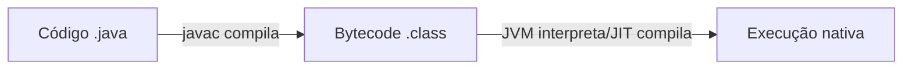

# 📖 Anexo D — Trilha Complementar: Java & Spring Boot

`↩ Índice Geral: README.md` | `⬅ Pré-requisito: trilha completa Node/TS (Fases 0-15)`

---

## Por que este anexo existe

Este guia foi construído com foco em Backend JavaScript/TypeScript (Node.js/NestJS) — a stack mais acessível para começar e extremamente demandada em startups, scale-ups e produtos digitais nativos (Nubank, iFood, PicPay, Mercado Livre, a maioria das SaaS). Mas ela **não é a única stack relevante**, e para quem quer maximizar empregabilidade — especialmente em bancos tradicionais, seguradoras, grandes varejistas, telecomunicações, governo e consultorias — **Java com Spring Boot é, em volume de vagas, uma das stacks mais demandadas do mercado brasileiro**, muitas vezes com processos de trainee/Junior robustos e bem remunerados (Itaú, Bradesco, Caixa, Porto Seguro, TOTVS, Embraer, XP, Localiza, Accenture, Thoughtworks, entre centenas de outras).

> **Como isso aparece no mercado:** é comum encontrar Juniors "poliglotas" — que sabem Node/TS *e* Java/Spring — com acesso a um leque de vagas muito maior do que quem domina só uma stack. A boa notícia: a **maior parte do que você já aprendeu neste guia se transfere quase 1:1** — algoritmos, SQL, arquitetura (SOLID, Clean Architecture), testes, Docker, segurança, Git. O que muda de verdade é a linguagem e o framework.

### Pré-requisito

Faça este anexo **depois** de terminar (ou pelo menos concluir a Fase 9 — Testes) da trilha principal. Ele pressupõe que você já sabe: lógica de programação (Fase 2), SQL e modelagem de dados (Fase 8), arquitetura em camadas e SOLID (Fase 10), testes (Fase 9), Docker/CI-CD (Fase 11) e segurança (Fase 12) — aqui você vai **reaplicar** esse conhecimento em uma linguagem e framework novos, não aprendê-lo do zero de novo.

### Comparativo rápido: o que muda e o que não muda

| Conceito | Node/TypeScript | Java/Spring | Muda? |
|---|---|---|---|
| Algoritmos, Big O, estruturas de dados | ✅ | ✅ | **Não muda** — é o mesmo raciocínio |
| SOLID, Clean Architecture | ✅ | ✅ | **Não muda** — os princípios são universais |
| Modelagem de banco, SQL, normalização | ✅ | ✅ | **Não muda** |
| Pirâmide de testes, TDD | ✅ | ✅ | **Não muda** o conceito, muda a ferramenta |
| Tipagem | Estática opcional (TS) | Estática obrigatória | Muda a rigidez e o compilador |
| Execução | V8, single-thread + event loop | JVM, multi-thread nativa | Muda o modelo de concorrência |
| Framework web | Express/NestJS | Spring Boot | Muda a sintaxe e convenções |
| ORM | Prisma | Spring Data JPA / Hibernate | Muda a ferramenta, mesmo conceito |
| Build/dependências | npm/pnpm | Maven/Gradle | Muda a ferramenta |
| Testes | Jest/Vitest | JUnit 5 + Mockito | Muda a ferramenta |

---

## Roadmap deste anexo


---

# 📖 D.1 — Fundamentos de Java: a Linguagem

## 🎯 Objetivo

Java é estaticamente tipada de forma **obrigatória** (diferente do TypeScript, que é opcional e "apaga" em tempo de execução), compilada para bytecode e executada em uma máquina virtual (JVM) — um modelo de execução fundamentalmente diferente do V8/Node. Esta seção existe para você deixar de "escrever JS com sintaxe de Java" e passar a pensar de forma idiomática na linguagem.

> **Como isso aparece no mercado:** entrevistas técnicas para vagas Java frequentemente cobram entendimento de OOP "de verdade" (herança, polimorfismo, interfaces) com mais rigor do que entrevistas JS — é uma linguagem historicamente usada para ensinar OOP em cursos de graduação.

## 📝 Conceitos

- JVM, JRE e JDK — o que cada um faz
- Compilação para bytecode e portabilidade ("write once, run anywhere")
- Tipagem estática obrigatória e tipos primitivos vs. wrapper classes
- Classes, interfaces, classes abstratas
- Encapsulamento, herança, polimorfismo (os pilares de OOP)
- Generics
- Collections Framework (`List`, `Set`, `Map` e suas implementações)
- Streams API e expressões lambda
- `Optional` — tratamento de ausência de valor sem `null`
- Exceptions: checked vs. unchecked
- Records (Java 17+) — equivalente a um DTO imutável enxuto

## 📋 Ordem de estudo

1. Sintaxe básica, tipos primitivos e wrapper classes
2. OOP: classes, interfaces, herança, polimorfismo
3. Generics
4. Collections Framework
5. Streams API e lambdas
6. Exceptions (checked vs. unchecked)
7. `Optional` e Records

## 🔍 Explicação

### 1. JVM, JRE, JDK



- **JDK (Java Development Kit):** o que você instala para desenvolver — inclui compilador (`javac`) e ferramentas.
- **JRE (Java Runtime Environment):** o necessário para *rodar* (não desenvolver) aplicações Java — inclui a JVM.
- **JVM (Java Virtual Machine):** executa o bytecode, com seu próprio Garbage Collector e (assim como o V8 estudado na Fase 1) um compilador JIT.

### 2. Tipagem estática obrigatória

```java
int idade = 28;              // tipo primitivo
String nome = "Ana";         // objeto
List<String> nomes = new ArrayList<>(); // Generics obrigatórios (sem inferência "solta" como TS)
```

Diferente do TypeScript (onde `any` é uma porta de fuga), em Java **não existe compilar sem tipo definido** — isso é rígido por design, e é exatamente essa rigidez que muitas empresas de missão crítica (bancos, seguradoras) valorizam.

### 3. OOP — os quatro pilares, aplicados de verdade

```java
public interface Notificador {
    void enviar(String mensagem);
}

public class EmailNotificador implements Notificador {
    @Override
    public void enviar(String mensagem) {
        System.out.println("Enviando e-mail: " + mensagem);
    }
}

public abstract class Pagamento {
    protected BigDecimal valor;

    public abstract BigDecimal calcularTaxa();

    public BigDecimal calcularTotal() {
        return valor.add(calcularTaxa()); // reaproveita lógica comum
    }
}
```

> 💡 Note o paralelo direto com o que você já viu no TypeScript (Fase 4) e em SOLID (Fase 10) — `interface` e Dependency Inversion funcionam de forma muito parecida; a diferença é que em Java isso é **imposto pela linguagem**, não uma boa prática opcional.

### 4. Generics

```java
public class Caixa<T> {
    private T conteudo;
    public void guardar(T item) { this.conteudo = item; }
    public T pegar() { return conteudo; }
}

Caixa<String> caixaDeTexto = new Caixa<>();
```

Exatamente o mesmo conceito dos Generics do TypeScript (Fase 4) — reuso de código com segurança de tipo.

### 5. Streams API — o "map/filter/reduce" do Java

```java
List<Pedido> pedidosPagos = pedidos.stream()
    .filter(p -> p.getStatus().equals("pago"))
    .collect(Collectors.toList());

BigDecimal totalPago = pedidos.stream()
    .filter(p -> p.getStatus().equals("pago"))
    .map(Pedido::getValor)
    .reduce(BigDecimal.ZERO, BigDecimal::add);
```

Se você domina `map/filter/reduce` do JavaScript (Fase 3), a Streams API é o equivalente direto em Java — a diferença é a sintaxe (lambdas `->` em vez de arrow functions) e a necessidade de `.collect()` para materializar o resultado de volta em uma coleção.

### 6. Exceptions: checked vs. unchecked

```java
// Checked: o compilador OBRIGA você a tratar ou declarar (throws)
public void lerArquivo(String caminho) throws IOException {
    Files.readString(Path.of(caminho));
}

// Unchecked (RuntimeException): não é obrigatório tratar
public BigDecimal dividir(BigDecimal a, BigDecimal b) {
    if (b.equals(BigDecimal.ZERO)) throw new IllegalArgumentException("Divisor não pode ser zero");
    return a.divide(b);
}
```

> ⚠️ **Armadilha comum:** capturar `Exception` genérica só para "silenciar" o compilador (`catch (Exception e) {}`), escondendo erros reais. Assim como em JS/TS (Fase 12), engolir erros silenciosamente é considerado falha grave de qualidade.

### 7. `Optional` — nada de `NullPointerException`

```java
public Optional<Usuario> buscarPorEmail(String email) {
    return usuarios.stream().filter(u -> u.getEmail().equals(email)).findFirst();
}

// uso:
buscarPorEmail("ana@exemplo.com")
    .map(Usuario::getNome)
    .orElse("Usuário não encontrado");
```

`NullPointerException` é historicamente um dos erros mais comuns em Java em produção — `Optional` (desde Java 8) força você a lidar explicitamente com a ausência de valor, de forma parecida com o `strict null checks` do TypeScript (Fase 4).

## 💻 O que dominar

- [ ] Explico a diferença entre JDK, JRE e JVM
- [ ] Escrevo classes, interfaces e uso herança/polimorfismo corretamente
- [ ] Uso Generics para escrever código reutilizável com segurança de tipo
- [ ] Uso a Streams API fluentemente (equivalente a map/filter/reduce)
- [ ] Explico a diferença entre exceptions checked e unchecked, e quando usar cada uma
- [ ] Uso `Optional` para evitar `NullPointerException`

## ⚠️ Erros comuns

1. Comparar objetos com `==` em vez de `.equals()` (compara referência, não valor).
2. Capturar `Exception` genérica para silenciar erros.
3. Não usar Generics, gerando `ClassCastException` em tempo de execução.
4. Mutar coleções recebidas por parâmetro sem necessidade, gerando efeitos colaterais inesperados.
5. Ignorar `Optional` e continuar checando `if (objeto != null)` manualmente em todo lugar.

## 🧠 Exercícios

**Iniciante:** implemente uma classe `ContaBancaria` com encapsulamento correto (atributos privados, métodos `depositar`/`sacar` com validação).
**Intermediário:** reimplemente, em Java, a busca binária e a pilha/fila que você construiu na Fase 2, usando Generics.
**Avançado:** modele, com interfaces e classes abstratas, o mesmo "motor de precificação" do Projeto 5 do Portfólio Final (Fase 13/Anexo B), usando Streams para compor as regras.

## 🌱 Projetos

Nenhum projeto de portfólio isolado nesta seção — o objetivo é consolidar a linguagem antes de ir para Spring Boot, onde os projetos reais acontecem.

## ✔️ Critério de conclusão

Você conclui a D.1 quando escreve código Java idiomático (não "JavaScript traduzido"), usando Streams, Generics e `Optional` com naturalidade, sem consultar sintaxe básica.

---

# 📖 D.2 — Build Tools & Ecossistema (Maven/Gradle)

## 🎯 Objetivo

Assim como `npm`/`pnpm` gerenciam dependências e scripts no mundo Node, Maven e Gradle fazem isso no mundo Java — e são pré-requisito para qualquer projeto Spring Boot real.

## 📝 Conceitos

- `pom.xml` (Maven) — dependências, plugins, ciclo de vida de build
- `build.gradle` (Gradle) — alternativa mais moderna e flexível
- Repositórios de dependências (Maven Central)
- Ciclo de vida de build: `compile`, `test`, `package`, `install`

## 🔍 Explicação

```xml
<!-- pom.xml — equivalente ao package.json -->
<dependencies>
  <dependency>
    <groupId>org.springframework.boot</groupId>
    <artifactId>spring-boot-starter-web</artifactId>
  </dependency>
  <dependency>
    <groupId>org.springframework.boot</groupId>
    <artifactId>spring-boot-starter-data-jpa</artifactId>
  </dependency>
</dependencies>
```

```bash
mvn clean install   # equivalente a: rm -rf dist && npm install && npm run build
mvn spring-boot:run # equivalente a: npm run dev
```

> **Qual escolher?** Maven é mais comum em empresas tradicionais (mais verboso, XML, muito estável); Gradle é mais moderno (sintaxe mais enxuta, usado por Android e projetos mais recentes). Para o mercado brasileiro geral, **comece com Maven** — é o que você vai encontrar com mais frequência em código legado corporativo, o tipo de ambiente onde uma Junior de Java costuma começar.

## 💻 O que dominar

- [ ] Adicionar e gerenciar dependências via `pom.xml`
- [ ] Rodar build, testes e execução via linha de comando (Maven)
- [ ] Explicar a diferença entre Maven e Gradle

## ✔️ Critério de conclusão

Você conclui a D.2 quando consegue criar um projeto Spring Boot do zero via [start.spring.io](https://start.spring.io) (o "create-react-app" do ecossistema Spring), adicionar dependências manualmente no `pom.xml`, e rodá-lo localmente.

---

# 📖 D.3 — Spring Boot: Fundamentos & APIs REST

## 🎯 Objetivo

Spring Boot é, para o ecossistema Java, o equivalente ao NestJS — um framework opinativo, baseado fortemente em Injeção de Dependência, que você já domina conceitualmente desde a Fase 7 e a Fase 10 (SOLID/DIP).

## 📝 Conceitos

- Inversão de Controle (IoC) e o Spring Container
- Injeção de Dependência via anotações
- `@RestController`, `@RequestMapping`, `@GetMapping`, `@PostMapping`
- `@Service`, `@Repository`, `@Component`
- `ResponseEntity` e status codes
- Bean Validation (`@Valid`, `jakarta.validation`)
- Tratamento global de erro (`@ControllerAdvice`, `@ExceptionHandler`)
- DTOs vs. Entidades

## 📋 Ordem de estudo

1. IoC e Injeção de Dependência via anotações
2. Controllers e rotas REST
3. Services e separação de camadas
4. Validação de entrada
5. Tratamento global de erro
6. DTOs

## 🔍 Explicação

### Tabela de tradução: NestJS ↔ Spring Boot

| NestJS (Fase 7) | Spring Boot | Papel |
|---|---|---|
| `@Controller()` | `@RestController` | Recebe requisições HTTP |
| `@Injectable()` | `@Service` | Lógica de negócio |
| `@Module()` | Auto-configuração + `@ComponentScan` | Organização/registro de dependências |
| Constructor injection | `@Autowired` (ou constructor injection, preferido) | Injeção de dependência |
| `@Get(':id')` | `@GetMapping("/{id}")` | Rota GET |
| `class-validator` (`@IsEmail`) | Bean Validation (`@Email`) | Validação de DTO |
| `@UseGuards()` | Spring Security `@PreAuthorize` | Proteção de rota |

### Exemplo completo

```java
@RestController
@RequestMapping("/produtos")
public class ProdutoController {

    private final ProdutoService produtoService;

    // Injeção via construtor — preferida a @Autowired em campo (facilita testes)
    public ProdutoController(ProdutoService produtoService) {
        this.produtoService = produtoService;
    }

    @GetMapping("/{id}")
    public ResponseEntity<ProdutoDTO> buscarPorId(@PathVariable String id) {
        ProdutoDTO produto = produtoService.buscarPorId(id);
        return ResponseEntity.ok(produto);
    }

    @PostMapping
    public ResponseEntity<ProdutoDTO> criar(@Valid @RequestBody CriarProdutoDTO dto) {
        ProdutoDTO criado = produtoService.criar(dto);
        return ResponseEntity.status(HttpStatus.CREATED).body(criado);
    }
}
```

```java
public record CriarProdutoDTO(
    @NotBlank String nome,
    @Positive BigDecimal preco
) {}
```

### Tratamento global de erro

```java
@RestControllerAdvice
public class GlobalExceptionHandler {

    @ExceptionHandler(RecursoNaoEncontradoException.class)
    public ResponseEntity<ErroDTO> tratarNaoEncontrado(RecursoNaoEncontradoException ex) {
        return ResponseEntity.status(HttpStatus.NOT_FOUND)
            .body(new ErroDTO(ex.getMessage()));
    }
}
```

Equivalente direto ao middleware de tratamento de erro centralizado do Express/NestJS (Fase 7) — centraliza o mapeamento de exceções para respostas HTTP corretas, em vez de `try/catch` espalhado.

## 💻 O que dominar

- [ ] Explico Inversão de Controle e como o Spring gerencia beans/dependências
- [ ] Construo uma API REST completa com Controllers, Services e DTOs separados
- [ ] Valido entrada com Bean Validation
- [ ] Implemento tratamento global de erro com `@RestControllerAdvice`
- [ ] Explico a diferença entre DTO e Entidade e por que não expor a entidade diretamente

## ⚠️ Erros comuns

1. Expor entidades JPA diretamente como resposta da API (em vez de DTOs), vazando detalhes internos de persistência.
2. Usar `@Autowired` em campo em vez de injeção via construtor (dificulta testes).
3. Colocar lógica de negócio no Controller em vez do Service (mesmo erro visto na Fase 7/10, só que em Java).

## 🧠 Exercícios

Reimplemente, em Spring Boot, a mesma API de tarefas simples que você construiu no início da Fase 7 (Express), comparando as diferenças de estrutura.

## ✔️ Critério de conclusão

Você conclui a D.3 quando constrói uma API REST em Spring Boot com camadas corretamente separadas, validação e tratamento de erro, sem consultar tutorial básico.

---

# 📖 D.4 — Persistência: Spring Data JPA

## 🎯 Objetivo

Spring Data JPA (sobre Hibernate) é o equivalente Java ao Prisma da Fase 8 — um ORM que abstrai SQL, mas que você deve entender por baixo, já que aprendeu SQL puro na Fase 8.

## 📝 Conceitos

- `@Entity`, `@Id`, `@GeneratedValue`
- Relacionamentos: `@OneToMany`, `@ManyToOne`, `@ManyToMany`
- Interfaces `Repository` / `JpaRepository`
- Query methods (derivação automática de query pelo nome do método)
- JPQL para queries customizadas
- `@Transactional`
- Lazy vs. Eager loading (e o problema N+1, revisitado)
- Migrations com Flyway

## 🔍 Explicação

```java
@Entity
@Table(name = "pedidos")
public class Pedido {
    @Id @GeneratedValue(strategy = GenerationType.UUID)
    private UUID id;

    @ManyToOne
    @JoinColumn(name = "usuario_id")
    private Usuario usuario;

    @OneToMany(mappedBy = "pedido", cascade = CascadeType.ALL)
    private List<ItemPedido> itens = new ArrayList<>();

    private BigDecimal total;
    private String status;
}

public interface PedidoRepository extends JpaRepository<Pedido, UUID> {
    // Query method: Spring gera o SQL automaticamente pelo nome do método
    List<Pedido> findByStatusAndUsuarioId(String status, UUID usuarioId);

    @Query("SELECT p FROM Pedido p WHERE p.total > :valorMinimo")
    List<Pedido> buscarComTotalMaiorQue(@Param("valorMinimo") BigDecimal valorMinimo);
}
```

```java
@Service
public class PedidoService {

    @Transactional
    public Pedido criarPedido(CriarPedidoDTO dto) {
        // toda a operação (baixa de estoque + criação de pedido) é atômica
        estoqueService.baixarEstoque(dto.itens());
        return pedidoRepository.save(construirPedido(dto));
    }
}
```

> ⚠️ **Armadilha comum (o mesmo N+1 da Fase 8, agora em Java):** usar `FetchType.EAGER` em relacionamentos por padrão, carregando dados desnecessários em toda consulta, ou o oposto — `LAZY` sem configurar corretamente, gerando `LazyInitializationException` fora de uma transação ativa. Entenda o ciclo de vida da sessão do Hibernate antes de usar relacionamentos em produção.

## 💻 O que dominar

- [ ] Modelo entidades e relacionamentos com JPA corretamente
- [ ] Uso query methods e JPQL para consultas customizadas
- [ ] Explico `@Transactional` e por que é necessário em operações multi-etapa
- [ ] Explico Lazy vs. Eager loading e o problema N+1 no contexto do Hibernate
- [ ] Uso Flyway para versionar mudanças de schema

## ✔️ Critério de conclusão

Você conclui a D.4 quando modela um domínio relacional completo com JPA, evita N+1 conscientemente, e usa migrations para versionar o schema — sem depender de `ddl-auto: update` em produção (usado só em desenvolvimento).

---

# 📖 D.5 — Segurança: Spring Security & JWT

## 🎯 Objetivo

Reaplicar tudo o que você aprendeu na Fase 12 (hash de senha, JWT, CORS, rate limiting) usando o framework de segurança mais usado do ecossistema Java — que tem uma curva de aprendizado real (a chain de filtros do Spring Security costuma ser o ponto onde mais Juniors travam).

## 📝 Conceitos

- Filter Chain do Spring Security
- `PasswordEncoder` (BCrypt)
- Autenticação stateless com JWT customizado
- `@PreAuthorize` e controle de acesso por papel
- Configuração de CORS

## 🔍 Explicação

```java
@Configuration
@EnableWebSecurity
public class SecurityConfig {

    @Bean
    public SecurityFilterChain filterChain(HttpSecurity http, JwtFilter jwtFilter) throws Exception {
        return http
            .csrf(csrf -> csrf.disable()) // API stateless não usa cookies de sessão tradicionais
            .sessionManagement(sm -> sm.sessionCreationPolicy(SessionCreationPolicy.STATELESS))
            .authorizeHttpRequests(auth -> auth
                .requestMatchers("/auth/**").permitAll()
                .requestMatchers("/admin/**").hasRole("ADMIN")
                .anyRequest().authenticated())
            .addFilterBefore(jwtFilter, UsernamePasswordAuthenticationFilter.class)
            .build();
    }

    @Bean
    public PasswordEncoder passwordEncoder() {
        return new BCryptPasswordEncoder(); // exatamente o bcrypt da Fase 12
    }
}
```

O modelo mental é o mesmo da Fase 12 (hash com bcrypt, JWT stateless, rotas protegidas por papel) — a diferença é que o Spring Security implementa isso como uma **cadeia de filtros** que intercepta toda requisição antes dela chegar ao Controller, um conceito mais explícito e configurável do que os middlewares do Express.

## 💻 O que dominar

- [ ] Configuro a filter chain do Spring Security para uma API stateless com JWT
- [ ] Uso `BCryptPasswordEncoder` corretamente para hash de senha
- [ ] Protejo rotas por papel usando `@PreAuthorize` ou configuração de `authorizeHttpRequests`
- [ ] Configuro CORS corretamente para consumo por um frontend externo

## ✔️ Critério de conclusão

Você conclui a D.5 quando implementa autenticação JWT completa em Spring Security, incluindo controle de acesso por papel, sem depender de tutorial passo a passo.

---

# 📖 D.6 — Testes: JUnit 5, Mockito & Testcontainers

## 🎯 Objetivo

Reaplicar a pirâmide de testes da Fase 9 no ecossistema Java, incluindo uma ferramenta que não tem equivalente direto tão maduro no mundo Node: **Testcontainers**, que sobe um banco de dados real em Docker durante os testes de integração.

## 📝 Conceitos

- JUnit 5 (`@Test`, assertions)
- Mockito (`@Mock`, `@InjectMocks`)
- `@SpringBootTest` para testes de integração
- `MockMvc` para testar Controllers sem subir servidor real
- Testcontainers — banco de dados real e efêmero para testes

## 🔍 Explicação

```java
// Teste unitário com Mockito — equivalente direto ao mock do Jest (Fase 9)
@ExtendWith(MockitoExtension.class)
class PedidoServiceTest {

    @Mock
    private PedidoRepository pedidoRepository;

    @InjectMocks
    private PedidoService pedidoService;

    @Test
    void deveCriarPedidoComSucesso() {
        when(pedidoRepository.save(any())).thenReturn(new Pedido());
        Pedido resultado = pedidoService.criarPedido(dtoValido());
        assertNotNull(resultado);
        verify(pedidoRepository, times(1)).save(any());
    }
}
```

```java
// Teste de integração com Testcontainers — banco PostgreSQL real, efêmero
@SpringBootTest
@Testcontainers
class PedidoRepositoryIntegrationTest {

    @Container
    static PostgreSQLContainer<?> postgres = new PostgreSQLContainer<>("postgres:16");

    @DynamicPropertySource
    static void configurarBanco(DynamicPropertyRegistry registry) {
        registry.add("spring.datasource.url", postgres::getJdbcUrl);
    }

    @Test
    void deveSalvarEBuscarPedido() {
        // teste roda contra um Postgres real, não um mock — mais próximo do comportamento real
    }
}
```

> 💡 **Por que isso importa:** Testcontainers resolve exatamente o dilema da pirâmide de testes (Fase 9) entre "teste rápido mas pouco realista" (mock) e "teste realista mas lento/frágil" (banco real compartilhado) — cada teste sobe seu próprio banco isolado em um container Docker e destrói ao final.

## 💻 O que dominar

- [ ] Escrevo testes unitários com JUnit 5 e Mockito, isolando dependências
- [ ] Escrevo testes de integração de Controllers com `MockMvc`
- [ ] Uso Testcontainers para testes de integração com banco real e isolado

## ✔️ Critério de conclusão

Você conclui a D.6 quando tem uma suíte de testes completa (unitários + integração com Testcontainers) para uma API Spring Boot, seguindo a mesma proporção da pirâmide de testes da Fase 9.

---

# 📖 D.7 — Docker & CI/CD para Java

## 🎯 Objetivo

Aplicar o que você já sabe da Fase 11, adaptado às particularidades de build e imagem de aplicações Java (que são compiladas, diferente do Node que roda o código-fonte diretamente).

## 🔍 Explicação

```dockerfile
# Multi-stage build — evita carregar o Maven e o JDK completo na imagem final
FROM maven:3.9-eclipse-temurin-21 AS build
WORKDIR /app
COPY pom.xml .
RUN mvn dependency:go-offline
COPY src ./src
RUN mvn clean package -DskipTests

FROM eclipse-temurin:21-jre-alpine
WORKDIR /app
COPY --from=build /app/target/*.jar app.jar
EXPOSE 8080
ENTRYPOINT ["java", "-jar", "app.jar"]
```

> **Por que multi-stage:** a imagem final não precisa do Maven nem do JDK completo (só do JRE para *rodar* o `.jar` já compilado) — isso reduz drasticamente o tamanho da imagem final, o mesmo princípio de otimização de camadas visto na Fase 11, aplicado ao contexto de uma linguagem compilada.

O pipeline de GitHub Actions segue a mesma lógica da Fase 11 (lint → testes → build → deploy), trocando `npm ci`/`npm test` por `mvn test`/`mvn package`.

## 💻 O que dominar

- [ ] Escrevo um Dockerfile multi-stage para uma aplicação Spring Boot
- [ ] Configuro um pipeline de CI/CD equivalente ao da Fase 11, adaptado para Maven

## ✔️ Critério de conclusão

Você conclui a D.7 quando tem uma aplicação Spring Boot containerizada, com pipeline de CI/CD e deploy real funcionando.

---

# 📖 Projeto de Consolidação — Reescrevendo um Projeto do Portfólio em Java/Spring

## Objetivo de negócio

Este é o projeto mais valioso deste anexo: pegue o **Projeto 3 (E-commerce: Gestão de Pedidos)** ou o **Projeto 4 (Sistema de Reservas com Concorrência)** do Portfólio Final (Anexo B) e **reimplemente-o do zero em Java/Spring Boot**, mantendo as mesmas regras de negócio.

## Por que isso é tão valioso para entrevistas

Ter o **mesmo sistema implementado em duas stacks diferentes** é um diferencial de portfólio extremamente raro entre Juniors, e gera uma resposta poderosa para uma das perguntas mais comuns de entrevista técnica ("por que você escolheu essa tecnologia?"): você literalmente já comparou as duas na prática, com decisões documentadas.

## Requisitos

- Mesmas regras de negócio da versão Node (ex: prevenção de dupla reserva sob concorrência, ou baixa de estoque atômica).
- Arquitetura em camadas equivalente (Controller/Service/Repository), aplicando os mesmos princípios SOLID.
- Suíte de testes completa (JUnit + Mockito + Testcontainers).
- Deploy real, containerizado, com CI/CD.
- **README comparativo:** uma seção específica documentando as diferenças de decisão entre a versão Node/TS e a versão Java/Spring (ex: "na versão Node usei Prisma; na versão Java usei Spring Data JPA — a diferença mais relevante na prática foi X").

## Perguntas de entrevista possíveis

"Você implementou o mesmo sistema em Node e Java — quais foram as maiores diferenças de produtividade e de garantias que cada stack te deu?"; "Em qual cenário você recomendaria Java/Spring em vez de Node para um novo projeto, e por quê?".

---

## Cursos e documentação recomendados

| Recurso | Tipo | Nível | Observação |
|---|---|---|---|
| **docs.oracle.com/javase** | Documentação oficial | Todos | Referência definitiva da linguagem Java |
| **spring.io/guides** | Documentação oficial | Todos | Guias curtos e práticos, mantidos pela própria Spring — comece por aqui |
| **docs.spring.io/spring-boot** | Documentação oficial | Intermediário+ | Referência completa do framework |
| **Baeldung (baeldung.com)** | Blog/tutoriais | Todos | Referência não-oficial mais respeitada da comunidade Java — cobre praticamente qualquer dúvida prática |
| **start.spring.io** | Ferramenta | — | Gerador oficial de projetos Spring Boot (o "create-react-app" do ecossistema) |

---

## Checklist mestre do Anexo D

- [ ] Escrevo Java idiomático (OOP, Generics, Streams, Optional) sem "traduzir" JS mentalmente
- [ ] Construo APIs REST completas em Spring Boot, com camadas corretamente separadas
- [ ] Modelo persistência com Spring Data JPA, evitando N+1 conscientemente
- [ ] Implemento autenticação JWT com Spring Security, incluindo controle por papel
- [ ] Escrevo suíte de testes completa (JUnit + Mockito + Testcontainers)
- [ ] Containerizo e faço deploy real de uma aplicação Spring Boot, com CI/CD
- [ ] Tenho pelo menos um projeto do Portfólio Final reimplementado em Java/Spring, com README comparativo

> **É isso que empresas realmente esperam de uma Junior "poliglota"?** Sim — e mais que isso: ter clareza sobre **quando** escolher cada stack (não apenas saber usar as duas) é, em si, um sinal de maturidade técnica que vai além do nível Junior médio, e costuma se destacar positivamente em entrevistas de empresas que trabalham com múltiplas stacks internamente.

---

`↩ Índice Geral: README.md`
