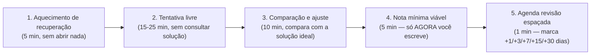

# 📖 Anexo E — Rotina de Prática Deliberada (LeetCode & Solidificação)

`↩ Índice Geral: ../modulos/00-INDICE-GERAL.md` | `⬅ Relacionado: ../modulos/modulo-01.md (Fase 0), ../modulos/modulo-02.md (Fase 2)`

---

## 🎯 Objetivo

Os módulos deste guia entregam **profundidade conceitual** — você entende o *porquê* de cada coisa. Mas entender não é o mesmo que **executar sob pressão de tempo**, que é exatamente o que uma entrevista técnica, um desafio ao vivo ou um bug em produção vão exigir. Este anexo existe para resolver duas lacunas específicas que o guia principal não cobre em detalhe:

1. **Onde ferramentas de prática (LeetCode e afins) entram na sua rotina** — elas não substituem as fases, elas rodam **em paralelo** a partir da Fase 2.
2. **Como solidificar conhecimento *antes* de escrever a nota formal** — a ordem entre "tentar lembrar" e "documentar" muda completamente o quanto você retém.

> Este anexo não é uma fase nova a "concluir" — é uma **rotina contínua**, que passa a rodar em paralelo a partir da Fase 2 e nunca mais para, nem depois da primeira vaga.

---

## 📝 Conceitos

- Deliberate Practice vs. prática ingênua (revisão da Fase 0)
- O efeito de teste (testing effect) — por que tentar lembrar > reler
- Prática por padrão (pattern-based practice) vs. problemas soltos aleatórios
- Dificuldade progressiva (progressive overload aplicado a algoritmos)
- Simulação de entrevista cronometrada (timeboxing)
- Ferramentas: LeetCode, HackerRank, Codewars, NeetCode 150, Exercism, AlgoExpert
- Fila de revisão espaçada aplicada a problemas (não só a conceitos)

---

## 📋 Ordem de estudo — quando cada ferramenta entra

| Momento | O que fazer | Ferramenta |
|---|---|---|
| Fase 0-1 | Nada ainda — foco é método de estudo e fundamentos | — |
| **Fase 2** (Lógica de Programação) | Introdução a padrões básicos: arrays, two pointers, busca binária, recursão | LeetCode (Easy) · Exercism |
| Fases 3-9 (stack técnica) | 3-5 problemas/semana, sem parar, alternando padrões | LeetCode (Easy/Medium) · Codewars |
| Fases 10-12 (arquitetura/segurança) | Mantém o ritmo, ainda sem pressa | LeetCode (Medium) |
| **Fase 13** (Projetos Profissionais) | Intensifica: modo cronometrado, simulação de entrevista | LeetCode (Medium/Hard) · NeetCode 150 · AlgoExpert (opcional) |
| Fase 15 (candidaturas ativas) | Revisão dos padrões que você mais erra, mocks com colegas | LeetCode · plataformas de mock interview |

---

## 🔍 Explicação

### 1. Onde o LeetCode entra de verdade

O erro mais comum é tratar o LeetCode como "uma fase à parte" que se faz depois de terminar o guia inteiro — isso é ineficiente por dois motivos: (a) você perde meses sem treinar o raciocínio sob pressão, que é uma habilidade diferente de "entender o conceito"; (b) quando finalmente for praticar, vai ter esquecido boa parte dos fundamentos por falta de repetição espaçada aplicada à prática, não só à teoria.

**A partir da Fase 2**, reserve um bloco fixo (mesmo que pequeno — 20-30 min) na sua rotina diária ou a cada dois dias, **independente de qual fase você está estudando no momento**. Esse bloco nunca para, só muda de intensidade e de nível de dificuldade.

### 2. Comparativo de ferramentas — qual usar em cada momento

| Ferramenta | Foco | Gratuito? | Quando usar |
|---|---|---|---|
| **LeetCode** | Algoritmos e estruturas de dados, padrão de entrevista | Parcial (free tier cobre 80%+ do necessário) | Ferramenta principal, do início ao fim |
| **NeetCode 150 / NeetCode Roadmap** | Curadoria dos problemas mais cobrados, organizados por padrão | Sim (vídeos e lista gratuitos) | A partir da Fase 2 — use como "trilha dentro do LeetCode" em vez de escolher problemas aleatórios |
| **HackerRank** | Desafios mais amplos, incluindo SQL e desafios de domínio específico | Sim | Complementar, principalmente para praticar SQL (Fase 8) |
| **Codewars** | Problemas curtos, "kata", com ranking de dificuldade progressivo | Sim | Bom para aquecimento rápido e treinar sintaxe de JS/TS especificamente |
| **Exercism** | Exercícios com **mentoria por correção humana** de código, por linguagem | Sim | Ótimo nas Fases 2-4 para receber feedback de código idiomático, não só "passou ou não passou" |
| **AlgoExpert** | Curadoria paga com vídeo-explicação de cada solução | Pago | Opcional — só vale se o orçamento permitir; NeetCode gratuito cobre função parecida |

> ⚠️ **Armadilha comum:** resolver problemas aleatórios, sem padrão, sem repetir os que você errou. Isso gera uma falsa sensação de progresso ("já fiz 100 problemas") sem consolidar os **padrões** que realmente se repetem em entrevistas (two pointers, sliding window, BFS/DFS, backtracking, programação dinâmica). Prefira seguir uma trilha curada (NeetCode 150 é a mais usada globalmente) a "caçar" problemas aleatórios por dificuldade.

### 3. Protocolo de Solidificação Diária — a ordem que importa

Este é o núcleo deste anexo e responde diretamente à pergunta "como solidificar antes de processar minhas notas". A sequência **importa**: inverter a ordem (nota antes de tentar) reduz drasticamente o ganho de retenção, porque você perde o desconforto produtivo do Active Recall (Fase 0) que é justamente o que fortalece a memória.

1. **Aquecimento de recuperação (5 min):** antes de abrir qualquer material, escreva ou fale em voz alta o que você lembra do que estudou ontem — sem consultar nada. Isso já é uma sessão de Active Recall antes mesmo de começar algo novo.
2. **Tentativa livre (15-25 min):** encare o problema/conceito novo sozinha, com timer, sem consultar solução, mesmo que erre ou trave. O objetivo não é acertar — é forçar o cérebro a buscar ativamente, o que já cria a conexão que a nota, sozinha, nunca criaria.
3. **Comparação e ajuste (10 min):** só agora você olha a solução ideal/gabarito, compara com a sua, e identifica exatamente **onde** o raciocínio divergiu — isso é mais valioso do que ver a solução direto, porque você sabe exatamente o que precisa corrigir.
4. **Nota mínima viável (5 min):** escreva a nota formal **depois** de todo esse processo, e só sobre o que realmente precisou de ajuste — evite copiar a solução inteira; escreva a lição, não o código-fonte.
5. **Agenda a revisão espaçada (1 min):** marque esse problema/conceito para revisão em 1, 3, 7, 15 e 30 dias (o mesmo princípio do Anki da Fase 0, aplicado a problemas práticos, não só a definições).

> 💡 **Por que isso funciona:** este protocolo nada mais é do que o Active Recall e a Repetição Espaçada da Fase 0, só que formalizados em um ritual repetível — a diferença entre "eu sei que devo praticar recall" e efetivamente ter uma sequência de passos que você segue todo dia sem precisar decidir de novo.

### 4. Padrões de algoritmo prioritários (aprofundando a Fase 2)

Ordem sugerida de padrões, do mais fundamental ao mais avançado — cada um deve ser praticado em pelo menos 5-8 problemas antes de avançar para o próximo:

1. Arrays e Strings (manipulação básica)
2. Two Pointers
3. Sliding Window
4. Busca Binária (e variações)
5. Recursão e Backtracking
6. BFS e DFS (árvores e grafos)
7. Programação Dinâmica (introdução: 1D antes de 2D)
8. Heaps / Filas de Prioridade
9. Union-Find (opcional, mais raro em entrevistas Junior)

> **Como isso aparece no mercado:** entrevistadores frequentemente escolhem problemas justamente para testar se você reconhece o **padrão** por trás, não o problema específico — por isso praticar por padrão (e não por dificuldade aleatória) tem retorno muito maior por hora investida.

---

## 💻 O que dominar

- [ ] Reconheço, ao ler um problema novo, qual padrão de algoritmo provavelmente se aplica
- [ ] Sigo o Protocolo de Solidificação Diária (tentativa antes de nota) como hábito, não como exceção
- [ ] Tenho uma rotina fixa de prática (mesmo que pequena) rodando desde a Fase 2, sem interrupção
- [ ] Sei resolver, sob timer, problemas Easy/Medium dos padrões prioritários listados acima
- [ ] Mantenho uma fila de revisão espaçada para problemas que errei ou travei

---

## ⚠️ Erros comuns

1. **Deixar para começar LeetCode só depois de terminar o guia inteiro** — perde meses de repetição espaçada aplicada à prática.
2. **Ver a solução antes de tentar por tempo suficiente** — anula o efeito de teste, a parte que mais gera retenção.
3. **Resolver problemas aleatórios sem seguir uma trilha por padrão** — gera volume sem consolidar o que realmente se repete em entrevistas.
4. **Escrever a nota antes de tentar puxar da memória** — inverte a ordem do protocolo e reduz drasticamente o ganho de retenção.
5. **Nunca praticar cronometrado** — resolver sem pressão de tempo não prepara para a pressão real de uma entrevista ao vivo.
6. **Pular a fila de revisão espaçada** — resolver um problema uma única vez e nunca revisitá-lo é o mesmo erro de "reler uma vez e achar que aprendeu" da Fase 0.

---

## 🧠 Exercícios

**Iniciante**
1. Configure uma conta no LeetCode e resolva os 3 primeiros problemas da trilha "Arrays & Hashing" do NeetCode 150, aplicando o Protocolo de Solidificação Diária completo em cada um.

**Intermediário**
2. Pratique o padrão "Two Pointers" até resolver 5 problemas Easy/Medium consecutivos sem consultar solução, cronometrando cada tentativa.

**Avançado**
3. Escolha um padrão que você mais erra (ex: Programação Dinâmica) e monte sua própria mini-trilha de 8 problemas, do mais simples ao mais complexo, documentando o "ajuste" identificado em cada um.

**Desafio final**
4. Simule uma entrevista técnica completa: 45 minutos, um problema Medium desconhecido, verbalizando seu raciocínio em voz alta do início ao fim (pode gravar-se ou pedir para um colega assistir).

---

## 🌱 Projetos

Este anexo não gera um projeto de portfólio — o "produto" aqui é a **consistência da rotina** e o seu histórico de problemas resolvidos, que pode (e deve) ser citado em entrevistas como evidência de prática deliberada contínua.

---

## ✔️ Critério de conclusão

Este anexo não tem um "fim" — ele é considerado **em regime** quando você mantém a rotina de prática rodando por pelo menos 4 semanas consecutivas, sem pausas longas, seguindo o Protocolo de Solidificação Diária como padrão (não como exceção).

> **É isso que empresas realmente esperam de uma Junior?** Sim, diretamente — a etapa de teste técnico/live coding é, para a maioria das empresas, a etapa eliminatória mais dura do processo. Consistência aqui é o que separa quem "sabe a teoria" de quem consegue **demonstrar** sob pressão.

---

## 🔖 Livros recomendados

- **"Cracking the Coding Interview" — Gayle Laakmann McDowell.** A referência clássica do mercado para preparação de entrevistas técnicas — use como guia de padrões e banco de questões, não como leitura linear obrigatória.
- **"Elements of Programming Interviews" — Aziz, Lee, Prakash.** Mais denso e avançado; bom complemento depois de já ter uma base sólida via LeetCode/NeetCode.

---

## 📄 Documentações

- **leetcode.com** — plataforma principal de prática.
- **neetcode.io** — trilha curada (NeetCode 150) com vídeo-explicações gratuitas.
- **exercism.org** — prática com mentoria de código por linguagem.

---

`↩ Índice Geral: ../modulos/00-INDICE-GERAL.md`
