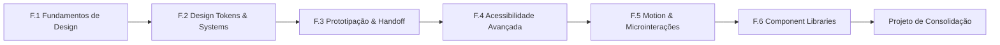

# 📖 Anexo F — Trilha de Design Engineering

`↩ Índice Geral: ../modulos/00-INDICE-GERAL.md` | `🔗 Conecta com: Fase 0, Fase 1, Fase 5 e Fase 14`

---

## Por que este anexo existe

A maioria dos Juniors "Backend/Fullstack" chega ao mercado sabendo construir uma API que funciona, mas incapaz de julgar se a interface que consome essa API é boa, acessível ou coerente — e isso é uma lacuna comum, não uma exceção. No seu caso é o oposto: você já vem de **Design Gráfico e Branding**, ou seja, já enxerga hierarquia visual, tipografia, cor e sistema antes mesmo de escrever a primeira linha de CSS. Este anexo existe para transformar essa bagagem em uma competência técnica nomeável — **Design Engineering** — em vez de deixá-la como um "diferencial vago" no currículo.

> **Design Engineer**, como função reconhecida hoje no mercado (Vercel, Linear, Stripe, GitHub, Airbnb usam esse título explicitamente), é a pessoa que fica na fronteira entre Produto/Design e Engenharia: traduz decisões de design em código de produção, constrói e mantém design systems, garante acessibilidade real (não só "passa no Lighthouse") e cuida de motion/microinterações. Não é UI Designer que também "mexe em CSS" — é engenheira que domina a camada visual com profundidade de sistema.

### Por que isso não é uma trilha "a mais", e sim uma **camada**

Diferente do Anexo D (Java/Spring), que é uma stack alternativa cursada **depois** da trilha principal, este anexo é uma **lente** que se aplica **desde o início** — por isso ele não tem um "pré-requisito" de fases completas. Cada bloco abaixo tem uma fase de origem no roadmap principal onde ele se conecta diretamente:

| Bloco deste anexo | Roda a partir de | Por quê |
|---|---|---|
| F.1 — Fundamentos de Design de Interface | **Fase 0/1** (desde o dia 1) | É teoria e vocabulário, não depende de saber programar |
| F.2 — Design Tokens & Design Systems | **Fase 4** (TypeScript) | Tokens são estruturas de dados tipadas |
| F.3 — Prototipação e Handoff (Figma → código) | **Fase 5** (HTML/CSS) | É literalmente a "tradução" que a Fase 5 ensina a receber |
| F.4 — Acessibilidade Avançada | **Fase 5**, aprofundado até **Fase 12** | Fase 5 ensina o básico de a11y; aqui você vai a fundo |
| F.5 — Motion & Microinterações | **Fase 5/7** (frontend consumindo API) | Depende de já ter estado/interação para animar |
| F.6 — Component Libraries & UI Engineering | **Fase 10/14** (Arquitetura/Portfólio) | É arquitetura de software aplicada a componentes visuais |
| Projeto de consolidação | **Fase 14** (Portfólio) | Vira a peça que te diferencia no portfólio final |

> 💡 **Regra prática:** não pare a trilha principal para fazer este anexo inteiro de uma vez. Cada bloco "acende" quando você chegar na fase de origem indicada — leia esta tabela como um mapa de gatilhos, não como uma fila sequencial fechada.

---

## Roadmap deste anexo



---

# 📖 F.1 — Fundamentos de Design de Interface

## 🎯 Objetivo

Sistematizar, com vocabulário técnico de mercado, o que você já pratica intuitivamente vindo do Design Gráfico. O objetivo aqui não é "aprender design do zero" — é traduzir sensibilidade visual em critérios que você consegue explicar e defender numa reunião de produto ou numa entrevista técnica.

> **Como isso aparece no mercado:** em entrevistas para vagas com componente de Design Engineering, é comum pedir que você **justifique** uma decisão de UI (não só executá-la) — contraste, espaçamento, hierarquia. Quem só "acha bonito" perde para quem cita um princípio.

## 📝 Conceitos

- Hierarquia visual (tamanho, peso, cor, posição, espaço em branco)
- Heurísticas de Nielsen para usabilidade
- Grid systems e sistemas de espaçamento (escala de 4px/8px)
- Tipografia para interface (escala tipográfica, line-height, pares de fontes)
- Teoria da cor aplicada a UI (contraste, acessibilidade, cor semântica de estado)
- Gestalt aplicado a interfaces (proximidade, similaridade, continuidade)

## 📋 Ordem de estudo

1. Reveja as 10 Heurísticas de Nielsen sob a ótica de "isso vira um critério de review de PR".
2. Estude escalas de espaçamento e tipografia baseadas em tokens (não valores soltos).
3. Traduza 2-3 peças do seu portfólio de Design Gráfico para "por que isso funciona", nomeando os princípios.

## 🔍 Explicação

### 1. Hierarquia visual como ferramenta de engenharia

Hierarquia visual não é "gosto" — é uma sequência de decisões (tamanho, peso, contraste, espaço) que guia o olho do usuário na ordem certa. Ao documentar essas decisões como regras (ex.: "títulos de seção sempre 24px/600, nunca cor de texto secundário"), elas deixam de ser subjetivas e viram algo que outro dev consegue seguir sem te perguntar.

### 2. Heurísticas de Nielsen, na prática de review

As 10 heurísticas (visibilidade do status do sistema, correspondência com o mundo real, controle do usuário, consistência, prevenção de erros, reconhecimento em vez de memorização, entre outras) funcionam como um checklist objetivo de UX — o mesmo tipo de "Critério de Conclusão" que já é usado nas fases anteriores deste guia, aplicado a interface.

### 3. Sistemas de espaçamento e tipografia como tokens, não valores soltos

Um erro comum de quem vem do design visual (Figma solto, sem sistema) é usar valores de espaçamento arbitrários (13px, 22px, 7px) em vez de uma escala (4, 8, 12, 16, 24, 32...). Pensar em escala desde já prepara terreno direto para F.2 (Design Tokens), onde isso vira código.

## ⚠️ Erros comuns

- Confundir "decisão de design" com "gosto pessoal" — sem conseguir nomear o princípio por trás.
- Usar valores de espaçamento/tipografia sem escala, dificultando manutenção e consistência.

## ✔️ Critério de conclusão

- [ ] Consegue explicar, em voz alta, 3 heurísticas de Nielsen com exemplo prático de uma interface real
- [ ] Tem uma escala de espaçamento e tipografia definida (mesmo que simples) para usar nos próximos projetos

---

# 📖 F.2 — Design Tokens & Design Systems

## 🎯 Objetivo

Transformar decisões visuais (cor, espaçamento, tipografia, raio de borda) em **dados estruturados e tipados** — a ponte exata entre design e engenharia. É aqui que "saber design" vira "saber construir a infraestrutura que sustenta o design em produção".

> **Como isso aparece no mercado:** produtos com Design System maduro (Nubank, Stone, Mercado Livre) têm times inteiros dedicados a manter tokens consistentes entre design (Figma) e código. Saber construir isso, mesmo em escala pequena, é o que diferencia um portfólio júnior comum de um com sinal claro de Design Engineering.

## 📝 Conceitos

- O que são Design Tokens (cor, espaçamento, tipografia, elevação, raio, timing de animação)
- Tokens primitivos vs. tokens semânticos (`blue-500` vs. `color-action-primary`)
- Formatos de token (JSON, CSS Custom Properties, Style Dictionary)
- Design System vs. Component Library vs. UI Kit — diferenças
- Tema (light/dark) como aplicação prática de tokens semânticos

## 📋 Ordem de estudo

1. Defina tokens primitivos (paleta de cor bruta, escala de espaçamento, escala tipográfica).
2. Derive tokens semânticos a partir dos primitivos (ex.: `color-danger` aponta para `red-500`).
3. Implemente os tokens como CSS Custom Properties (`:root { --color-action-primary: ... }`) em um projeto real.
4. Implemente um tema escuro trocando apenas os tokens semânticos, sem tocar nos componentes.

## 🔍 Explicação

### 1. Token primitivo vs. semântico

Um token primitivo é o valor bruto (`blue-600: #2563eb`). Um token semântico dá **intenção** a esse valor (`color-action-primary: var(--blue-600)`). A vantagem prática: trocar o tema (ou rebrand) significa mudar os primitivos uma vez, não caçar cada `#2563eb` espalhado pelo código.

```css
:root {
  /* primitivos */
  --blue-600: #2563eb;
  --gray-900: #111827;

  /* semânticos */
  --color-action-primary: var(--blue-600);
  --color-text-primary: var(--gray-900);
}
```

### 2. Design System não é "biblioteca de componentes bonita"

Um Design System é a combinação de: tokens + princípios documentados + componentes + regras de uso. A Component Library (F.6) é só a parte de código. Confundir os dois é comum — e citar essa diferença numa entrevista já sinaliza profundidade.

## ⚠️ Erros comuns

- Pular direto para componentes sem definir tokens primeiro (resultado: inconsistência visual difícil de corrigir depois).
- Misturar token primitivo e semântico no mesmo nome, perdendo a camada de indireção que permite temas.

## ✔️ Critério de conclusão

- [ ] Tem um arquivo de tokens (JSON ou CSS Custom Properties) versionado, com primitivos e semânticos separados
- [ ] Implementou pelo menos um tema alternativo (dark mode) trocando só os tokens semânticos

---

# 📖 F.3 — Prototipação e Handoff (Figma → Código)

## 🎯 Objetivo

Dominar o fluxo profissional real entre design e desenvolvimento: sair de um protótipo Figma para uma implementação fiel, incluindo os detalhes que normalmente se perdem nessa tradução (espaçamento exato, estados de interação, responsividade).

> **Como isso aparece no mercado:** em times sem Design Engineer dedicado, é comum o próprio dev "quebrar" o handoff — pegar specs incompletas do Figma e tomar decisões visuais no meio do caminho sem critério. Saber ler um arquivo Figma como profissional (Dev Mode, Auto Layout, variantes) evita retrabalho e ganha confiança do time de produto.

## 📝 Conceitos

- Figma: Auto Layout, Componentes, Variantes, Constraints
- Figma Dev Mode — extração de specs (espaçamento, cor, tipografia) direto para código
- Estados de componente (default, hover, focus, disabled, loading, error) e como o Figma os representa
- Responsividade no protótipo (breakpoints, constraints) vs. responsividade no CSS

## 📋 Ordem de estudo

1. Aprenda Auto Layout e Componentes/Variantes no Figma (mesmo no nível de leitura, não só criação).
2. Pratique usar o Dev Mode para extrair tokens de um arquivo de exemplo (ou um Community File).
3. Implemente um componente completo (todos os estados: default, hover, focus, disabled) a partir de um protótipo.

## 🔍 Explicação

### 1. Todo componente tem estados, não só uma aparência

Um erro clássico de handoff mal feito é implementar só o estado "default" visto no protótipo estático, ignorando hover/focus/disabled/loading/error — que muitas vezes nem estão desenhados. Uma Design Engineer competente sabe **perguntar** por esses estados ou inferi-los de forma consistente com o sistema.

### 2. Dev Mode como fonte da verdade, não "chute no olho"

Extrair espaçamento e cor exatos via Dev Mode (em vez de aproximar visualmente) é o que separa uma implementação "parecida" de uma implementação fiel — e é rastreável/revisável em code review.

## ⚠️ Erros comuns

- Implementar só o estado default e deixar hover/focus genéricos do navegador.
- "Chutar" espaçamento no olho em vez de extrair do Dev Mode ou dos tokens definidos em F.2.

## ✔️ Critério de conclusão

- [ ] Implementou um componente com pelo menos 4 estados de interação fiéis a um protótipo
- [ ] Consegue extrair specs (cor, espaçamento, tipografia) do Figma Dev Mode sem depender de "olhômetro"

---

# 📖 F.4 — Acessibilidade Avançada

## 🎯 Objetivo

Ir além do básico de a11y já coberto na Fase 5 (tags semânticas, `alt`, foco por teclado) e tratar acessibilidade como um requisito de engenharia testável — não um checklist de boa vontade feito no fim do projeto.

> **Como isso aparece no mercado:** empresas com contratos governamentais, financeiras e grandes players (Itaú, bancos digitais, e-commerces grandes) frequentemente têm requisitos formais de WCAG AA por obrigação legal/contratual — saber isso na prática é um diferencial concreto, não só "boa prática".

## 📝 Conceitos

- WCAG 2.1/2.2 — níveis A, AA, AAA e o que cada um cobra na prática
- ARIA: quando usar (e quando **não** usar — "no ARIA is better than bad ARIA")
- Padrões ARIA de componentes complexos (modal, combobox, tabs, tooltip) — WAI-ARIA Authoring Practices
- Testes com leitor de tela (NVDA gratuito, VoiceOver no Mac) e navegação 100% por teclado
- Contraste de cor calculado (não estimado) e ferramentas de auditoria (axe, Lighthouse, WAVE)

## 📋 Ordem de estudo

1. Leia os critérios de sucesso do nível AA do WCAG (é o padrão mais cobrado no mercado).
2. Aprenda os padrões ARIA para 2-3 componentes complexos (modal e combobox são os mais comuns em testes técnicos).
3. Teste um componente seu navegando **só de teclado** e depois com um leitor de tela.
4. Rode uma auditoria automatizada (axe ou Lighthouse) num projeto seu e corrija os achados.

## 🔍 Explicação

### 1. ARIA é reparo, não substituto de HTML semântico

A primeira regra do ARIA é: se existe uma tag HTML nativa que já faz o que você precisa (`<button>`, `<dialog>`), use-a — ela já vem com semântica e comportamento de teclado corretos. ARIA existe para os casos em que você **precisa** construir um padrão que o HTML não oferece nativamente (um combobox customizado, por exemplo), e mal aplicado (ARIA redundante ou incorreto) piora a experiência de quem usa leitor de tela.

### 2. Testar com teclado revela bugs que o olho não vê

Navegar um componente só com Tab/Enter/Esc/setas expõe imediatamente ordem de foco quebrada, foco "preso" dentro de um modal, ou elementos interativos inalcançáveis — problemas invisíveis numa revisão puramente visual.

## ⚠️ Erros comuns

- Adicionar `role` e `aria-*` em elementos que já têm semântica nativa equivalente, criando conflito.
- Validar acessibilidade só com ferramenta automatizada — auditorias automáticas pegam só uma fração dos problemas reais; teste manual com teclado e leitor de tela é insubstituível.

## ✔️ Critério de conclusão

- [ ] Um componente seu passa em navegação 100% por teclado, incluindo foco visível e ordem lógica
- [ ] Implementou corretamente o padrão ARIA de pelo menos um componente complexo (modal ou combobox)

---

# 📖 F.5 — Motion & Microinterações

## 🎯 Objetivo

Usar animação com propósito funcional (comunicar mudança de estado, guiar atenção, dar feedback) em vez de decoração — e saber quando **não** animar.

> **Como isso aparece no mercado:** produtos com forte identidade de produto (Linear, Vercel, Stripe) são frequentemente citados como referência de motion "com intenção" — microinterações sutis que comunicam feedback de sistema sem virar ruído visual.

## 📝 Conceitos

- Princípios de animação aplicados a UI (easing, duração, timing)
- CSS Transitions vs. CSS Animations vs. bibliotecas (Framer Motion)
- Motion como feedback de estado (loading, sucesso, erro, transição de página)
- `prefers-reduced-motion` e acessibilidade em animação

## 📋 Ordem de estudo

1. Aprenda a diferença entre transition (estado A → B) e animation (sequência independente de estado).
2. Estude curvas de easing (ease-out para entradas, ease-in para saídas) e por que duração importa (~150-300ms para microinterações).
3. Implemente feedback de estado (loading, sucesso, erro) com transições simples antes de partir para bibliotecas.
4. Respeite `prefers-reduced-motion` em qualquer animação não-essencial.

## 🔍 Explicação

### 1. Toda animação deveria responder "o que ela comunica?"

Se a resposta for "nada, só fica bonito", ela provavelmente está adicionando ruído em vez de clareza. Motion funcional responde a uma mudança real de estado do sistema (algo carregou, algo foi confirmado, algo mudou de lugar).

### 2. `prefers-reduced-motion` não é opcional

Parte real de usuários (incluindo pessoas com distúrbios vestibulares) configura o sistema operacional para reduzir movimento. Ignorar essa media query é um problema de acessibilidade, não só um detalhe técnico.

```css
@media (prefers-reduced-motion: reduce) {
  * {
    animation-duration: 0.01ms !important;
    transition-duration: 0.01ms !important;
  }
}
```

## ⚠️ Erros comuns

- Animar tudo (toda troca de tela, todo hover) até a interface parecer "nervosa" em vez de fluida.
- Ignorar `prefers-reduced-motion`, deixando a interface inacessível para quem precisa dessa configuração.

## ✔️ Critério de conclusão

- [ ] Implementou pelo menos 2 microinterações de feedback de estado (loading/sucesso/erro) com propósito claro
- [ ] Respeitou `prefers-reduced-motion` em pelo menos um projeto

---

# 📖 F.6 — Component Libraries & UI Engineering

## 🎯 Objetivo

Aplicar os princípios de arquitetura já estudados na Fase 10 (SOLID, composição, separação de responsabilidades) à construção de uma biblioteca de componentes reutilizável — a peça de código que materializa tudo que você estudou neste anexo.

> **Como isso aparece no mercado:** ter uma Component Library própria e documentada (mesmo pequena) no portfólio é um dos sinais mais fortes de Design Engineering para quem avalia — mostra que você entende design system como arquitetura de software, não só como estilo visual.

## 📝 Conceitos

- Componentes compostos (compound components) vs. componentes monolíticos
- Variantes e props tipadas (TypeScript) para um componente flexível e seguro
- Documentação viva de componentes (Storybook)
- Testes visuais e de acessibilidade automatizados em componentes isolados
- Publicação de uma library (npm) — versionamento semântico aplicado a UI

## 📋 Ordem de estudo

1. Escolha 4-6 componentes centrais (Button, Input, Modal, Card costumam cobrir bem o essencial) baseados nos tokens de F.2.
2. Modele as props com TypeScript, incluindo variantes (`variant`, `size`, `state`) de forma tipada e restrita.
3. Documente cada componente no Storybook, incluindo todos os estados de F.3/F.4.
4. (Opcional, mas forte para portfólio) Publique a library no npm com versionamento semântico.

## 🔍 Explicação

### 1. Props tipadas como contrato do componente

Assim como uma API bem desenhada tem um contrato claro (Fase 7), um componente bem desenhado tem props que **impedem** combinações inválidas em tempo de compilação — por exemplo, usar union types para que `variant` só aceite valores válidos, em vez de aceitar qualquer string.

```typescript
type ButtonVariant = "primary" | "secondary" | "danger";
type ButtonSize = "sm" | "md" | "lg";

interface ButtonProps {
  variant?: ButtonVariant;
  size?: ButtonSize;
  disabled?: boolean;
}
```

### 2. Storybook como documentação executável

Diferente de um README estático, o Storybook permite que qualquer pessoa (incluindo você mesma, meses depois) veja e interaja com cada estado de cada componente isoladamente — é a mesma lógica do Swagger para APIs (Fase 7), aplicada à camada visual.

## ⚠️ Erros comuns

- Criar componentes "flexíveis demais" (aceitam qualquer prop, incluindo combinações que quebram visualmente).
- Documentar só o estado feliz do componente no Storybook, sem cobrir erro/loading/disabled.

## ✔️ Critério de conclusão

- [ ] Tem uma Component Library com pelo menos 4 componentes, props tipadas e documentação no Storybook
- [ ] Todos os componentes cobrem os estados definidos em F.3/F.4 (não só o default)

---

## 🌱 Projeto de Consolidação

Duas opções — escolha a que fizer mais sentido para o seu momento no Portfólio Final (Anexo B):

1. **Integrar ao portfólio existente:** pegue um dos 10 projetos do Portfólio Final (Anexo B) e construa, para o frontend que consome essa API, um design system próprio e documentado (tokens + component library + Storybook), em vez de usar uma UI library pronta sem customização.
2. **Standalone:** construa e publique uma Component Library independente no npm, com Storybook público, cobrindo os 6 blocos deste anexo — vira um 11º item forte no portfólio, especificamente para sinalizar Design Engineering.

> ✏️ Qualquer uma das opções acima é o tipo de peça que, sozinha, já responde "por que ela e não outra Junior" numa entrevista — é a materialização direta da sua bagagem em Design Gráfico virando competência técnica de mercado.

---

## 🔖 Referências recomendadas

- Refactoring UI (Adam Wathan & Steve Schoger) — o livro mais direto sobre decisões visuais objetivas para devs
- WAI-ARIA Authoring Practices Guide (W3C) — padrões de referência para componentes acessíveis
- Documentação oficial do Figma (Dev Mode, Auto Layout, Componentes)
- Storybook — documentação oficial
- Design systems públicos como referência de estudo: Material Design (Google), Polaris (Shopify), Primer (GitHub), Carbon (IBM)

---

`↩ Índice Geral: ../modulos/00-INDICE-GERAL.md`
