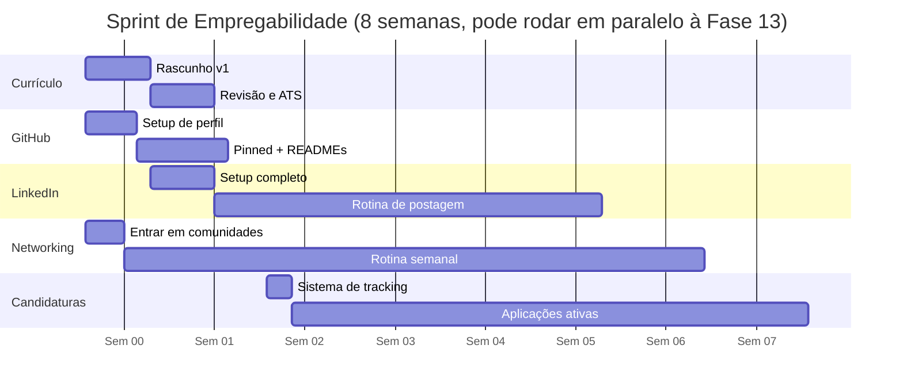
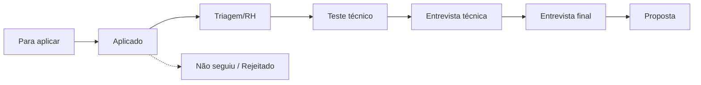

# 📖 Anexo C — Plano de Empregabilidade Aprofundado

`↩ Índice Geral: README.md` | `⬅ Relacionado: Capítulo 14 - modulo-14.md (Portfólio), Capítulo 15 - modulo-15.md (Currículo, Networking e Primeira Vaga)`

---

## Por que este anexo existe

As Fases 14 e 15 explicam **o quê** e **por quê** (estrutura de README, currículo orientado a impacto, networking genuíno). Este anexo aprofunda em **como, passo a passo, com templates prontos e cronograma semanal** — o nível de detalhe que transforma "eu sei que preciso arrumar meu currículo" em "sexta-feira às 19h eu termino a versão 1 do meu currículo".

Trate isso como um **sprint de 8 semanas**, que você roda em paralelo à Fase 13 (Projetos Profissionais) — não depois dela. Currículo, GitHub e LinkedIn devem amadurecer *junto* com seus projetos, não só no final.

---

## Visão geral do sprint de 8 semanas



> 💡 As datas acima são ilustrativas — o que importa é a **ordem relativa**: GitHub e currículo começam primeiro (são pré-requisito de qualidade para os outros passos); candidaturas ativas começam só depois que currículo e GitHub têm uma base decente (não perfeita — decente).

---

## 1. Currículo — passo a passo completo

### Semana 1 — Rascunho v1 (não busque perfeição aqui)

**Passo 1 — Brain dump (30 min, sem se editar).** Liste, sem filtro, tudo que você já fez: projetos deste guia, cursos, experiências profissionais (mesmo não-técnicas), conquistas, ferramentas que domina. Não organize ainda, só tire da cabeça.

**Passo 2 — Escolha o template.** Para tecnologia, o padrão de mercado é **simples, sem elementos gráficos pesados** (sem infográficos, sem barra de "nível de habilidade" em %, sem foto grande) — a maioria dos ATS (sistemas de triagem automática) falha ao ler currículos muito visuais.

| Ferramenta | Quando usar |
|---|---|
| **Google Docs** (template simples) | Mais rápido para começar, fácil de compartilhar link |
| **Overleaf (LaTeX)** | Visual mais "técnico", popular entre devs; curva de aprendizado maior |
| **Novoresume / Enhancv (versão gratuita)** | Bom equilíbrio entre visual e ATS-friendly |
| **Canva** | Evite para tech — tende a gerar currículos visualmente pesados, ruins para ATS |

**Passo 3 — Estrutura de uma página (template para preencher):**

```
[Nome completo]
[Cidade, Estado] · [email] · [linkedin.com/in/seu-perfil] · [github.com/seu-usuario]

RESUMO
[2-3 linhas: quem você é tecnicamente + o que busca. Ex: "Desenvolvedora Backend Junior
com base sólida em Node.js, TypeScript e arquitetura de sistemas, buscando minha
primeira oportunidade para aplicar fundamentos de engenharia em produtos reais."]

PROJETOS
[Nome do projeto] — [1 linha de impacto, ver fórmula abaixo]
  · [Tecnologia principal] · [link do repo] · [link do deploy, se houver]
[Repita para 3-4 projetos, do mais complexo para o mais simples]

FORMAÇÃO E CURSOS
[CS50 — Harvard (via edX), 2026]
[Outro curso relevante, se houver]

STACK TÉCNICA
Linguagens: JavaScript, TypeScript
Backend: Node.js, Express, NestJS
Banco de Dados: PostgreSQL, Prisma, Redis
Ferramentas: Docker, GitHub Actions, Git

EXPERIÊNCIA (se houver, mesmo não-técnica)
[Cargo] — [Empresa], [período]
  · [1-2 linhas sobre responsabilidade/conquista, focando em habilidades transferíveis:
     resolução de problema, comunicação, trabalho sob prazo]
```

**Passo 4 — A fórmula de impacto para cada projeto.** Use esta estrutura para transformar "o que o projeto faz" em algo que demonstra competência real:

```
[Verbo de ação] + [o que foi construído] + [como/com quê] + [resultado ou decisão relevante]
```

| Fraco | Forte (usando a fórmula) |
|---|---|
| "Fiz uma API de pedidos" | "Desenvolvi API de gestão de pedidos com Node.js e PostgreSQL, aplicando transações para garantir consistência de estoque sob concorrência" |
| "Projeto com testes" | "Implementei suíte de testes unitários e de integração (Jest), atingindo cobertura de 85% na lógica de negócio crítica" |
| "Deploy configurado" | "Configurei pipeline de CI/CD com GitHub Actions, automatizando lint, testes e deploy em cada merge na branch principal" |

> ⚠️ **Armadilha comum:** listar tecnologias soltas ("JavaScript, Node, SQL...") sem contexto. Isso não diferencia nada — praticamente todo candidato lista as mesmas. O que diferencia é **o que você fez com elas**.

### Semana 2 — Revisão, ATS e versão final

**Passo 5 — Checklist de revisão técnica:**

- [ ] Cabe em **uma página** (para Junior, isso é inegociável)
- [ ] Nenhum erro de português/inglês (use um corretor + leia em voz alta)
- [ ] Todos os links (LinkedIn, GitHub, projetos) funcionam de verdade
- [ ] Nomes de projeto são descritivos, não genéricos ("api-pedidos", não "projeto-final")
- [ ] Formato de arquivo: **PDF** (nunca .docx — pode quebrar formatação em outra máquina)
- [ ] Nome do arquivo profissional: `curriculo-seu-nome-backend-junior.pdf`, não `CV (2) final versão3.pdf`

**Passo 6 — Teste de compatibilidade com ATS.** Cole o texto do seu PDF em um editor de texto simples (Bloco de Notas). Se o texto sair embaralhado, fora de ordem, ou com colunas misturadas, seu currículo provavelmente vai falhar em sistemas de triagem automática (comuns em processos de empresas médias/grandes) — revise o layout, evitando tabelas complexas e colunas múltiplas.

**Passo 7 — Peça revisão de 2-3 pessoas.** Idealmente: uma pessoa técnica (para checar precisão), uma pessoa não-técnica (para checar clareza — se ela não entende o que você faz, um recrutador de RH na triagem inicial também pode não entender), e, se possível, alguém que já trabalha na área.

> 💡 **Boa prática:** mantenha 2 versões — uma em português (para vagas nacionais) e uma em inglês (para vagas remotas/internacionais) — usando vocabulário técnico correto em cada idioma, não tradução literal.

---

## 2. GitHub — configuração completa

### Checklist de perfil (faça isso primeiro, antes de aplicar para qualquer vaga)

- [ ] **Foto de perfil real e profissional** (não avatar genérico, não foto de festa)
- [ ] **Bio preenchida:** cargo desejado + 2-3 tecnologias principais (ex: "Backend Developer Junior | Node.js · TypeScript · PostgreSQL")
- [ ] **Localização e link** para LinkedIn/portfólio preenchidos no perfil
- [ ] **README de perfil** criado (repositório especial `seu-usuario/seu-usuario`)

### Template de README de perfil

```markdown
### Olá, eu sou [Seu Nome] 👋

Backend Developer Junior em formação, com foco em Node.js, TypeScript e arquitetura
de sistemas. Construindo minha base seguindo um roadmap equivalente a uma formação
sólida em Ciência da Computação, aplicada a projetos reais.

🔭 Atualmente aprofundando: [ex: "arquitetura de sistemas distribuídos"]
🌱 Meus projetos em destaque estão fixados abaixo
📫 Contato: [LinkedIn] · [email]

**Stack principal:**
`JavaScript` `TypeScript` `Node.js` `NestJS` `PostgreSQL` `Docker`
```

### Pinned repositories — quais fixar e como

Fixe **4 a 6 repositórios**, priorizando os projetos da Fase 13 (complexos, com regra de negócio real) sobre exercícios soltos das fases iniciais. Para cada um:

- **Nome do repositório claro:** `api-gestao-pedidos`, não `projeto2` ou `teste-nest`.
- **Descrição preenchida** (campo "About" do GitHub) — uma frase, visível na lista de pinned repos.
- **Topics/tags configuradas** (`nodejs`, `typescript`, `postgresql`, `rest-api`) — ajuda em buscas e comunica stack rapidamente.
- **README completo**, seguindo a estrutura da Fase 14.

### Organização geral do perfil

- Repositórios de estudo/exercícios soltos (Fases 0-9) podem ficar agrupados em **um único repositório** tipo `estudos-engenharia-de-software` com subpastas — isso evita poluir seu perfil com dezenas de repositórios pequenos e sem contexto.
- Repositórios de portfólio (Fase 13 em diante) ficam **individuais**, um por projeto, fixados.
- Mantenha o gráfico de contribuições ativo com consistência real — não é necessário commit todo santo dia, mas evite lacunas de várias semanas sem nenhuma atividade durante o período em que você está buscando vaga ativamente.

> ⚠️ **Armadilha comum:** "inflar" o gráfico de contribuições com commits vazios ou triviais só para preencher quadradinhos verdes. Recrutadores técnicos que abrem o histórico percebem isso rapidamente, e é considerado um sinal negativo (parece manipulação, não trabalho real).

---

## 3. LinkedIn — setup e rotina de manutenção

### Setup inicial (checklist)

- [ ] **Foto de perfil** igual à do GitHub (consistência de identidade — Fase 14)
- [ ] **Foto de capa** — pode ser algo simples relacionado a tech, ou apenas uma cor sólida de bom gosto; evite deixar a capa padrão do LinkedIn
- [ ] **Headline** (abaixo do nome) — não deixe "Buscando oportunidades". Use a fórmula: `[Cargo desejado] | [2-3 tecnologias principais]`. Ex: `Backend Developer Junior | Node.js, TypeScript, PostgreSQL`
- [ ] **URL personalizada** do perfil (`linkedin.com/in/seu-nome`, não uma sequência de números)

### Template da seção "Sobre"

```
Estou construindo minha carreira como Software Engineer com foco em Backend
(Node.js/TypeScript), seguindo uma formação autodidata estruturada, equivalente
em profundidade a uma base sólida de Ciência da Computação — fundamentos de
computação, algoritmos, arquitetura de software, banco de dados e segurança,
aplicados em projetos reais.

Meus projetos mais recentes resolvem problemas de negócio genuínos: [cite 1-2
exemplos rápidos, ex: "um sistema de reservas com controle de concorrência" e
"uma API multi-tenant com controle de acesso granular"].

Busco minha primeira oportunidade como Backend/Fullstack Developer Junior, em
um time onde eu possa continuar aprendendo com engenheiros mais experientes e
contribuir com qualidade desde o primeiro dia.

📫 [email] | 🔗 github.com/seu-usuario
```

### Seção "Destaques" (Featured)

Adicione, nesta ordem de prioridade: (1) link do seu melhor projeto com deploy funcionando, (2) link do seu perfil GitHub, (3) qualquer certificado ou artigo relevante que você tenha escrito.

### Experiência — como listar projetos sem experiência formal

O LinkedIn permite adicionar "Projetos" como uma seção própria (fora de "Experiência"), ou você pode criar uma entrada de experiência do tipo "Projeto Independente" com as datas do seu período de estudo. Use a mesma fórmula de impacto do currículo (Seção 1) para a descrição.

### Rotina semanal de manutenção (a partir da Semana 3, contínua)

| Dia | Ação | Tempo |
|---|---|---|
| Segunda | Comentar de forma substantiva em 2-3 posts de pessoas da área (não só "ótimo post!") | 15 min |
| Quarta | Publicar 1 post sobre o que está aprendendo/construindo (ver fórmula abaixo) | 20 min |
| Sexta | Conectar-se com 3-5 pessoas novas da área, com mensagem personalizada (ver script na Seção 5) | 15 min |

### Fórmula de post técnico (para praticar Feynman em público — Fase 0)

```
[Gancho: o que você estava tentando resolver]
[O que você aprendeu/decidiu, em 2-4 linhas, linguagem acessível]
[Opcional: um link para o projeto/repo relacionado]
[Pergunta ou convite à discussão, para gerar engajamento genuíno]
```

**Exemplo:**
> "Esta semana entendi de verdade por que `0.1 + 0.2 !== 0.3` em quase toda linguagem de programação — e não é 'bug', é como números de ponto flutuante são representados em binário (IEEE 754). Documentei o motivo e um exemplo prático aqui: [link]. Alguém mais já caiu nessa armadilha em produção? 👀"

---

## 4. Aplicação para vagas — estratégia e volume

### Sistema de tracking (kanban simples)

Use uma planilha, Notion ou Trello com estas colunas — isso evita perder o controle de candidaturas e permite fazer follow-up no momento certo:



Registre para cada vaga: empresa, data da candidatura, link da vaga, status atual, data do próximo follow-up (se aplicável), e notas pós-entrevista (o que perguntaram, como você se saiu — isso vira material de estudo para a próxima).

### Onde buscar (para além do que já foi citado na Fase 15)

- Página de carreiras das empresas citadas neste guia diretamente (não espere elas aparecerem em portal — busque ativamente).
- Filtros de "Fácil candidatura" no LinkedIn Jobs, combinados com palavras-chave específicas: "backend junior node", "desenvolvedor junior typescript", "estágio/trainee desenvolvimento".
- Comunidades de tecnologia (Seção 5) frequentemente compartilham vagas antes de irem para portais públicos — mais um motivo para estar presente nelas desde já.

### Como personalizar cada candidatura (mensagem de apresentação)

Quando a plataforma permitir (ou ao aplicar por e-mail direto), inclua uma mensagem curta — isso aumenta significativamente a taxa de resposta em relação a uma candidatura "muda":

```
Olá [nome do recrutador, se souber, senão "equipe de recrutamento da [Empresa]"],

Me candidatei para a vaga de [Cargo] porque [motivo específico e genuíno — algo
sobre o produto, stack ou cultura da empresa, não genérico].

Tenho construído uma base sólida em [stack principal], aplicada em projetos como
[nome do projeto mais relevante para ESSA vaga específica], onde [uma linha de
impacto usando a fórmula da Seção 1].

Ficaria feliz em conversar sobre como posso contribuir com o time. Segue meu
GitHub para mais detalhes: [link].

Atenciosamente,
[Seu nome]
```

> ⚠️ **Armadilha comum:** enviar a mesma mensagem genérica para todas as vagas, sem nenhuma menção específica à empresa. Isso é perceptível e reduz a taxa de resposta — mesmo uma frase específica já faz diferença.

### Volume esperado

Buscar a primeira vaga geralmente exige **volume real de candidaturas** — não é incomum precisar aplicar para 30-80 vagas ao longo de um processo de busca de alguns meses, mesmo com um bom portfólio. Trate rejeição como parte estatística esperada do processo, não como um sinal de que você não está pronta. Estabeleça uma meta semanal realista (ex: 5-10 candidaturas de qualidade por semana, priorizando personalização sobre volume puro) e mantenha-a mesmo diante de rejeições.

### Follow-up

Se não houver resposta em 7-10 dias úteis após a candidatura, um follow-up curto e educado (via LinkedIn ou e-mail) é aceitável e, muitas vezes, bem recebido:

```
Olá [nome], espero que esteja bem. Me candidatei para a vaga de [Cargo] em
[data] e gostaria de saber se há alguma atualização sobre o processo. Continuo
muito interessada na oportunidade. Obrigada pelo seu tempo!
```

---

## 5. Networking — plano de ação prático

### Onde entrar (Semana 1, uma vez só)

- **Comunidades de tecnologia brasileiras** (Discord/Telegram/WhatsApp) voltadas a desenvolvimento web/backend — pesquise as ativas no momento em que você estiver executando este plano, pois comunidades específicas mudam de popularidade ao longo do tempo.
- **Grupos locais** (meetups, se houver na sua cidade) de tecnologia.
- **Comunidade oficial** de tecnologias que você usa (ex: comunidades de Node.js, NestJS, PostgreSQL costumam ter Discord/fórum oficial).

### Script de conexão no LinkedIn (cold outreach)

```
Oi [Nome], vi que você trabalha com [área/empresa] e admiro [algo específico:
um post que a pessoa fez, um projeto, a trajetória dela]. Estou construindo
minha carreira em Backend (Node/TypeScript) e adoraria me conectar para
acompanhar seu conteúdo. Obrigada!
```

### Script para pedir uma "conversa informativa" (15-20 min)

Use isso com moderação (não em massa) e apenas depois de já ter alguma conexão mínima (comentou em posts, trocou mensagens antes):

```
Oi [Nome], tudo bem? Estou me preparando para minha primeira vaga como Backend
Developer e queria muito entender melhor como é o dia a dia em [empresa/área
dela]. Você teria 15-20 minutos nas próximas semanas para uma conversa rápida?
Prometo ser objetiva com o seu tempo. Se não rolar, sem problemas — de qualquer
forma, obrigada!
```

> 💡 **Regra de ouro:** nunca peça vaga diretamente nesse primeiro contato. O objetivo é aprender e construir relação — pedidos diretos de vaga para desconhecidos têm taxa de sucesso muito baixa e desgastam a rede antes mesmo dela existir.

### Open Source — passo a passo prático para a primeira contribuição

1. Escolha um projeto que você já usa (uma biblioteca, um framework do seu stack) — contribuir para algo que você conhece é muito mais fácil que escolher um projeto aleatório popular.
2. Procure por issues marcadas como `good first issue` ou `help wanted` no repositório no GitHub.
3. Leia o `CONTRIBUTING.md` do projeto (quase todo projeto sério tem um) antes de começar.
4. Comece pequeno: correção de documentação, correção de um bug simples e bem descrito, ou adição de um teste faltante — não tente sua primeira contribuição sendo uma feature grande.
5. Abra o Pull Request seguindo exatamente as práticas da Fase 6 (descrição clara, commits organizados).
6. Interaja educadamente com o feedback dos mantenedores — isso, por si só, já é uma forma real (e visível publicamente) de demonstrar como você trabalha em equipe.

### Hackathons

Procure hackathons (presenciais ou online) voltados a desenvolvedores iniciantes/estudantes — são, ao mesmo tempo, prática intensiva sob prazo, networking concentrado, e um item forte de currículo. Prepare-se levando: seu ambiente de desenvolvimento já configurado, conhecimento básico de uma stack rápida de prototipagem, e disposição para trabalhar em equipe com desconhecidas.

### Rotina semanal de networking (contínua, a partir da Semana 2)

| Ação | Frequência |
|---|---|
| Interagir genuinamente em comunidades (responder dúvidas, comentar) | 2-3x por semana, ~15 min cada |
| Enviar 2-3 conexões novas personalizadas no LinkedIn | 1x por semana |
| Buscar 1 "good first issue" para contribuir | A cada 2 semanas |
| Participar de 1 evento/meetup/hackathon | Conforme disponibilidade (mensal é um bom ritmo) |

---

## Checklist mestre do sprint de empregabilidade

- [ ] Currículo v1 escrito (Semana 1) e revisado/ATS-friendly (Semana 2)
- [ ] Perfil GitHub com foto, bio e README de perfil configurados
- [ ] 4-6 repositórios fixados, com README completo cada
- [ ] LinkedIn com headline, "Sobre" e "Destaques" configurados
- [ ] Rotina semanal de LinkedIn rodando (post + comentários + conexões)
- [ ] Sistema de tracking de candidaturas criado e em uso
- [ ] Pelo menos 10 candidaturas de qualidade enviadas, cada uma personalizada
- [ ] Entrada em pelo menos 2 comunidades de tecnologia ativas
- [ ] Pelo menos 1 contribuição em Open Source (mesmo pequena)
- [ ] Pelo menos 1 "conversa informativa" realizada com alguém da área

> **É isso que empresas realmente esperam de uma Junior?** Empresas não avaliam diretamente "quantas vezes você postou no LinkedIn" — mas avaliam a **consequência** de tudo isso: um perfil profissional coerente, um portfólio bem apresentado, e (frequentemente) uma indicação ou reconhecimento prévio via networking, que é, estatisticamente, um dos caminhos mais eficazes de conseguir a primeira entrevista.

---

`↩ Índice Geral: 00-INDICE-GERAL.md`
