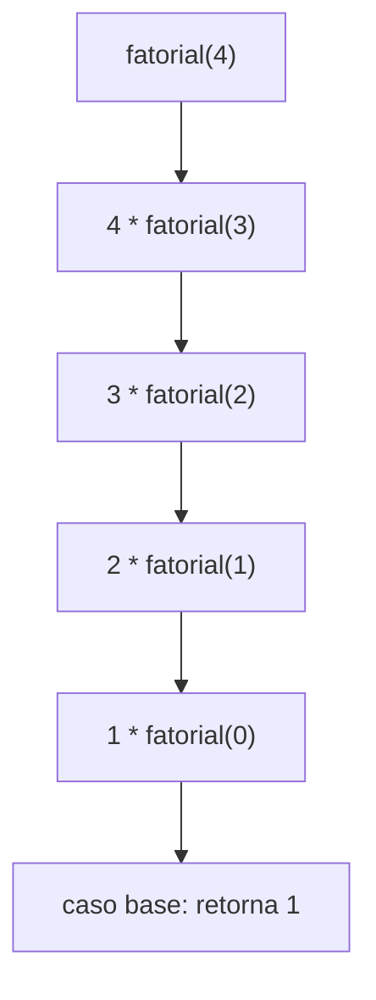

# 📖 Capítulo 2 — Fase 2: Lógica de Programação

`↩ Índice Geral: README.md` | `⬅ Anterior: Capítulo 1 - modulo-01.md (Fundamentos da Computação)` | `➡ Próximo: Capítulo 3 — modulo-03.md (JavaScript Moderno)`

---

## 🎯 Objetivo

Antes de aprender qualquer linguagem "de mercado" (JavaScript, TypeScript), você precisa dominar o raciocínio que é **independente de linguagem**: como decompor um problema, expressar solução em passos lógicos, entender custo computacional e escrever código que funcione, seja legível e seja testável. Pular esta fase é a razão número um de Juniors que "sabem sintaxe" mas travam completamente em entrevistas técnicas com problemas novos.

> **Como isso aparece no mercado:** praticamente toda entrevista técnica de Junior (LeetCode-style, ou até desafios de negócio) testa raciocínio algorítmico, não decoreba de sintaxe de framework.

---

## 📝 Conceitos

- Algoritmos e pseudocódigo
- Estruturas de controle (sequência, condição, repetição)
- Funções, parâmetros, retorno, escopo
- Recursão (base case, caso recursivo, pilha de chamadas)
- Estruturas de dados básicas (array, lista, pilha, fila, hash map/dicionário)
- Complexidade de tempo e espaço — Notação Big O
- Abstração e modularização
- Debug sistemático (não por tentativa e erro)
- Testes simples (asserts manuais, antes de frameworks de teste)

---

## 📋 Ordem de estudo

1. Algoritmos e pseudocódigo — pensar antes de codar
2. Estruturas de controle e funções
3. Estruturas de dados básicas (array, pilha, fila, hash map)
4. Recursão
5. Big O — como medir e comparar soluções
6. Debug sistemático e testes manuais

---

## 🔍 Explicação

### 1. Algoritmo antes de código

Um algoritmo é uma sequência finita e não ambígua de passos para resolver um problema. Antes de escrever qualquer linha de código de verdade, pratique escrever a solução em **pseudocódigo** ou até em português estruturado. Isso separa "pensar" de "lutar com sintaxe" — duas habilidades diferentes que iniciantes costumam confundir.

**Exemplo de pseudocódigo** para encontrar o maior número de uma lista:
```
função maior(lista):
    se lista está vazia:
        retornar erro
    maior_valor = lista[0]
    para cada item em lista:
        se item > maior_valor:
            maior_valor = item
    retornar maior_valor
```

### 2. Estruturas de controle

Todo programa, em qualquer linguagem, se resume a três estruturas combinadas: **sequência** (uma instrução após outra), **condição** (`if/else`, `switch`) e **repetição** (`for`, `while`). Domine a lógica dessas estruturas de forma abstrata — a sintaxe específica de cada linguagem você aprende depois, rapidamente, porque o raciocínio já está consolidado.

### 3. Funções

Uma função é a unidade fundamental de abstração e reuso. Entenda profundamente:
- **Parâmetros vs. argumentos.**
- **Retorno** — uma função sempre "devolve" algo (mesmo que implicitamente `undefined`/`void`).
- **Escopo** — onde uma variável "existe" e onde não existe (variáveis locais vs. globais). Esse é um dos maiores geradores de bugs em iniciantes.
- **Efeitos colaterais (side effects)** — uma função que modifica algo fora dela mesma (ex: uma variável global, o DOM, um banco de dados) tem efeito colateral. Funções sem efeito colateral (puras) são mais fáceis de testar e reutilizar — conceito que vai aparecer constantemente em Clean Code (Fase 10).

### 4. Estruturas de dados básicas

| Estrutura | O que é | Quando usar | Complexidade de acesso |
|---|---|---|---|
| **Array/Lista** | Coleção ordenada, indexada | Ordem importa, acesso por posição | O(1) acesso por índice, O(n) busca |
| **Pilha (Stack)** | LIFO — último a entrar, primeiro a sair | Desfazer ações, chamadas de função, parênteses balanceados | O(1) push/pop |
| **Fila (Queue)** | FIFO — primeiro a entrar, primeiro a sair | Filas de processamento, BFS | O(1) enqueue/dequeue |
| **Hash Map / Dicionário** | Pares chave-valor | Busca rápida por chave | O(1) médio para busca/inserção |

Entender **quando usar cada uma** é mais importante do que decorar a sintaxe — essa decisão aparece o tempo todo em entrevistas técnicas ("por que você usou um hash map aqui em vez de um array?").

### 5. Recursão

Uma função recursiva é uma função que chama a si mesma, sempre com dois componentes obrigatórios:
- **Caso base:** a condição que para a recursão (sem isso, estouro de pilha — lembra da Fase 1?).
- **Caso recursivo:** a chamada da função com um problema "menor" que se aproxima do caso base.



> ⚠️ **Armadilha comum:** esquecer o caso base ou defini-lo de forma que nunca é alcançado, causando recursão infinita (stack overflow — agora você entende por quê, graças à Fase 1).

### 6. Big O — medindo eficiência

Big O descreve como o tempo (ou espaço) de execução de um algoritmo cresce conforme o tamanho da entrada (`n`) cresce. Não é sobre velocidade absoluta, é sobre **taxa de crescimento**.

| Notação | Nome | Exemplo |
|---|---|---|
| O(1) | Constante | Acessar item por índice em array |
| O(log n) | Logarítmica | Busca binária |
| O(n) | Linear | Percorrer um array uma vez |
| O(n log n) | Linearítmica | Bons algoritmos de ordenação (merge sort) |
| O(n²) | Quadrática | Loops aninhados sobre a mesma coleção |
| O(2ⁿ) | Exponencial | Fibonacci recursivo ingênuo |

> **Como isso aparece no mercado:** é praticamente garantido que uma entrevista técnica pergunte "qual a complexidade dessa solução?" depois de você resolver um exercício. Não saber responder é um sinal de alerta imediato para o entrevistador, mesmo que a solução funcione.

### 7. Debug sistemático

Iniciantes debugam por tentativa e erro ("vou mudar isso aqui e ver se funciona"). Engenheiras debugam metodicamente:
1. Reproduza o erro de forma consistente.
2. Isole a menor parte do código que causa o problema.
3. Formule uma hipótese sobre a causa.
4. Teste a hipótese (com `console.log`, debugger, ou testes).
5. Corrija e **confirme** que o problema realmente sumiu (não apenas "parece que sumiu").

---

## 💻 O que dominar

- [ ] Escrever pseudocódigo antes de codar qualquer solução nova
- [ ] Implementar busca linear e busca binária do zero
- [ ] Implementar pilha e fila do zero (sem usar estrutura pronta da linguagem)
- [ ] Escrever funções recursivas com caso base corretamente definido
- [ ] Calcular a complexidade Big O de um algoritmo simples, olhando o código
- [ ] Debugar sistematicamente, formulando hipóteses testáveis

---

## ⚠️ Erros comuns

1. Ir direto para o código sem pensar no algoritmo — resulta em soluções desorganizadas e retrabalho.
2. Confundir escopo de variável, causando bugs silenciosos.
3. Recursão sem caso base ou com caso base inalcançável.
4. Escolher a estrutura de dados errada (ex: usar array com busca linear O(n) quando um hash map resolveria em O(1)).
5. "Debug por sorte" — mudar código aleatoriamente até "funcionar", sem entender a causa raiz.

---

## 🧠 Exercícios

**Iniciante**
1. Escreva pseudocódigo e depois implemente uma função que verifica se um número é primo.
2. Implemente FizzBuzz (clássico, mas ainda usado como filtro inicial em processos seletivos reais).
3. Implemente uma função que inverte uma string sem usar métodos prontos de inversão.

**Intermediário**
4. Implemente uma pilha e uma fila do zero (usando array como base), com métodos `push/pop` e `enqueue/dequeue`.
5. Implemente busca binária recursiva e iterativa; compare e explique a complexidade de cada uma.
6. Dado um array de números, encontre o segundo maior valor sem ordenar o array (deve ser O(n), não O(n log n)).

**Avançado**
7. Implemente uma função recursiva para calcular a sequência de Fibonacci, depois otimize-a usando memoização (introdução prática a *programação dinâmica*).
8. Dado um array de inteiros e um valor alvo, encontre dois números que somam o alvo, em O(n) usando hash map (o clássico "Two Sum").

**Desafio final**
9. Implemente um verificador de parênteses balanceados (`(){}[]`) usando uma pilha, tratando corretamente casos de aninhamento incorreto.

---

## 🌱 Projetos

**Projeto 1 — Motor de busca de texto simples (CLI)**
Construa uma ferramenta de linha de comando que recebe uma lista de "documentos" (strings) e uma palavra-chave, e retorna quais documentos contêm a palavra, com contagem de ocorrências — sem usar métodos de busca prontos da linguagem para a lógica central. Simula, em miniatura, o problema real de indexação que sistemas de busca resolvem.

**Projeto 2 — Simulador de fila de atendimento (como um banco/hospital)**
Modele um sistema de fila de atendimento com prioridades (ex: idosos e gestantes têm prioridade). Use fila e, para as prioridades, uma estrutura adequada (fila de prioridade / heap simplificado). Esse é um problema real que aparece em sistemas de agendamento e atendimento — não um "todo list".

---

## ✔️ Critério de conclusão

Você conclui a Fase 2 quando resolve os exercícios avançados sem consultar solução pronta, consegue explicar a complexidade Big O de qualquer solução que escreve, e implementou as estruturas de dados básicas do zero pelo menos uma vez cada.

> **É isso que empresas realmente esperam de uma Junior?** Sim, e é um dos pontos mais cobrados de fato. Praticamente toda entrevista técnica de Junior em empresas de tecnologia (de startups a Big Techs) testa esse raciocínio, independente da stack usada no dia a dia.

---

`↩ Índice Geral: README.md` | `➡ Próximo: Capítulo 3 — modulo-03.md (JavaScript Moderno)`
