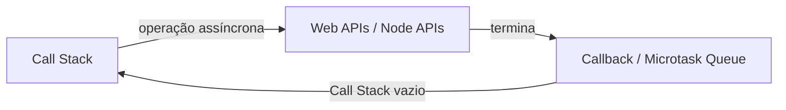

# 📖 Capítulo 3 — Fase 3: JavaScript Moderno

`↩ Índice Geral: README.md` | `⬅ Anterior: Capítulo 2 - modulo-02.md (Lógica de Programação)` | `➡ Próximo:  Capítulo 4 - modulo-04.md (TypeScript)`

---

## 🎯 Objetivo

JavaScript é, em 2026, a linguagem mais usada do planeta em termos de número de desenvolvedores ativos, e a linguagem-base do seu caminho (Backend com JS/TS). Esta fase existe para que você entenda JavaScript **de verdade** — não apenas "sintaxe de framework" — incluindo suas peculiaridades, seu modelo de concorrência (event loop), e os recursos modernos da linguagem (ES2015+) que todo código profissional usa hoje.

> **Como isso aparece no mercado:** perguntas sobre closures, `this`, event loop, Promises e diferenças entre `var/let/const` são extremamente comuns em entrevistas técnicas para vagas JS/TS, mesmo Junior.

---

## 📝 Conceitos

- Tipos primitivos e tipagem dinâmica
- `var`, `let`, `const` e escopo (block scope vs. function scope)
- Funções: declarações, expressões, arrow functions
- `this` e como ele muda de contexto
- Closures
- Hoisting
- Objetos, arrays e seus métodos funcionais (`map`, `filter`, `reduce`, etc.)
- Destructuring, spread/rest operator
- Programação assíncrona: callbacks, Promises, `async/await`
- Event Loop, Call Stack, Callback Queue, Microtask Queue
- Módulos ES (`import`/`export`)
- Classes e Protótipos (herança prototípica)
- Tratamento de erros (`try/catch`, erros customizados)
- Novidades modernas: optional chaining (`?.`), nullish coalescing (`??`), template literals

---

## 📋 Ordem de estudo

1. Fundamentos: tipos, variáveis, escopo
2. Funções e `this`
3. Closures e hoisting
4. Arrays, objetos e métodos funcionais
5. Programação assíncrona (callbacks → Promises → async/await)
6. Event Loop (o "porquê" por trás do assíncrono)
7. Módulos, classes e tratamento de erros
8. Sintaxe moderna (ES2015+)

---

## 🔍 Explicação

### 1. Tipagem dinâmica e tipos primitivos

JavaScript é **dinamicamente tipado** (o tipo de uma variável pode mudar em tempo de execução) e tem tipos primitivos: `string`, `number`, `boolean`, `null`, `undefined`, `symbol`, `bigint`. Tudo que não é primitivo é um **objeto** (incluindo arrays e funções).

> ⚠️ **Armadilha comum:** confundir `null` (ausência intencional de valor) com `undefined` (variável declarada mas não atribuída, ou propriedade inexistente). Essa distinção aparece constantemente em bugs reais e em entrevistas.

### 2. `var`, `let`, `const`

- `var`: escopo de função, sofre *hoisting* com inicialização em `undefined`. **Evite usar em código moderno.**
- `let`: escopo de bloco, pode ser reatribuída.
- `const`: escopo de bloco, não pode ser reatribuída (mas, se for um objeto/array, seu **conteúdo** pode ser mutado — isso confunde muito iniciante).

**Regra profissional:** use `const` por padrão; use `let` só quando precisar reatribuir; nunca use `var` em código novo.

### 3. `this`

`this` em JavaScript não é fixo como em outras linguagens — seu valor depende de **como a função é chamada**, não de onde ela é definida (exceto em arrow functions, que "herdam" o `this` do escopo léxico onde foram criadas). Esse é um dos tópicos que mais gera bugs e mais aparece em entrevistas.

| Forma de chamada | Valor de `this` |
|---|---|
| `objeto.metodo()` | O objeto antes do ponto |
| Função solta `funcao()` | `undefined` (modo estrito) ou objeto global |
| Arrow function | `this` do escopo onde foi definida (léxico) |
| `new Funcao()` | O novo objeto sendo criado |
| `funcao.call(obj)` / `.apply()` / `.bind()` | O objeto passado explicitamente |

### 4. Closures

Uma closure é uma função que "lembra" do escopo onde foi criada, mesmo depois que esse escopo já terminou de executar. É a base de padrões como *encapsulamento*, *factory functions*, e é constantemente cobrada em entrevistas técnicas.

```javascript
function criarContador() {
  let contagem = 0; // "presa" na closure
  return function () {
    contagem++;
    return contagem;
  };
}

const contador = criarContador();
console.log(contador()); // 1
console.log(contador()); // 2 — "contagem" persiste entre chamadas
```

### 5. Programação assíncrona

JavaScript é **single-threaded** (uma única thread de execução principal), mas consegue lidar com operações demoradas (rede, arquivo, timers) sem travar, através do **Event Loop**.

**Evolução histórica que você precisa entender (não só usar):**
1. **Callbacks:** funções passadas como argumento, executadas quando a operação assíncrona termina. Geram o problema do "callback hell" (aninhamento excessivo).
2. **Promises:** objetos que representam um valor futuro (`pending`, `fulfilled`, `rejected`), permitindo encadeamento com `.then()`/`.catch()`.
3. **async/await:** açúcar sintático sobre Promises, permitindo escrever código assíncrono com aparência síncrona — o padrão da indústria hoje.

```javascript
// Callback (evitar em código novo)
buscarDados(id, (erro, dados) => { ... });

// Promise
buscarDados(id).then(dados => ...).catch(erro => ...);

// async/await (padrão atual)
async function processar(id) {
  try {
    const dados = await buscarDados(id);
    return dados;
  } catch (erro) {
    console.error(erro);
  }
}
```

### 6. Event Loop — o coração do JavaScript assíncrono

Este é, sem exagero, um dos tópicos mais decisivos em entrevistas para vagas JS/Node. O modelo:



- **Call Stack:** onde o código síncrono executa, uma coisa de cada vez.
- **Web APIs / Node APIs:** onde operações assíncronas (timers, requisições de rede, leitura de arquivo) realmente acontecem "por fora" da thread principal.
- **Microtask Queue:** fila de alta prioridade (Promises) — executada **antes** da próxima tarefa da Callback Queue.
- **Callback/Macrotask Queue:** fila de menor prioridade (ex: `setTimeout`).
- **Event Loop:** o mecanismo que constantemente verifica se a Call Stack está vazia para empurrar a próxima tarefa das filas.

> 💡 **Pergunta clássica de entrevista:** "qual a ordem de impressão desse código com `console.log`, `setTimeout` e uma Promise misturados?" — se você entende o Event Loop, você acerta sem decorar; se não entende, você chuta.

### 7. Métodos funcionais de array

`map`, `filter`, `reduce`, `find`, `some`, `every` são o padrão profissional para manipular coleções — muito mais legível e menos propenso a erro do que loops `for` manuais na maioria dos casos.

```javascript
const pedidos = [{ valor: 100, status: 'pago' }, { valor: 50, status: 'pendente' }];

const totalPago = pedidos
  .filter(p => p.status === 'pago')
  .reduce((soma, p) => soma + p.valor, 0);
```

> **Como isso aparece no mercado:** código profissional moderno praticamente não usa `for` para transformar coleções — usa métodos funcionais. Escrever `for` onde `map/filter/reduce` seria mais claro é um sinal de código "não idiomático" em code review.

---

## 💻 O que dominar

- [ ] Explicar a diferença entre `var`, `let` e `const`, e por que evitar `var`
- [ ] Explicar como `this` se comporta em diferentes contextos de chamada
- [ ] Escrever e explicar uma closure funcional
- [ ] Escrever código assíncrono usando `async/await` com tratamento de erro (`try/catch`)
- [ ] Explicar o Event Loop com um exemplo de código e prever a ordem de execução
- [ ] Usar `map`, `filter`, `reduce` fluentemente, sem recorrer sempre a `for`
- [ ] Explicar herança prototípica e como `class` em JS é açúcar sintático sobre protótipos

---

## ⚠️ Erros comuns

1. Usar `var` em código novo (gera bugs de escopo sutis).
2. Confundir arrow function com função tradicional em métodos de objeto (perder o `this` esperado).
3. Misturar `async/await` com `.then()` desnecessariamente, gerando código confuso.
4. Não tratar erros em código assíncrono (`await` sem `try/catch`, Promise sem `.catch()`).
5. Mutar objetos/arrays declarados com `const` acreditando que isso os torna "imutáveis" (const impede reatribuição, não mutação).
6. Não entender o Event Loop e "chutar" a ordem de execução de código assíncrono.

---

## 🧠 Exercícios

**Iniciante**
1. Escreva uma função que recebe um array de números e retorna apenas os pares, usando `filter`.
2. Escreva uma closure que implementa um contador com `incrementar()` e `resetar()`.
3. Reescreva um loop `for` que soma valores de um array usando `reduce`.

**Intermediário**
4. Implemente uma função `debounce` do zero (usada para limitar chamadas repetidas, como em um campo de busca) — isso exige entender closures e timers profundamente.
5. Escreva uma função assíncrona que busca dados de 3 "APIs" simuladas (usando `setTimeout` dentro de uma Promise) em paralelo, usando `Promise.all`.
6. Preveja e depois teste a ordem de impressão de um trecho de código misturando `console.log`, `setTimeout(fn, 0)` e `Promise.resolve().then(fn)`.

**Avançado**
7. Implemente uma versão simplificada de `Promise` do zero (um "Promise polyfill" básico com `then` e resolução de estado) — exercício clássico para entender profundamente o mecanismo por trás.
8. Refatore um trecho de "callback hell" (3+ callbacks aninhados) para `async/await`.

**Desafio final**
9. Construa um pequeno "rate limiter" (limitador de chamadas) usando closures e timers, que impede uma função de ser chamada mais que N vezes em um intervalo de tempo — um problema real de engenharia (usado em APIs para prevenir abuso).

---

## 🌱 Projetos

**Projeto 1 — Agregador de cotações (simulado)**
Construa um script que consulta múltiplas "fontes" assíncronas simuladas (funções com `setTimeout` representando APIs de câmbio/bolsa) em paralelo, trata falhas parciais (uma fonte pode falhar sem quebrar as outras — usando `Promise.allSettled`), e retorna um relatório consolidado. Simula um problema real de sistemas financeiros que agregam múltiplas fontes de dados.

**Projeto 2 — Motor de regras de desconto (e-commerce)**
Dado um carrinho de compras (array de produtos com categoria, preço, quantidade) e um conjunto de regras de negócio (ex: "10% de desconto acima de R$200", "frete grátis para categoria X"), implemente um motor que aplica as regras usando composição de funções puras (`map`/`filter`/`reduce`), sem mutar o carrinho original. Este é um problema real e recorrente em sistemas de e-commerce (Mercado Livre, iFood, etc. resolvem variações disso).

---

## ✔️ Critério de conclusão

Você conclui a Fase 3 quando resolve os exercícios avançados sem consultar, escreve código assíncrono corretamente tratado, e consegue explicar o Event Loop com um exemplo de código na ponta da língua — sem decorar a explicação, mas raciocinando sobre ela.

> **É isso que empresas realmente esperam de uma Junior?** Sim, integralmente. JavaScript moderno bem dominado (não apenas "sei usar React") é o requisito mínimo absoluto para qualquer vaga de backend ou fullstack JS/TS em 2026.

---

## 📄 Documentações

- **MDN Web Docs (developer.mozilla.org)** — a fonte da verdade para JavaScript. Sempre priorize sobre tutoriais de terceiros.
- **TC39 proposals (github.com/tc39/proposals)** — para entender o que está vindo na linguagem (avançado, mas útil para acompanhar evolução).

---

`↩ Índice Geral: README.md` | `➡ Próximo: modulo-04.md (TypeScript)`
