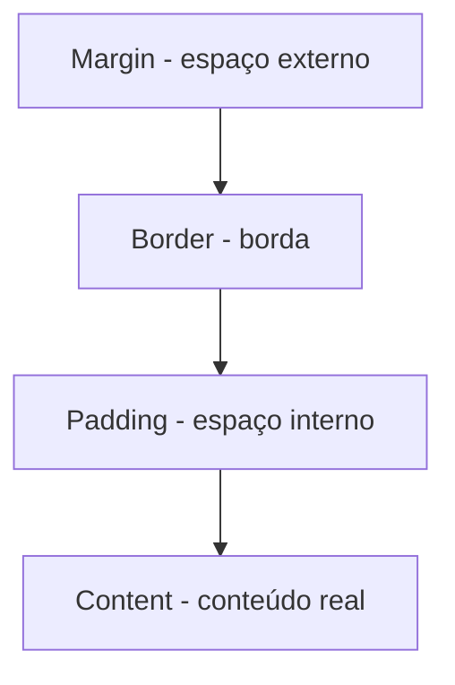

# 📖 Capítulo 5 — Fase 5: HTML, CSS, Responsividade e Acessibilidade

`↩ Índice Geral: README.md` | `⬅ Anterior: Capítulo 4 - modulo-04.md (TypeScript)` | `➡ Próximo: Capítulo 6 - modulo-06.md (Git, GitHub e Fluxo Profissional)`

---

## 🎯 Objetivo

Mesmo em uma trilha focada em Backend, um Software Engineer completo entende o outro lado da aplicação. Você não precisa virar especialista em frontend, mas precisa ser capaz de construir uma interface funcional, semântica, responsiva e acessível — porque isso é frequentemente pedido em desafios técnicos de vaga Backend/Fullstack Junior, e porque entender o "consumidor" da sua API (o frontend) torna você uma engenheira backend melhor.

> **Como isso aparece no mercado:** muitas vagas "Backend Junior" ainda pedem HTML/CSS básico e capacidade de construir uma tela simples de admin/dashboard, especialmente em startups menores.

---

## 📝 Conceitos

- HTML semântico (tags com significado, não apenas `div` genérico)
- Formulários e validação nativa
- CSS: seletores, especificidade, box model
- Flexbox e CSS Grid
- Responsividade (mobile-first, media queries)
- Acessibilidade (WCAG, ARIA, navegação por teclado)
- Fundamentos de UX (hierarquia visual, feedback ao usuário)

---

## 📋 Ordem de estudo

1. HTML semântico e formulários
2. Box model e seletores CSS
3. Flexbox
4. CSS Grid
5. Responsividade (mobile-first)
6. Acessibilidade
7. Fundamentos de UX aplicados

---

## 🔍 Explicação

### 1. HTML semântico

HTML semântico usa tags que descrevem o **significado** do conteúdo, não apenas sua aparência: `<header>`, `<nav>`, `<main>`, `<article>`, `<section>`, `<footer>`, em vez de `<div>` para tudo. Isso importa por três razões concretas:

- **SEO:** motores de busca entendem melhor a estrutura da página.
- **Acessibilidade:** leitores de tela dependem de semântica para navegação.
- **Manutenibilidade:** outro desenvolvedor entende a estrutura só de ler o HTML.

> ⚠️ **Armadilha comum ("divitis"):** usar `<div>` para absolutamente tudo, incluindo botões (`<div onclick="...">`) em vez de `<button>`. Isso quebra acessibilidade nativa (foco por teclado, leitores de tela) e é considerado código de baixa qualidade em qualquer review sério.

### 2. Box Model

Todo elemento HTML é uma caixa retangular composta por: **content → padding → border → margin**. Entender isso profundamente evita a maior fonte de frustração de iniciantes em CSS ("por que esse elemento não fica onde eu quero").



`box-sizing: border-box` (padrão profissional universal) faz com que `width`/`height` incluam padding e border, evitando cálculos manuais confusos.

### 3. Flexbox

Sistema de layout unidimensional (linha OU coluna), ideal para distribuir espaço entre itens, alinhar elementos e construir componentes como barras de navegação, cards, formulários.

```css
.container {
  display: flex;
  justify-content: space-between; /* eixo principal */
  align-items: center;            /* eixo cruzado */
  gap: 16px;
}
```

### 4. CSS Grid

Sistema de layout bidimensional (linhas E colunas simultaneamente), ideal para estruturas de página inteiras (dashboards, grids de produtos).

```css
.dashboard {
  display: grid;
  grid-template-columns: 240px 1fr;
  grid-template-rows: 64px 1fr;
  gap: 16px;
}
```

**Regra prática do mercado:** Flexbox para componentes e alinhamento; Grid para a estrutura macro da página. Muitos layouts combinam os dois.

### 5. Responsividade (mobile-first)

A abordagem profissional padrão é **mobile-first**: você estiliza primeiro para a tela pequena (o caso mais restritivo) e depois adiciona `media queries` para telas maiores — o oposto do que muitos iniciantes fazem (estilizar para desktop e "consertar" para mobile depois).

```css
.card { flex-direction: column; } /* mobile por padrão */

@media (min-width: 768px) {
  .card { flex-direction: row; } /* tablet/desktop */
}
```

### 6. Acessibilidade (a11y)

Acessibilidade não é um "extra" — é um requisito de qualidade profissional, e cada vez mais uma exigência legal (Lei Brasileira de Inclusão, WCAG como padrão internacional). O mínimo que você precisa dominar:

- Contraste de cor adequado.
- Texto alternativo (`alt`) em imagens.
- Formulários com `<label>` associado corretamente a cada campo.
- Navegação completa por teclado (Tab, Enter, Esc funcionando).
- Uso correto de atributos ARIA **apenas quando HTML semântico não é suficiente** (regra geral: "não use ARIA se um elemento HTML nativo já resolve").

> **Como isso aparece no mercado:** empresas com maturidade técnica (bancos digitais, grandes e-commerces) têm requisitos formais de acessibilidade em code review — ignorar isso é considerado falha de qualidade, não "detalhe estético".

### 7. Fundamentos de UX aplicados

Você não precisa ser designer, mas precisa entender princípios básicos que evitam interfaces confusas: hierarquia visual clara (o que é mais importante deve se destacar mais), feedback imediato ao usuário (loading states, mensagens de erro claras), consistência visual.

---

## 💻 O que dominar

- [ ] Escrever HTML semântico corretamente, sem abusar de `<div>`
- [ ] Explicar e aplicar o box model, incluindo `box-sizing: border-box`
- [ ] Construir layouts com Flexbox fluentemente
- [ ] Construir layouts com CSS Grid para estruturas de página
- [ ] Escrever CSS responsivo mobile-first
- [ ] Aplicar critérios básicos de acessibilidade (contraste, `alt`, `label`, navegação por teclado)

---

## ⚠️ Erros comuns

1. "Divitis" — usar `<div>` para tudo, ignorando semântica.
2. Estilizar para desktop primeiro e "remendar" para mobile depois.
3. Ignorar acessibilidade completamente ("isso é problema do time de design").
4. Usar `!important` para resolver problemas de especificidade CSS em vez de entender a cascata.
5. Não testar em diferentes tamanhos de tela reais (só olhar no próprio monitor grande).

---

## 🧠 Exercícios

**Iniciante**
1. Construa uma página de perfil simples usando apenas HTML semântico (sem CSS ainda), garantindo que faça sentido estruturalmente mesmo sem estilo.
2. Estilize essa página com Flexbox para alinhar informações em coluna no mobile e em linha no desktop.

**Intermediário**
3. Construa um formulário de cadastro completo com `label` associado a cada campo, validação nativa HTML5 (`required`, `type="email"`, etc.) e mensagens de erro visuais.
4. Construa um layout de dashboard (sidebar + header + conteúdo) usando CSS Grid, responsivo (sidebar vira menu colapsável no mobile).

**Avançado**
5. Pegue uma interface existente (pode ser uma sua) e faça uma auditoria de acessibilidade manual: navegue só com teclado, verifique contraste de cores, adicione `alt` faltantes.

**Desafio final**
6. Construa um card de produto de e-commerce (imagem, nome, preço, botão de compra, badge de desconto) totalmente responsivo e acessível, do zero, sem frameworks CSS prontos (Bootstrap/Tailwind) — para consolidar o domínio de CSS puro antes de usar ferramentas que abstraem isso.

---

## 🌱 Projetos

**Projeto 1 — Painel administrativo simples (admin dashboard)**
Construa a interface (sem backend real ainda, com dados mockados) de um painel administrativo com listagem de itens em tabela, filtros, e um formulário de cadastro/edição — responsivo e acessível. Este é o tipo de tela que toda empresa com sistema interno precisa, e é um excelente exercício de HTML/CSS aplicado a um caso real de negócio.

---

## ✔️ Critério de conclusão

Você conclui a Fase 5 quando constrói uma interface completa, responsiva e com critérios básicos de acessibilidade, sem depender de frameworks CSS prontos, e consegue explicar cada decisão de layout que tomou.

> **É isso que empresas realmente esperam de uma Junior de Backend?** Parcialmente — o nível de profundidade aqui é suficiente para "se virar" em telas simples e entender o que o time de frontend faz, mas não te torna uma especialista em frontend. Isso é intencional: seu foco é backend, e esta fase existe para completude de formação, não para especialização.

---

`↩ Índice Geral: README.md` | `➡ Próximo:  Capítulo 6 - modulo-06.md (Git, GitHub e Fluxo Profissional)`
