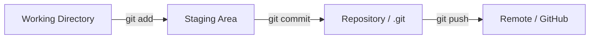
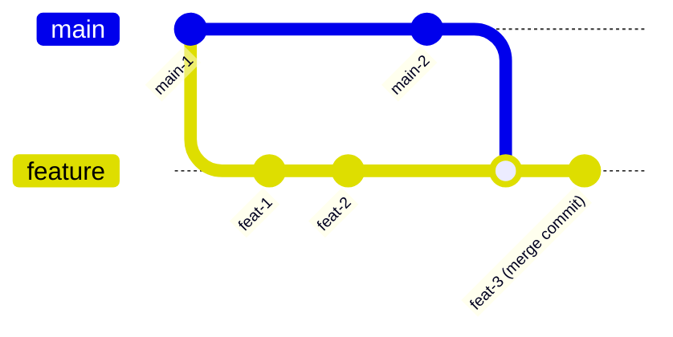

# 📖 Capítulo 6 — Fase 6: Git, GitHub e Fluxo Profissional

`↩ Índice Geral: README.md` | `⬅ Anterior:  Capítulo 5 - modulo-05.md (HTML, CSS, Responsividade e Acessibilidade)` | `➡ Próximo:  Capítulo 7 - modulo-07.md (Node.js, APIs REST e Autenticação)`

---

## 🎯 Objetivo

Git não é "só um lugar para guardar código" — é a ferramenta que define como equipes de engenharia colaboram sem se destruir mutuamente. Uma Junior que não domina Git profissionalmente (além do básico `add/commit/push`) gera atrito real em qualquer time no primeiro mês de trabalho. Esta fase transforma Git de "ferramenta que uso sem entender" para "ferramenta que domino e uso estrategicamente".

> **Como isso aparece no mercado:** em praticamente toda empresa, seu primeiro Pull Request é avaliado tanto pelo código quanto pela forma como você usou Git (commits organizados, branch bem nomeada, PR bem descrito).

---

## 📝 Conceitos

- Repositório, working directory, staging area, commit
- Branching e merging
- Conflitos de merge (e como resolvê-los)
- Rebase vs. Merge
- Conventional Commits
- GitFlow e Trunk-Based Development
- Pull Requests / Merge Requests
- Code Review (como dar e receber)
- `.gitignore`, `git stash`, `git cherry-pick`, `git bisect` (nível intermediário/avançado)

---

## 📋 Ordem de estudo

1. Fundamentos: repositório, commit, staging area
2. Branches e merge
3. Resolução de conflitos
4. Conventional Commits
5. Rebase vs. Merge (quando usar cada um)
6. Fluxos de trabalho profissionais (GitFlow, Trunk-Based)
7. Pull Requests e Code Review

---

## 🔍 Explicação

### 1. Os três estados de um arquivo no Git



Entender essa separação (working directory → staging → commit) explica **por que** `git add` existe: ele permite que você monte um commit com exatamente as mudanças que fazem sentido juntas, mesmo que você tenha alterado vários arquivos por motivos diferentes.

> ⚠️ **Armadilha comum:** usar `git add .` sempre, sem revisar o que está sendo commitado, misturando mudanças não relacionadas em um único commit — dificultando revisão e histórico.

### 2. Branches

Uma branch é uma linha independente de desenvolvimento. O fluxo profissional padrão: você nunca trabalha direto na branch principal (`main`); cria uma branch nova para cada funcionalidade/correção, e a integra de volta via Pull Request.

```bash
git checkout -b feature/autenticacao-jwt
# ... trabalho e commits ...
git push origin feature/autenticacao-jwt
# Abre-se um Pull Request no GitHub
```

### 3. Conventional Commits

Um padrão amplamente adotado pela indústria para mensagens de commit, que torna o histórico legível e permite automação (geração de changelog, versionamento semântico automático):

```
feat: adiciona autenticação via JWT
fix: corrige validação de e-mail duplicado
refactor: extrai lógica de hash de senha para service dedicado
docs: atualiza README com instruções de setup
test: adiciona testes para endpoint de login
chore: atualiza dependências
```

| Prefixo | Quando usar |
|---|---|
| `feat` | Nova funcionalidade |
| `fix` | Correção de bug |
| `refactor` | Mudança de código sem alterar comportamento |
| `docs` | Mudança de documentação |
| `test` | Adição/ajuste de testes |
| `chore` | Tarefas de manutenção (deps, configs) |

> **Como isso aparece no mercado:** times profissionais frequentemente **bloqueiam** merge de commits que não seguem o padrão (via linters de commit, como `commitlint`). Aprender isso desde já evita retrabalho no seu primeiro emprego.

### 4. Rebase vs. Merge

- **Merge:** junta duas branches criando um "commit de merge", preservando o histórico exatamente como aconteceu (incluindo os desvios).
- **Rebase:** reescreve o histórico da sua branch como se ela tivesse sido criada a partir do estado mais recente da branch principal — resulta em um histórico linear, mais limpo.



**Regra prática usada por muitos times:** rebase suas próprias branches locais (antes de abrir PR) para manter histórico limpo; use merge (via Pull Request) para integrar à branch principal, preservando rastreabilidade.

> ⚠️ **Regra de ouro:** nunca faça rebase de uma branch que outras pessoas já estão usando/baixaram — isso reescreve histórico compartilhado e causa caos para o time.

### 5. Resolução de conflitos

Um conflito acontece quando duas mudanças concorrentes afetam a mesma linha (ou linhas próximas) de um arquivo. O Git marca o conflito no arquivo:

```
<<<<<<< HEAD
const taxaDesconto = 0.10;
=======
const taxaDesconto = 0.15;
>>>>>>> feature/ajuste-desconto
```

Resolver significa **entender ambas as mudanças** (não apenas escolher uma ao acaso), decidir o resultado correto, remover os marcadores, e commitar. Conflitos mal resolvidos são uma fonte real e comum de bugs em produção.

### 6. GitFlow vs. Trunk-Based Development

| | GitFlow | Trunk-Based Development |
|---|---|---|
| Branches longas | Sim (`develop`, `release`, `hotfix`) | Não — branches curtas, integradas rapidamente |
| Complexidade | Alta | Baixa |
| Uso em 2026 | Projetos com ciclos de release formais/lentos | **Padrão dominante** em times ágeis, deploy contínuo |

> **O que empresas usam hoje:** a maioria das empresas modernas com CI/CD (que você verá na Fase 11) usa **Trunk-Based Development** ou variações simplificadas de GitFlow — branches curtas, integração frequente, feature flags para funcionalidades incompletas. GitFlow "clássico" ainda existe, mas é considerado pesado demais para o ritmo de entrega atual da maioria dos times.

### 7. Pull Requests e Code Review

Um Pull Request não é apenas "meu código está pronto" — é uma proposta de mudança, documentada, para ser revisada por pares. Um bom PR:

- Tem título e descrição claros (o quê e por quê, não apenas "fix").
- É pequeno o suficiente para ser revisado com atenção (PRs gigantes são revisados superficialmente ou ignorados).
- Passa em testes automatizados antes de pedir revisão humana.
- Referencia a issue/ticket relacionado.

**Como receber code review:** trate feedback como colaboração, não ataque pessoal. Perguntas do revisor geralmente indicam algo que não ficou claro no código — considere se o código (ou um comentário) poderia esclarecer isso.

**Como dar code review (você também vai revisar código de colegas, mesmo Junior):** foque em coisas que importam (lógica, legibilidade, testes) e não em preferências estéticas triviais; seja específica e sugira, não apenas aponte problemas.

---

## 💻 O que dominar

- [ ] Explicar os três estados de um arquivo no Git (working directory, staging, commit)
- [ ] Criar, trocar e mesclar branches confortavelmente
- [ ] Resolver conflitos de merge entendendo ambas as mudanças
- [ ] Escrever mensagens de commit seguindo Conventional Commits
- [ ] Explicar a diferença entre rebase e merge, e quando usar cada um
- [ ] Abrir um Pull Request bem descrito, pequeno e revisável
- [ ] Dar e receber feedback de code review de forma construtiva

---

## ⚠️ Erros comuns

1. Commits gigantes, com dezenas de arquivos e nenhuma relação lógica entre as mudanças.
2. Mensagens de commit vagas ("ajustes", "fix", "wip").
3. Trabalhar direto na `main`/`master` em vez de criar branches.
4. Fazer rebase de branch compartilhada, quebrando o histórico de colegas.
5. Resolver conflitos escolhendo um lado "no automático", sem entender o que a outra mudança fazia (causa bugs silenciosos).
6. Abrir Pull Requests enormes, difíceis de revisar com qualidade.

---

## 🧠 Exercícios

**Iniciante**
1. Configure Git localmente (nome, e-mail, editor padrão) e crie seu primeiro repositório com pelo menos 5 commits seguindo Conventional Commits.
2. Crie uma branch, faça uma mudança, e faça merge de volta na `main` localmente.

**Intermediário**
3. Simule um conflito de merge propositalmente (duas branches alterando a mesma linha de um arquivo) e resolva-o corretamente.
4. Pratique `git rebase -i` (rebase interativo) para squash (combinar) commits pequenos em um commit mais coeso antes de "enviar" para revisão.

**Avançado**
5. Use `git bisect` para encontrar, em um histórico com múltiplos commits, qual commit específico introduziu um bug proposital que você mesma vai inserir.
6. Configure um repositório com proteção de branch (`main` protegida, exigindo Pull Request) no GitHub.

**Desafio final**
7. Simule um fluxo de trabalho completo: crie uma branch, faça 3-4 commits pequenos e bem descritos, abra um Pull Request no GitHub com descrição completa (o quê, por quê, como testar), e revise seu próprio PR como se fosse outra pessoa, apontando pelo menos uma melhoria possível.

---

## 🌱 Projetos

Esta fase não gera um "projeto de portfólio" isolado — ao contrário, ela define o **fluxo de trabalho** que você vai aplicar em todos os projetos das próximas fases. A partir daqui, todo projeto deste guia deve ser desenvolvido usando branches, commits seguindo Conventional Commits, e (idealmente) Pull Requests, mesmo trabalhando sozinha — isso constrói o hábito antes que ele seja cobrado profissionalmente.

---

## ✔️ Critério de conclusão

Você conclui a Fase 6 quando consegue trabalhar com branches, resolver conflitos, escrever commits seguindo o padrão da indústria, e abrir um Pull Request bem estruturado, sem consultar tutorial.

> **É isso que empresas realmente esperam de uma Junior?** Sim, integralmente e imediatamente — desde o primeiro dia de trabalho. Esta é, possivelmente, a habilidade "de processo" mais universalmente exigida em qualquer vaga de engenharia, independente de stack.

---

`↩ Índice Geral: README.md` | `➡ Próximo: Capítulo 7 - modulo-07.md (Node.js, APIs REST e Autenticação)`
