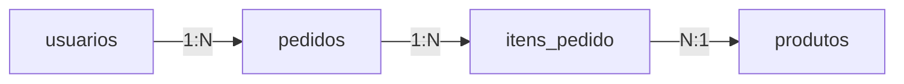

# 📖 Capítulo 8 — Fase 8: Banco de Dados

`↩ Índice Geral: README.md` | `⬅ Anterior: Capítulo 7 - modulo-07.md (Node.js, APIs REST e Autenticação)` | `➡ Próximo:  Capítulo 9 - modulo-09.md (Testes Automatizados)`

---

## 🎯 Objetivo

Uma API sem persistência de dados confiável não é um sistema real — é uma demonstração. Esta fase te dá a base para modelar dados corretamente, evitar armadilhas clássicas de banco relacional, e escolher a ferramenta certa (SQL vs. NoSQL, ORM vs. SQL puro) com justificativa técnica, não por modismo.

> **Como isso aparece no mercado:** modelagem de dados é um dos temas mais recorrentes em entrevistas técnicas e em desafios práticos ("modele o banco de dados para este sistema") — e é onde muitos Juniors demonstram (ou não) maturidade de engenharia.

---

## 📝 Conceitos

- Modelo relacional: tabelas, chaves primárias e estrangeiras
- SQL: DDL, DML, DQL (CREATE, INSERT/UPDATE/DELETE, SELECT)
- JOINs (INNER, LEFT, RIGHT, FULL)
- Normalização (1FN, 2FN, 3FN) e quando desnormalizar
- Índices — o que são e como afetam performance
- Transações e ACID
- PostgreSQL — recursos além do SQL básico
- ORMs — Prisma (e o trade-off ORM vs. SQL puro)
- MongoDB — quando NoSQL faz sentido (e quando não faz)
- Redis — cache e casos de uso

---

## 📋 Ordem de estudo

1. Modelo relacional e SQL básico (CRUD)
2. JOINs
3. Normalização
4. Índices e performance
5. Transações e ACID
6. PostgreSQL avançado
7. Prisma (ORM)
8. MongoDB — quando usar
9. Redis — cache

---

## 🔍 Explicação

### 1. Modelo relacional

Dados são organizados em **tabelas** (relações), cada uma com colunas tipadas. Uma **chave primária (PK)** identifica unicamente cada linha; uma **chave estrangeira (FK)** referencia a PK de outra tabela, criando relacionamentos.

```sql
CREATE TABLE usuarios (
  id UUID PRIMARY KEY DEFAULT gen_random_uuid(),
  nome VARCHAR(120) NOT NULL,
  email VARCHAR(160) UNIQUE NOT NULL,
  criado_em TIMESTAMP DEFAULT NOW()
);

CREATE TABLE pedidos (
  id UUID PRIMARY KEY DEFAULT gen_random_uuid(),
  usuario_id UUID NOT NULL REFERENCES usuarios(id),
  total NUMERIC(10,2) NOT NULL,
  status VARCHAR(20) NOT NULL DEFAULT 'pendente'
);
```

### 2. JOINs



```sql
SELECT u.nome, p.total, p.status
FROM usuarios u
INNER JOIN pedidos p ON p.usuario_id = u.id
WHERE p.status = 'pago';
```

| Tipo | Retorna |
|---|---|
| `INNER JOIN` | Apenas linhas com correspondência em ambas as tabelas |
| `LEFT JOIN` | Todas as linhas da esquerda + correspondências (ou `NULL`) da direita |
| `RIGHT JOIN` | Espelho do LEFT |
| `FULL JOIN` | Todas as linhas de ambas, com `NULL` onde não há correspondência |

> ⚠️ **Armadilha comum:** usar `INNER JOIN` quando o correto seria `LEFT JOIN` (ex: "listar todos os usuários e seus pedidos, incluindo quem nunca fez pedido nenhum" — `INNER JOIN` excluiria esses usuários silenciosamente).

### 3. Normalização

Normalização é o processo de organizar dados para eliminar redundância e inconsistência:

- **1FN:** cada célula tem um valor atômico (sem listas dentro de uma coluna).
- **2FN:** elimina dependências parciais (aplicável a chaves compostas).
- **3FN:** elimina dependências transitivas (uma coluna não deve depender de outra coluna que não é a chave).

**Exemplo de violação de 3FN:** armazenar `cidade` e `estado` diretamente na tabela `pedidos` (dados que dependem do `usuario_id`, não do pedido em si) — se o usuário mudar de cidade, pedidos antigos ficariam com dado inconsistente.

> 💡 **Quando desnormalizar de propósito:** em sistemas de leitura muito intensiva (dashboards, relatórios), desnormalização controlada (ou tabelas de cache/materialized views) é uma decisão de performance válida — mas deve ser consciente, não acidental por falta de modelagem.

### 4. Índices

Um índice é uma estrutura de dados auxiliar (geralmente uma árvore B) que acelera buscas, à custa de espaço extra e de escrita ligeiramente mais lenta (o índice precisa ser atualizado a cada INSERT/UPDATE).

```sql
CREATE INDEX idx_pedidos_usuario_id ON pedidos(usuario_id);
```

Sem índice em `usuario_id`, uma busca `WHERE usuario_id = X` faz uma varredura completa da tabela (*table scan*, O(n)); com índice, a busca é próxima de O(log n).

> **Como isso aparece no mercado:** "por que essa query está lenta" é uma pergunta prática comum, e a resposta frequentemente envolve entender se há (ou falta) índice na coluna filtrada — e usar `EXPLAIN ANALYZE` para diagnosticar, uma habilidade prática muito valorizada.

### 5. Transações e ACID

Uma transação agrupa múltiplas operações que devem acontecer **todas ou nenhuma** — essencial para operações com múltiplos passos relacionados (ex: transferência bancária: debitar de uma conta e creditar em outra).

- **Atomicidade:** tudo ou nada.
- **Consistência:** o banco vai de um estado válido para outro estado válido.
- **Isolamento:** transações concorrentes não interferem umas nas outras de forma inesperada.
- **Durabilidade:** uma vez confirmada (`COMMIT`), a mudança persiste mesmo em caso de falha do sistema.

```sql
BEGIN;
UPDATE contas SET saldo = saldo - 100 WHERE id = 'A';
UPDATE contas SET saldo = saldo + 100 WHERE id = 'B';
COMMIT;
```

Se qualquer passo falhar, `ROLLBACK` desfaz tudo — a conta A nunca fica debitada sem a conta B ser creditada.

### 6. Prisma — ORM moderno

```typescript
const usuario = await prisma.usuario.create({
  data: { nome: 'Ana', email: 'ana@exemplo.com' },
});

const pedidosComUsuario = await prisma.pedido.findMany({
  where: { status: 'pago' },
  include: { usuario: true },
});
```

**Trade-off ORM vs. SQL puro:** ORMs aceleram desenvolvimento e dão segurança de tipos (especialmente com TypeScript), mas podem gerar queries ineficientes se usados sem entendimento (ex: N+1 queries). **Regra profissional:** aprenda SQL puro primeiro (feito nesta fase); use ORM depois, entendendo o que ele gera por baixo.

> ⚠️ **Armadilha comum (Problema N+1):** buscar uma lista de pedidos e, para cada um, fazer uma query separada para buscar o usuário relacionado — resultando em N+1 queries em vez de 1 ou 2. Prisma (e a maioria dos ORMs) resolve isso com `include`/`join` explícito, mas só se você souber que o problema existe.

### 7. MongoDB — quando NoSQL faz sentido

MongoDB armazena documentos flexíveis (JSON-like), sem schema rígido. **Faz sentido quando:**
- A estrutura dos dados varia muito entre registros (ex: catálogos de produtos com atributos muito diferentes por categoria).
- Escrita e leitura de documentos completos, sem necessidade de relacionamentos complexos.
- Escala horizontal massiva é prioridade sobre consistência forte.

**Não faz sentido quando:**
- Os dados são fortemente relacionais (ex: sistema financeiro, onde integridade referencial e transações ACID são críticas).
- Você "escolhe Mongo porque é moderno", sem analisar o formato real dos dados — um erro extremamente comum entre autodidatas.

> **Como isso aparece no mercado:** a resposta certa em entrevista para "SQL ou NoSQL?" é sempre "depende dos requisitos" — nunca uma preferência absoluta. Saber justificar tecnicamente é o que diferencia uma Junior madura.

### 8. Redis — cache

Redis é um banco de dados em memória, extremamente rápido, usado tipicamente para:
- Cache de resultados de queries pesadas ou chamadas externas.
- Sessões de usuário (alternativa a JWT stateless).
- Rate limiting (Fase 12).
- Filas simples e pub/sub.

```typescript
const cacheKey = `produto:${id}`;
let produto = await redis.get(cacheKey);
if (!produto) {
  produto = await buscarProdutoNoBanco(id);
  await redis.set(cacheKey, JSON.stringify(produto), 'EX', 3600); // expira em 1h
}
```

---

## 💻 O que dominar

- [ ] Escrever SQL de CRUD completo, com JOINs corretos
- [ ] Modelar um banco de dados normalizado (até 3FN) para um domínio de negócio dado
- [ ] Explicar quando um índice ajuda e usar `EXPLAIN ANALYZE` para diagnosticar queries lentas
- [ ] Explicar ACID e usar transações corretamente em operações multi-etapa
- [ ] Usar Prisma para as operações comuns, entendendo o SQL gerado por baixo
- [ ] Explicar quando MongoDB é uma escolha justificada (e quando não é)
- [ ] Implementar cache básico com Redis

---

## ⚠️ Erros comuns

1. Não modelar o banco antes de codar — "ir criando tabelas conforme precisa", gerando inconsistência.
2. Ignorar índices até a aplicação já estar lenta em produção.
3. Não usar transações em operações que precisam ser atômicas (ex: pagamento).
4. Escolher MongoDB "porque é mais fácil no começo" para dados fortemente relacionais.
5. Cair no problema N+1 sem perceber, usando ORM sem entender as queries geradas.
6. Armazenar dados sensíveis (senha em texto puro) — antecipando a Fase 12.

---

## 🧠 Exercícios

**Iniciante**
1. Modele e crie, em SQL, as tabelas para um sistema de biblioteca (livros, autores, empréstimos), com chaves primárias e estrangeiras corretas.
2. Escreva queries de CRUD completo para esse modelo.

**Intermediário**
3. Escreva uma query com `LEFT JOIN` que lista todos os livros e, quando existir, o nome de quem os emprestou atualmente (livros nunca emprestados devem aparecer também, com `NULL`).
4. Adicione um índice em uma coluna de busca frequente e compare (com `EXPLAIN ANALYZE`) o plano de execução antes e depois.

**Avançado**
5. Implemente, em uma transação, uma operação de "renovação de empréstimo" que verifica se não há reserva pendente do mesmo livro antes de renovar — se houver, a transação deve falhar e reverter.
6. Modele o mesmo domínio de biblioteca usando Prisma, e compare o código gerado com o SQL puro escrito antes.

**Desafio final**
7. Implemente cache com Redis para uma consulta cara (ex: relatório agregado de empréstimos por mês), com invalidação correta quando novos dados são inseridos.

---

## 🌱 Projetos

**Projeto 1 — Sistema de reservas com controle de concorrência**
Construa o banco de dados e a lógica de um sistema de reservas (ex: reserva de mesas em restaurante, ou salas de reunião) que precisa garantir, mesmo com múltiplas requisições simultâneas, que o mesmo recurso não seja reservado duas vezes no mesmo horário — usando transações e constraints de banco (não apenas validação na aplicação). Este é um problema real e clássico de concorrência em bancos de dados.

**Projeto 2 — Dashboard de métricas com cache**
Construa endpoints de relatórios agregados (ex: vendas por dia, produtos mais vendidos) sobre um banco com volume razoável de dados simulados, usando índices adequados e cache Redis para as consultas mais pesadas, medindo e documentando o ganho de performance real.

---

## ✔️ Critério de conclusão

Você conclui a Fase 8 quando modela um banco de dados normalizado do zero, escreve SQL complexo com confiança, entende e sabe justificar quando usar índices, transações, ORM ou SQL puro, e MongoDB vs. PostgreSQL — com argumentos técnicos, não preferência.

> **É isso que empresas realmente esperam de uma Junior?** Sim — modelagem de dados sólida é um diferencial competitivo real entre Juniors, porque muitos autodidatas pulam essa fase e vão direto para ORMs "mágicos" sem entender o que está por baixo.

---

## 📄 Documentações

- **postgresql.org/docs** — documentação oficial do PostgreSQL.
- **prisma.io/docs** — documentação oficial do Prisma.
- **mongodb.com/docs** — documentação oficial do MongoDB.
- **redis.io/docs** — documentação oficial do Redis.

---

`↩ Índice Geral: README.md` | `➡ Próximo:  Capítulo 9 - modulo-09.md (Testes Automatizados)`
