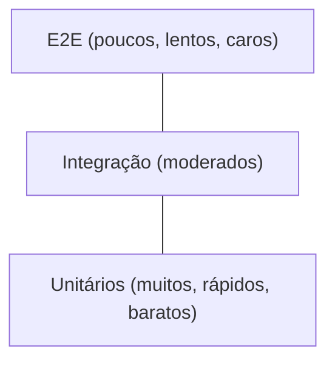
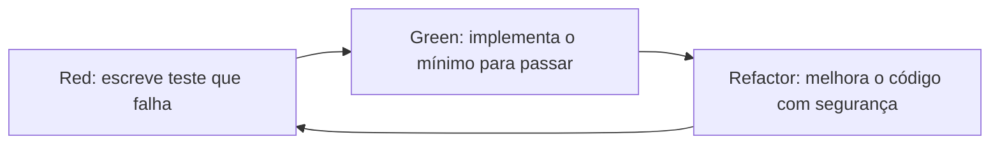

# 📖 Capítulo 9 — Fase 9: Testes Automatizados

`↩ Índice Geral: README.md` | `⬅ Anterior: Capítulo 8 - modulo-08.md (Banco de Dados)` | `➡ Próximo: Capítulo 10 - modulo-10.md (Arquitetura de Software)`

---

## 🎯 Objetivo

Código sem testes é código que ninguém tem coragem de mudar com confiança. Esta fase te ensina a escrever testes que realmente protegem contra regressões, e a diferença entre testar "para ter cobertura" e testar de forma estratégica.

> **Como isso aparece no mercado:** projetos sérios de backend em 2026 praticamente exigem testes automatizados como parte do CI/CD (Fase 11) — Pull Requests sem testes para lógica de negócio nova são frequentemente bloqueados em times maduros.

---

## 📝 Conceitos

- Pirâmide de testes (unitário, integração, E2E)
- Testes unitários — isolamento com mocks/stubs
- Testes de integração
- Testes E2E (end-to-end)
- Jest e Vitest — sintaxe e configuração
- TDD (Test-Driven Development) — ciclo Red-Green-Refactor
- Cobertura de código (e por que 100% não é a meta)
- Test doubles: mock, stub, spy, fake

---

## 📋 Ordem de estudo

1. Pirâmide de testes — entender a estratégia antes da ferramenta
2. Testes unitários com Jest/Vitest
3. Mocks e isolamento de dependências
4. Testes de integração (API + banco real/em memória)
5. TDD na prática
6. Testes E2E (introdução)

---

## 🔍 Explicação

### 1. A Pirâmide de Testes



- **Unitários:** testam uma unidade isolada (uma função, um método), sem dependências externas reais (banco, rede). Rápidos (milissegundos), devem ser a maioria dos seus testes.
- **Integração:** testam a interação entre partes reais (ex: um service acessando um banco de dados de teste real).
- **E2E:** testam o sistema como um todo, simulando o uso real (ex: uma requisição HTTP completa, do endpoint até a resposta). Lentos e caros de manter — devem ser poucos, cobrindo os fluxos mais críticos.

> ⚠️ **Armadilha comum (pirâmide invertida):** times iniciantes frequentemente escrevem muitos testes E2E (lentos, frágeis) e poucos unitários — o oposto do recomendado, resultando em suítes de teste lentas e que quebram por motivos não relacionados à lógica testada.

### 2. Testes unitários

```typescript
// calculadora-desconto.ts
export function calcularDesconto(valor: number, percentual: number): number {
  if (percentual < 0 || percentual > 100) throw new Error('Percentual inválido');
  return valor - (valor * percentual) / 100;
}

// calculadora-desconto.test.ts
import { calcularDesconto } from './calculadora-desconto';

describe('calcularDesconto', () => {
  it('aplica desconto corretamente', () => {
    expect(calcularDesconto(100, 10)).toBe(90);
  });

  it('lança erro para percentual inválido', () => {
    expect(() => calcularDesconto(100, 150)).toThrow('Percentual inválido');
  });

  it('retorna o valor original quando desconto é 0', () => {
    expect(calcularDesconto(100, 0)).toBe(100);
  });
});
```

**Estrutura AAA (Arrange-Act-Assert):** organize cada teste em três partes claras — preparar dados, executar a ação, verificar o resultado. Isso torna testes legíveis mesmo para quem não os escreveu.

### 3. Mocks, Stubs, Spies e Fakes

Ao testar uma unidade que depende de outra (ex: um service que chama um repositório de banco), você **isola** a dependência real usando "dublês de teste":

- **Stub:** substitui uma função, retornando valores fixos, sem lógica.
- **Mock:** como um stub, mas também verifica *como* foi chamado (quantas vezes, com quais argumentos).
- **Spy:** "espiona" uma função real, permitindo verificar chamadas sem substituir o comportamento.
- **Fake:** uma implementação simplificada, mas funcional (ex: um banco de dados em memória no lugar do banco real).

```typescript
const repositorioMock = {
  buscarPorId: jest.fn().mockResolvedValue({ id: '1', nome: 'Ana' }),
};

const service = new UsuarioService(repositorioMock);
const usuario = await service.buscarUsuario('1');

expect(repositorioMock.buscarPorId).toHaveBeenCalledWith('1');
expect(usuario.nome).toBe('Ana');
```

> **Por que isso importa:** testes unitários que dependem de banco de dados real são, tecnicamente, testes de integração disfarçados — lentos e frágeis. Isolar dependências com mocks é o que torna testes unitários rápidos e confiáveis.

### 4. TDD — Test-Driven Development

Ciclo **Red → Green → Refactor**:

1. **Red:** escreva um teste que falha, para um comportamento que ainda não existe.
2. **Green:** escreva o **mínimo** código necessário para o teste passar.
3. **Refactor:** melhore o código (legibilidade, estrutura), com a segurança de que o teste continua passando.



> 💡 **Boas práticas:** TDD não é obrigatório em toda empresa, mas é uma habilidade valorizada e frequentemente cobrada em entrevistas técnicas mais rigorosas (é comum pedir para o candidato "resolver esse problema usando TDD" em processos de empresas com cultura de engenharia forte). Praticar mesmo que você não use TDD no dia a dia consolida disciplina de design orientado a testabilidade.

### 5. Cobertura de código — e por que 100% não é a meta

Cobertura de código mede quantas linhas/branches do código são executadas pelos testes. **100% de cobertura não significa ausência de bugs** — significa apenas que toda linha foi executada ao menos uma vez, não que todos os cenários relevantes foram verificados.

> ⚠️ **Armadilha comum:** perseguir 100% de cobertura escrevendo testes triviais (ex: testar um getter que só retorna uma propriedade) enquanto ignora casos de borda importantes em lógica complexa. **Foque em testar comportamento e casos de borda relevantes**, não em número de cobertura.

### 6. Testes de integração e E2E na prática

```typescript
// teste de integração de API (usando supertest)
import request from 'supertest';
import { app } from '../app';

describe('POST /usuarios', () => {
  it('cria um usuário e retorna 201', async () => {
    const resposta = await request(app)
      .post('/usuarios')
      .send({ nome: 'Ana', email: 'ana@exemplo.com', senha: 'senhaSegura123' });

    expect(resposta.status).toBe(201);
    expect(resposta.body).toHaveProperty('id');
  });

  it('retorna 400 para e-mail inválido', async () => {
    const resposta = await request(app)
      .post('/usuarios')
      .send({ nome: 'Ana', email: 'invalido', senha: 'senhaSegura123' });

    expect(resposta.status).toBe(400);
  });
});
```

---

## 💻 O que dominar

- [ ] Explicar a pirâmide de testes e por que a proporção importa
- [ ] Escrever testes unitários usando Jest ou Vitest, com estrutura AAA
- [ ] Usar mocks para isolar dependências externas em testes unitários
- [ ] Escrever testes de integração para endpoints de API
- [ ] Aplicar o ciclo TDD (Red-Green-Refactor) em um exercício prático
- [ ] Explicar por que 100% de cobertura não é sinônimo de qualidade

---

## ⚠️ Erros comuns

1. Escrever testes apenas para "bater cobertura", sem testar casos de borda relevantes.
2. Testes unitários que dependem de banco/rede real, tornando-se lentos e frágeis.
3. Testes que dependem de ordem de execução ou de estado compartilhado entre eles.
4. Ignorar testes de casos de erro (só testar o "caminho feliz").
5. Pirâmide invertida — muitos testes E2E, poucos unitários.

---

## 🧠 Exercícios

**Iniciante**
1. Escreva testes unitários completos (caminho feliz + casos de erro) para as funções de lógica de programação que você escreveu na Fase 2 (busca binária, verificador de parênteses, etc.).

**Intermediário**
2. Escreva testes unitários com mock para um service que depende de um repositório (ex: `UsuarioService` que depende de `UsuarioRepository`), isolando completamente a dependência.
3. Escreva testes de integração para os endpoints da API construída na Fase 7, incluindo casos de sucesso e de validação.

**Avançado**
4. Implemente, usando TDD estrito (teste antes do código, sempre), uma função de validação de CPF (incluindo dígitos verificadores) — um problema real e comum em sistemas brasileiros.

**Desafio final**
5. Pegue um dos projetos das fases anteriores (Fase 7 ou Fase 8) e escreva uma suíte de testes completa seguindo a pirâmide correta: a maioria unitários, alguns de integração, e (se aplicável) um teste E2E do fluxo mais crítico do sistema.

---

## 🌱 Projetos

**Projeto 1 — Suíte de testes para motor de regras de negócio**
Pegue o "motor de regras de desconto" construído na Fase 3 (ou similar) e escreva uma suíte de testes completa cobrindo todas as regras, incluindo casos de borda (desconto de 0%, 100%, valores negativos inválidos, combinação de múltiplas regras) — simulando o rigor que um time de QA/engenharia exigiria antes de aprovar essa lógica em produção, já que erros em regras de desconto têm impacto financeiro direto.

---

## ✔️ Critério de conclusão

Você conclui a Fase 9 quando consegue escrever, sem consultar tutorial, testes unitários com mocks, testes de integração de API, e aplicar TDD em um problema novo — e consegue explicar por que escolheu testar cada cenário específico.

> **É isso que empresas realmente esperam de uma Junior?** Sim, cada vez mais. A expectativa mínima em 2026 é que uma Junior escreva testes para código novo que produz — não é mais considerado "trabalho de QA separado" na maioria dos times de engenharia modernos.

---

## 📄 Documentações

- **jestjs.io** — documentação oficial do Jest.
- **vitest.dev** — documentação oficial do Vitest.
- **testing-library.com** — princípios de testes focados em comportamento (mais relevante para frontend, mas os princípios se aplicam).

---

`↩ Índice Geral: README.md` | `➡ Próximo: Capítulo 10 - modulo-10.md (Arquitetura de Software)`
