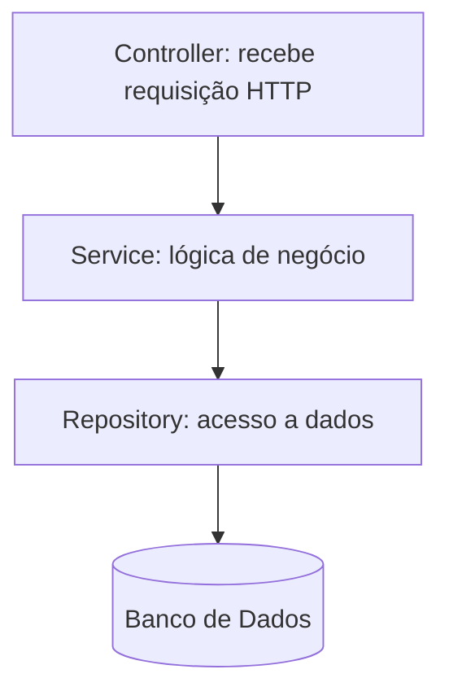
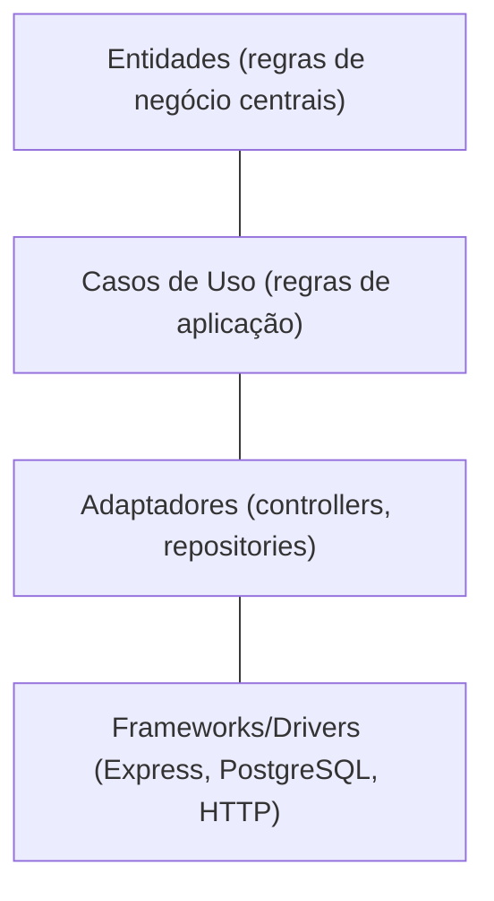

# 📖 Capítulo 10 — Fase 10: Arquitetura de Software

`↩ Índice Geral: README.md` | `⬅ Anterior: Capítulo 9 - modulo-09.md (Testes Automatizados)` | `➡ Próximo: Capítulo 11 - modulo-11.md (Cloud, Docker e CI/CD)`

---

## 🎯 Objetivo

Esta é a fase que transforma "código que funciona" em "código que sobrevive". Qualquer pessoa consegue fazer um sistema pequeno funcionar; a diferença entre uma Junior mediana e uma Junior excelente é a capacidade de estruturar código que continua fácil de entender, testar e modificar conforme o sistema cresce. Arquitetura não é sobre complexidade — é sobre **gerenciar mudança** ao longo do tempo.

> **Como isso aparece no mercado:** perguntas sobre SOLID, Clean Code e padrões de projeto são extremamente comuns em entrevistas técnicas de empresas com times de engenharia maduros, e a qualidade da estrutura do seu código de portfólio é frequentemente avaliada tanto quanto (ou mais que) a funcionalidade em si.

---

## 📝 Conceitos

- Clean Code — princípios de código legível
- SOLID (S, O, L, I, D — cada princípio a fundo)
- Clean Architecture — camadas e regra de dependência
- Introdução a DDD (Domain-Driven Design)
- Design Patterns essenciais: Repository, Factory, Strategy, Dependency Injection
- MVC (Model-View-Controller)
- Arquitetura em camadas vs. arquitetura hexagonal (introdução)

---

## 📋 Ordem de estudo

1. Clean Code — a base de tudo
2. SOLID — princípios de design orientado a objetos/módulos
3. Design Patterns essenciais
4. MVC e arquitetura em camadas
5. Clean Architecture
6. Introdução a DDD

---

## 🔍 Explicação

### 1. Clean Code — fundamentos

Código limpo é código que **outra pessoa (ou você mesma, em 6 meses) consegue entender sem esforço excessivo**. Princípios centrais:

- **Nomes significativos:** `calcularTotalComDesconto()` é melhor que `calc()`. Nomes devem revelar intenção, sem precisar de comentário explicativo.
- **Funções pequenas, fazendo uma coisa só:** se você precisa usar "e" para descrever o que uma função faz ("busca o usuário **e** envia e-mail **e** loga"), ela provavelmente deveria ser três funções.
- **Evitar comentários que explicam "o quê"** (o código já deveria ser claro o suficiente); comentários bons explicam **"por quê"** (uma decisão não óbvia, uma regra de negócio específica).
- **Evitar duplicação (DRY — Don't Repeat Yourself):** mas sem exagerar — abstrair cedo demais ("abstração prematura") também é um problema real.

> ⚠️ **Armadilha comum:** confundir "código limpo" com "código elegante e complexo". Código limpo é, na verdade, **simples e óbvio** — a elegância vem da clareza, não da sofisticação.

### 2. SOLID

**S — Single Responsibility Principle (Responsabilidade Única)**
Uma classe/módulo deve ter apenas um motivo para mudar. Um `UsuarioService` que também formata e-mails e também gera relatórios em PDF viola esse princípio — são três responsabilidades diferentes, que devem mudar por razões diferentes.

**O — Open/Closed Principle (Aberto/Fechado)**
Código deve ser aberto para extensão, fechado para modificação. Em vez de um `if/else` gigante que você precisa editar toda vez que surge um novo tipo, use polimorfismo/composição para **adicionar** comportamento sem **alterar** código existente.

```typescript
// Viola OCP: precisa editar essa função a cada novo tipo de pagamento
function calcularTaxa(tipoPagamento: string, valor: number) {
  if (tipoPagamento === 'cartao') return valor * 0.03;
  if (tipoPagamento === 'boleto') return valor * 0.01;
  // ... cada novo tipo exige editar aqui
}

// Respeita OCP: novos tipos são adicionados sem modificar código existente
interface CalculadoraTaxa { calcular(valor: number): number; }
class TaxaCartao implements CalculadoraTaxa { calcular(valor: number) { return valor * 0.03; } }
class TaxaBoleto implements CalculadoraTaxa { calcular(valor: number) { return valor * 0.01; } }
```

**L — Liskov Substitution Principle (Substituição de Liskov)**
Uma subclasse deve poder substituir sua classe-base sem quebrar o comportamento esperado. O exemplo clássico: se `Quadrado` herda de `Retangulo` mas altera largura e altura juntas (porque em um quadrado elas são iguais), código que espera um `Retangulo` genérico pode quebrar com um `Quadrado` — violação de LSP.

**I — Interface Segregation Principle (Segregação de Interface)**
Prefira várias interfaces pequenas e específicas a uma interface grande e genérica. Uma classe não deveria ser forçada a implementar métodos que não usa.

**D — Dependency Inversion Principle (Inversão de Dependência)**
Módulos de alto nível não devem depender de módulos de baixo nível diretamente — ambos devem depender de abstrações. Isso é exatamente o que torna código testável (você consegue trocar a implementação real por um mock nos testes, como visto na Fase 9).

```typescript
// Viola DIP: o service depende diretamente de uma implementação concreta
class UsuarioService {
  private repo = new PostgresUsuarioRepository(); // acoplamento direto
}

// Respeita DIP: depende de uma abstração (interface), injetada de fora
interface UsuarioRepository { buscarPorId(id: string): Promise<Usuario>; }

class UsuarioService {
  constructor(private repo: UsuarioRepository) {} // pode ser Postgres, Mongo, ou um mock em teste
}
```

> **Como isso aparece no mercado:** SOLID é um dos tópicos mais recorrentes em entrevistas de nível intermediário/sênior, mas cada vez mais também aparece em processos Junior de empresas com cultura técnica forte, especialmente o "D" (Dependency Inversion), diretamente ligado a testabilidade.

### 3. Design Patterns essenciais

**Repository Pattern:** abstrai o acesso a dados, separando a lógica de negócio de como os dados são persistidos (SQL, NoSQL, API externa). Você já usou esse padrão implicitamente na Fase 7/8.

**Factory Pattern:** centraliza a lógica de criação de objetos complexos, especialmente quando a criação depende de condições.

```typescript
class NotificacaoFactory {
  static criar(tipo: 'email' | 'sms' | 'push'): Notificador {
    switch (tipo) {
      case 'email': return new EmailNotificador();
      case 'sms': return new SmsNotificador();
      case 'push': return new PushNotificador();
    }
  }
}
```

**Strategy Pattern:** permite trocar um algoritmo/comportamento em tempo de execução (é, na prática, o que a solução do exemplo de OCP acima já demonstra).

**Dependency Injection:** em vez de uma classe criar suas próprias dependências, elas são "injetadas" de fora (via construtor, geralmente) — visto no exemplo de DIP acima e nativamente suportado pelo NestJS (Fase 7).

### 4. MVC e Arquitetura em Camadas



Cada camada tem uma responsabilidade clara e só conhece a camada imediatamente abaixo (ou uma abstração dela) — nunca "pula camadas" (um controller nunca deveria acessar o banco diretamente).

### 5. Clean Architecture

Clean Architecture leva a separação de camadas a um nível mais rigoroso: a **regra de dependência** diz que as camadas mais internas (regras de negócio) nunca devem depender de detalhes externos (framework, banco de dados, HTTP) — é o contrário: os detalhes externos dependem das regras de negócio.



Isso significa, na prática: sua lógica de negócio central não deveria ter nenhum `import` de Express ou Prisma diretamente — ela deveria funcionar mesmo se você trocasse o framework HTTP ou o banco de dados amanhã.

> ⚠️ **Armadilha comum, principalmente entre Juniors entusiasmadas:** aplicar Clean Architecture completa (com todas as camadas e abstrações) em um CRUD simples de 3 telas. Isso é **overengineering** — a arquitetura deve ser proporcional à complexidade real do problema. Saber **quando não aplicar** um padrão é tão importante quanto saber aplicá-lo.

### 6. Introdução a DDD (Domain-Driven Design)

DDD é uma abordagem para modelar software que espelha profundamente o domínio de negócio real, usando uma linguagem compartilhada entre desenvolvedores e especialistas de negócio (**linguagem ubíqua**). Para uma Junior, o essencial é entender dois conceitos:

- **Entidade:** um objeto com identidade única que persiste ao longo do tempo (ex: um `Usuario`, identificado por `id`, mesmo que seus dados mudem).
- **Value Object:** um objeto definido apenas por seus valores, sem identidade própria (ex: um `Endereco` ou um `Dinheiro` — dois objetos com os mesmos valores são considerados iguais).

DDD completo (Bounded Contexts, Aggregates, Domain Events) é um tópico de nível sênior — para uma Junior, entender esses dois conceitos básicos e saber que DDD existe como abordagem já é suficiente e demonstra maturidade em entrevistas.

---

## 💻 O que dominar

- [ ] Escrever código seguindo princípios de Clean Code (nomes claros, funções pequenas, sem duplicação desnecessária)
- [ ] Explicar cada um dos 5 princípios SOLID com um exemplo prático próprio
- [ ] Implementar Repository, Factory e Dependency Injection em um projeto real
- [ ] Estruturar uma API em camadas (Controller/Service/Repository) corretamente
- [ ] Explicar a regra de dependência da Clean Architecture
- [ ] Explicar a diferença entre Entidade e Value Object
- [ ] Reconhecer quando uma arquitetura está sendo overengineered para o problema em questão

---

## ⚠️ Erros comuns

1. Aplicar padrões de projeto "porque são bons", sem que o problema realmente peça — overengineering.
2. Confundir SOLID com regras rígidas em vez de princípios orientadores (aplicar cegamente, sem julgamento).
3. Deixar lógica de negócio vazar para controllers ou para o banco (ex: cálculos importantes feitos direto em queries SQL complexas, sem lógica testável em código).
4. Acoplar lógica de negócio diretamente a frameworks (ex: usar `req`/`res` do Express dentro da lógica de domínio).
5. Nomear mal (`data`, `info`, `handler2`, `temp`) — um dos sinais mais rápidos de código não profissional em code review.

---

## 🧠 Exercícios

**Iniciante**
1. Pegue um trecho de código seu de fases anteriores com nomes ruins e funções grandes, e refatore aplicando Clean Code.

**Intermediário**
2. Refatore a API da Fase 7 para seguir explicitamente o princípio de Responsabilidade Única, separando qualquer lógica de formatação/negócio que esteja misturada no controller.
3. Implemente o Strategy Pattern para um cálculo de frete que varia por transportadora (cada transportadora com sua própria regra de cálculo).

**Avançado**
4. Refatore o repositório de dados da Fase 8 para seguir Dependency Inversion — o service deve depender de uma interface `Repository`, não da implementação concreta (Prisma/SQL), permitindo trocar por um mock em testes sem alterar o service.

**Desafio final**
5. Pegue o projeto de "gestão de pedidos" da Fase 7 e reestruture-o seguindo Clean Architecture (camadas de entidade, caso de uso, adaptador, framework), documentando no README por que cada camada existe e o que ela não deveria conhecer.

---

## 🌱 Projetos

**Projeto 1 — Refatoração de um "código legado" proposital**
Escreva (propositalmente) uma pequena API com más práticas clássicas: funções gigantes, lógica de negócio dentro de controllers, acoplamento direto a Prisma, nomes ruins, duplicação. Depois, refatore-a passo a passo, documentando cada decisão (qual princípio SOLID resolveu qual problema). Este exercício simula uma situação extremamente comum no primeiro emprego: herdar código legado e precisar melhorá-lo com segurança.

---

## ✔️ Critério de conclusão

Você conclui a Fase 10 quando consegue olhar para um código (seu ou de terceiros) e identificar violações de SOLID e Clean Code concretamente, propor a refatoração correta, e justificar por que a mudança melhora manutenibilidade — sem aplicar padrões cegamente onde não fazem sentido.

> **É isso que empresas realmente esperam de uma Junior?** Parcialmente — não se espera domínio total de Clean Architecture ou DDD completo de uma Junior, mas se espera consciência de SOLID e Clean Code, e capacidade de discutir essas ideias com maturidade em entrevistas e code reviews.

---

## 🔖 Livros recomendados

- **"Clean Code" — Robert C. Martin.** Leia nesta fase, é a referência definitiva sobre o assunto e amplamente citada no mercado — embora alguns exemplos sejam datados (o livro é de 2008), os princípios continuam extremamente relevantes.
- **"Clean Architecture" — Robert C. Martin.** Leia em seguida, aprofunda a regra de dependência e separação de camadas com exemplos mais arquiteturais.
- **"Design Patterns" (Gang of Four) — Gamma, Helm, Johnson, Vlissides.** Referência histórica, mas densa — recomendado como consulta pontual (buscar o padrão que você precisa entender), não leitura linear obrigatória para uma Junior.

---

`↩ Índice Geral: README.md` | `➡ Próximo: Capítulo 11 - modulo-11.md (Cloud, Docker e CI/CD)`
