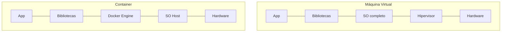
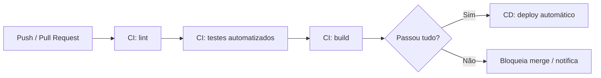

# 📖 Capítulo 11 — Fase 11: Cloud, Docker e CI/CD

`↩ Índice Geral: README.md` | `⬅ Anterior:  Capítulo 10 - modulo-10.md (Arquitetura de Software)` | `➡ Próximo: Capítulo 12 - modulo-12.md (Segurança de Aplicações)`

---

## 🎯 Objetivo

Código que só roda "na sua máquina" não é um produto — é um protótipo. Esta fase te ensina a levar seu código do seu computador até um ambiente real, acessível pela internet, de forma automatizada, reproduzível e confiável. É também aqui que seu portfólio deixa de ser "um repositório no GitHub" e vira "um sistema que funciona, e que eu consigo mostrar rodando".

> **Como isso aparece no mercado:** ter projetos com deploy real (link funcionando), pipeline de CI/CD configurado e Docker no repositório é um diferencial competitivo enorme entre Juniors — a maioria só mostra código, poucas mostram sistemas operando de verdade.

---

## 📝 Conceitos

- Docker: containers vs. máquinas virtuais, imagens, Dockerfile
- Docker Compose (orquestração local multi-serviço)
- CI/CD: conceitos e por que importam
- GitHub Actions
- Ambientes (development, staging, production) e variáveis de ambiente
- Deploy: Render, Railway, Vercel
- AWS — fundamentos essenciais (EC2, S3, RDS — visão geral)

---

## 📋 Ordem de estudo

1. Docker — containers e Dockerfile
2. Docker Compose
3. Conceitos de CI/CD
4. GitHub Actions na prática
5. Deploy em plataformas modernas (Render/Railway/Vercel)
6. Fundamentos de AWS

---

## 🔍 Explicação

### 1. Docker — containers vs. VMs

Um container empacota sua aplicação com **todas as suas dependências** (runtime, bibliotecas, configurações), garantindo que ela rode exatamente igual em qualquer máquina — resolvendo o clássico "na minha máquina funciona".



Diferente de uma máquina virtual (que virtualiza um sistema operacional inteiro), um container compartilha o kernel do sistema operacional host, sendo muito mais leve e rápido de iniciar.

### 2. Dockerfile

```dockerfile
FROM node:20-alpine

WORKDIR /app

COPY package*.json ./
RUN npm ci --only=production

COPY . .

EXPOSE 3000
CMD ["node", "dist/main.js"]
```

Cada linha cria uma **camada** (layer) da imagem — o Docker faz cache de camadas que não mudaram, por isso copiar `package.json` antes do resto do código (e instalar dependências antes de copiar o código-fonte) acelera builds subsequentes, já que dependências mudam com menos frequência que o código.

> ⚠️ **Armadilha comum:** copiar todo o código antes de instalar dependências, invalidando o cache de camadas a cada pequena mudança de código, tornando o build lento desnecessariamente.

### 3. Docker Compose

Para orquestrar múltiplos serviços localmente (API + banco de dados + Redis, por exemplo):

```yaml
version: '3.8'
services:
  api:
    build: .
    ports:
      - '3000:3000'
    environment:
      - DATABASE_URL=postgresql://user:pass@db:5432/meubanco
    depends_on:
      - db
      - redis
  db:
    image: postgres:16
    environment:
      - POSTGRES_PASSWORD=pass
    volumes:
      - db-data:/var/lib/postgresql/data
  redis:
    image: redis:7-alpine
volumes:
  db-data:
```

Com `docker-compose up`, todo o ambiente de desenvolvimento sobe com um único comando — eliminando o problema de "instalar Postgres, Redis e configurar tudo manualmente" para qualquer pessoa que clone o repositório (incluindo você mesma, em uma máquina nova).

### 4. CI/CD — Integração e Entrega Contínuas

- **Integração Contínua (CI):** toda mudança de código é automaticamente testada e validada (lint, testes, build) antes de ser integrada à branch principal.
- **Entrega/Deploy Contínuo (CD):** código validado é automaticamente (ou com um clique) implantado em produção.



> **Como isso aparece no mercado:** em times profissionais, um Pull Request literalmente não pode ser mesclado se o pipeline de CI falhar (testes quebrados, lint com erro) — isso é configurado como regra obrigatória de proteção de branch (visto na Fase 6).

### 5. GitHub Actions

```yaml
name: CI
on: [pull_request]
jobs:
  test:
    runs-on: ubuntu-latest
    steps:
      - uses: actions/checkout@v4
      - uses: actions/setup-node@v4
        with:
          node-version: 20
      - run: npm ci
      - run: npm run lint
      - run: npm run test
      - run: npm run build
```

Este workflow roda automaticamente em cada Pull Request, garantindo que nada quebrado seja mesclado. Ter isso configurado nos seus projetos de portfólio é um sinal forte de maturidade profissional.

### 6. Ambientes e variáveis de ambiente

Um sistema profissional roda em múltiplos ambientes com configurações diferentes (URL do banco, chaves de API, nível de log):

```
# .env (NUNCA commitado no Git — sempre no .gitignore)
DATABASE_URL=postgresql://localhost:5432/dev
JWT_SECRET=segredo-local-apenas-para-dev
```

> ⚠️ **Armadilha comum e séria:** commitar arquivos `.env` com segredos reais no repositório Git — mesmo em repositórios privados, isso é considerado uma falha grave de segurança (aprofundado na Fase 12), e já causou vazamentos reais de credenciais em empresas grandes.

### 7. Deploy em plataformas modernas

Para portfólio e projetos de pequeno/médio porte, plataformas como **Render**, **Railway** e **Vercel** oferecem deploy simplificado, direto do GitHub, com CI/CD já embutido:

- **Vercel:** ideal para frontend (Next.js) e funções serverless.
- **Render/Railway:** ideais para backend Node.js/NestJS com banco de dados gerenciado.

O fluxo típico: conectar o repositório GitHub → configurar variáveis de ambiente na plataforma → cada push na branch principal dispara deploy automático.

### 8. AWS — fundamentos essenciais

AWS é o provedor de nuvem dominante no mercado corporativo. Para uma Junior, o essencial não é dominar todos os serviços (são centenas), mas entender os pilares:

| Serviço | Para que serve |
|---|---|
| **EC2** | Máquinas virtuais — computação sob demanda |
| **S3** | Armazenamento de arquivos (objetos) |
| **RDS** | Banco de dados relacional gerenciado (Postgres, MySQL) |
| **Lambda** | Funções serverless (executa código sem gerenciar servidor) |
| **IAM** | Gerenciamento de identidade e permissões |

> **Como isso aparece no mercado:** vagas Junior raramente exigem certificação AWS, mas entender esses conceitos (e idealmente ter feito deploy de algo, mesmo simples, na AWS) é um diferencial em empresas de médio/grande porte que usam AWS como padrão.

---

## 💻 O que dominar

- [ ] Escrever um Dockerfile eficiente (com cache de camadas otimizado) para uma aplicação Node.js
- [ ] Orquestrar múltiplos serviços localmente com Docker Compose
- [ ] Explicar a diferença entre CI e CD
- [ ] Configurar um pipeline de GitHub Actions que roda lint, testes e build
- [ ] Gerenciar variáveis de ambiente corretamente, sem expor segredos
- [ ] Fazer deploy de uma aplicação real em uma plataforma moderna (Render/Railway/Vercel)
- [ ] Explicar os fundamentos de EC2, S3 e RDS

---

## ⚠️ Erros comuns

1. Commitar arquivos `.env` com segredos reais no Git.
2. Escrever Dockerfiles ineficientes (sem otimização de cache de camadas).
3. Não configurar CI, descobrindo bugs/quebras só depois do deploy manual.
4. Misturar configuração de ambientes (usar banco de produção em desenvolvimento, por exemplo).
5. Achar que "aprender Docker" significa decorar comandos, sem entender o problema que containers resolvem.

---

## 🧠 Exercícios

**Iniciante**
1. Escreva um Dockerfile para a API construída na Fase 7 e rode-a localmente via `docker run`.
2. Configure um `docker-compose.yml` que sobe a API junto com um banco PostgreSQL.

**Intermediário**
3. Configure um pipeline de GitHub Actions que roda lint e testes automaticamente em cada Pull Request.
4. Faça deploy real da API (com banco de dados) em Render ou Railway, com variáveis de ambiente configuradas corretamente na plataforma (nunca no código).

**Avançado**
5. Configure o pipeline de CI para também rodar o build de produção e falhar caso o build quebre, protegendo a branch principal com essa regra no GitHub.

**Desafio final**
6. Configure um pipeline completo de CI/CD: testes → build → deploy automático em produção a cada merge na branch principal, documentando o fluxo completo em um diagrama Mermaid no README do projeto.

---

## 🌱 Projetos

**Projeto 1 — Deploy completo do "Sistema de gestão de pedidos" (Fase 7)**
Containerize, configure CI/CD e faça deploy real do projeto de e-commerce construído na Fase 7, com banco de dados gerenciado, variáveis de ambiente seguras, e um link público funcionando — este projeto se torna a primeira peça "viva" do seu portfólio, algo que você pode literalmente mostrar funcionando em uma entrevista, não apenas o código.

---

## ✔️ Critério de conclusão

Você conclui a Fase 11 quando tem pelo menos um projeto seu rodando via Docker, com pipeline de CI/CD configurado no GitHub Actions, e deploy real acessível publicamente — e consegue explicar cada etapa do pipeline.

> **É isso que empresas realmente esperam de uma Junior?** Sim, cada vez mais — e é um dos maiores diferenciadores de portfólio entre candidatos, já que a maioria dos autodidatas para no "roda na minha máquina".

---

## 📄 Documentações

- **docs.docker.com** — documentação oficial do Docker.
- **docs.github.com/actions** — documentação oficial do GitHub Actions.
- **docs.aws.amazon.com** — documentação oficial da AWS (vasta; use como referência pontual).

---

`↩ Índice Geral: README.md` | `➡ Próximo: Capítulo 12 - modulo-12.md (Segurança de Aplicações)`
