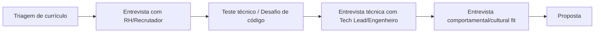

# 📖 Capítulo 15 — Fase 15: Currículo, Networking e Primeira Vaga

`↩ Índice Geral: README.md` | `⬅ Anterior: Capítulo 14 - modulo-14.md (Portfólio)` | `➡ Próximo: Capítulo 16 - cronogramas.md (Cronogramas de Estudo)`

---

## 🎯 Objetivo

Você pode ser tecnicamente excelente e ainda assim não conseguir a primeira vaga, se não souber se comunicar para o mercado. Esta fase fecha o ciclo: currículo, LinkedIn, networking, entrevistas técnicas e comportamentais, e onde buscar oportunidades reais em 2026/2027.

---

## 📝 Conceitos

- Currículo técnico orientado a impacto (não a lista de tecnologias)
- LinkedIn como ferramenta ativa, não estática
- Networking genuíno (vs. spam de conexões)
- Estrutura de entrevistas técnicas (screening, técnica, comportamental, fit)
- Hackathons, Open Source e comunidades como via de entrada
- Onde buscar vagas Junior reais

---

## 🔍 Explicação

### 1. Currículo — orientado a impacto, não a lista de tecnologias

O erro mais comum de currículos de autodidatas é uma lista genérica: "Conhecimentos: JavaScript, Node.js, React, SQL...". Isso não diferencia nada — praticamente todo candidato lista as mesmas tecnologias. O que diferencia é **impacto e contexto**.

**Formato fraco:**
> "Desenvolvi uma API REST com Node.js e Express."

**Formato forte:**
> "Desenvolvi uma API REST de gestão de pedidos com autenticação JWT, testes automatizados (85% de cobertura) e deploy via CI/CD, aplicando princípios de Clean Architecture para permitir troca de banco de dados sem impacto na lógica de negócio."

A segunda versão comunica: profundidade técnica, atenção à qualidade (testes), maturidade de processo (CI/CD) e pensamento arquitetural — em uma frase.

**Estrutura recomendada de currículo para Junior:**
1. Cabeçalho: nome, contato, LinkedIn, GitHub, portfólio (se tiver).
2. Resumo curto (2-3 linhas): quem você é tecnicamente, o que busca.
3. Projetos (para quem não tem experiência formal, esta seção substitui "Experiência" em destaque) — 3-4 projetos da Fase 13, no formato de impacto acima.
4. Formação/Cursos relevantes (CS50, cursos citados nas fases anteriores).
5. Stack técnica, organizada por categoria (Linguagens, Backend, Banco de Dados, Ferramentas).
6. Experiência prévia (mesmo não-técnica) — soft skills transferíveis importam, especialmente para quem migra de carreira.

> ⚠️ **Armadilha comum:** currículo de 3+ páginas para quem está começando. Para Junior, **uma página** é o padrão esperado — objetividade é, ela mesma, um sinal de comunicação técnica clara.

### 2. LinkedIn ativo

LinkedIn não deve ser um perfil estático — recrutadores técnicos ativamente buscam candidatos por palavras-chave e observam atividade recente. Práticas eficazes:

- Publicar sobre o que você está aprendendo/construindo (aplicando a Técnica de Feynman da Fase 0 — ensinar publicamente é also uma forma de aprender e de ser vista).
- Conectar-se genuinamente com pessoas da área (comentando, não apenas "adicionar e sumir").
- Manter a seção "Destaques" com links diretos para seus melhores projetos.
- Usar o campo de headline não apenas como "Buscando oportunidades", mas descrevendo o que você faz: "Backend Developer Junior | Node.js, TypeScript, PostgreSQL".

### 3. Networking genuíno

Networking eficaz não é "pedir vaga" para desconhecidos — é construir relações reais ao longo do tempo. Formas práticas e realistas para quem está começando:

- Participar ativamente de comunidades técnicas (Discord/Telegram de tecnologia, grupos locais).
- Contribuir com Open Source, mesmo em coisas pequenas (correção de documentação, primeira issue "good first issue") — isso gera interação real com mantenedores e visibilidade genuína.
- Participar de hackathons — mesmo sem vencer, é uma forma intensa de praticar trabalho em equipe sob pressão e conhecer pessoas da indústria.
- Pedir *conversas informativas* (15-20 min) com profissionais da área que você admira, com perguntas específicas — não pedidos diretos de vaga.

### 4. Estrutura de entrevistas técnicas

A maioria dos processos seletivos para Junior segue um padrão similar:

- **Triagem:** seu currículo e portfólio precisam passar aqui — reforça a importância das Fases 13-14.
- **Teste técnico:** frequentemente um desafio para casa (build de uma API/feature) ou um live coding — as Fases 2, 7 e 9 (lógica, APIs, testes) são o que mais é testado aqui.
- **Entrevista técnica:** perguntas conceituais (Fases 1, 3, 7, 8, 10, 12) e, às vezes, resolução de problema ao vivo.
- **Comportamental:** perguntas sobre como você lida com feedback, conflito, prazos — prepare exemplos reais e concretos (mesmo de experiências fora de tecnologia).

> 💡 **Prática recomendada:** simule entrevistas técnicas regularmente (com colegas de estudo, mentores, ou mesmo sozinha em voz alta) — a habilidade de **verbalizar raciocínio técnico sob leve pressão** é diferente da habilidade de resolver o problema em silêncio, e precisa ser treinada separadamente.

### 5. Onde buscar vagas Junior reais em 2026/2027

- Portais especializados em tecnologia (LinkedIn Jobs com filtro técnico, GitHub Jobs quando disponível, portais de vagas tech brasileiras).
- Páginas de carreira diretas das empresas mencionadas neste guia (Nubank, Mercado Livre, Stone, iFood, PicPay, e SaaS/startups locais) — muitas têm programas específicos de trainee/Junior.
- Comunidades e grupos de tecnologia que compartilham vagas (frequentemente antes de irem para portais públicos).
- Indicação — a forma mais eficaz de entrada, reforçando a importância do networking genuíno acima.

> ⚠️ Este guia evita listar links específicos de portais de vaga porque essas plataformas mudam com frequência — no momento de buscar, pesquise "vagas Junior desenvolvedor backend [sua cidade/remoto] 2026/2027" e priorize sempre a página oficial de carreiras das empresas de interesse.

---

## 💻 O que dominar

- [ ] Escrever um currículo de uma página, orientado a impacto, sem lista genérica de tecnologias
- [ ] Manter um LinkedIn ativo e coerente com o GitHub e o portfólio
- [ ] Ter pelo menos uma contribuição em Open Source (mesmo pequena)
- [ ] Simular e se sentir confortável verbalizando raciocínio técnico em voz alta
- [ ] Ter respostas preparadas (com exemplos reais) para perguntas comportamentais comuns

---

## ⚠️ Erros comuns

1. Currículo genérico, sem métricas ou contexto de impacto.
2. LinkedIn abandonado, sem atividade, sem conexão com o trabalho real feito.
3. Não praticar verbalizar raciocínio — travar em entrevistas mesmo sabendo resolver o problema sozinha.
4. Aplicar só para vagas "perfeitas", sem aplicar em volume real (buscar primeira vaga geralmente exige volume de candidaturas maior do que se imagina).
5. Networking só quando "precisa" de vaga, em vez de construir relação ao longo do tempo.

---

## 🧠 Exercícios

1. Escreva (ou reescreva) seu currículo seguindo a estrutura de impacto apresentada.
2. Atualize seu LinkedIn com headline, resumo e destaques apontando para seus projetos da Fase 13.
3. Encontre e resolva uma issue "good first issue" em um projeto Open Source real.
4. Simule uma entrevista técnica completa (pode ser com um amigo, mentor, ou gravando-se respondendo perguntas técnicas em voz alta) e revise sua clareza de comunicação.

---

## ✔️ Critério de conclusão

Você conclui a Fase 15 — e o guia — quando tem currículo, LinkedIn e portfólio alinhados e prontos, já aplicou para vagas reais, tem pelo menos uma experiência de entrevista técnica (mesmo que não tenha sido aprovada — é aprendizado real) e consegue verbalizar com confiança qualquer tópico técnico coberto neste guia.

> **É isso que empresas realmente esperam de uma Junior?** Sim — e este é o momento em que tudo o que foi construído nas 15 fases se converte, de fato, em oportunidade real.

---

`↩ Índice Geral: README.md` | `➡ Próximo: Capítulo 16 - cronogramas.md (Cronogramas de Estudo)`
