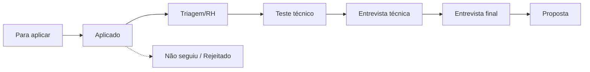

# 📋 Tracking de Candidaturas

`↩ Metodologia completa: ../anexos/anexo-c-empregabilidade.md` (Seção 4 — Aplicação para vagas)

Registre aqui cada candidatura, seguindo o funil abaixo. Atualize o status conforme avança e use as notas pós-entrevista como material de estudo para a próxima.

## Candidaturas ativas

| Empresa | Vaga | Data da candidatura | Link | Status | Próximo follow-up | Notas |
|---|---|---|---|---|---|---|
| | | | | Para aplicar | | |

> ✏️ Adicione uma linha por vaga. Nas notas, registre o que foi perguntado em cada etapa e como você se saiu — isso vira material de revisão para a candidatura seguinte.
