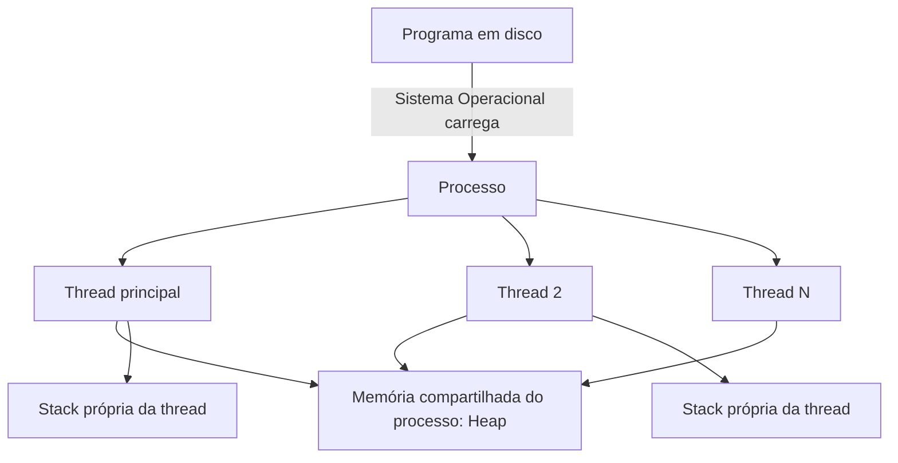
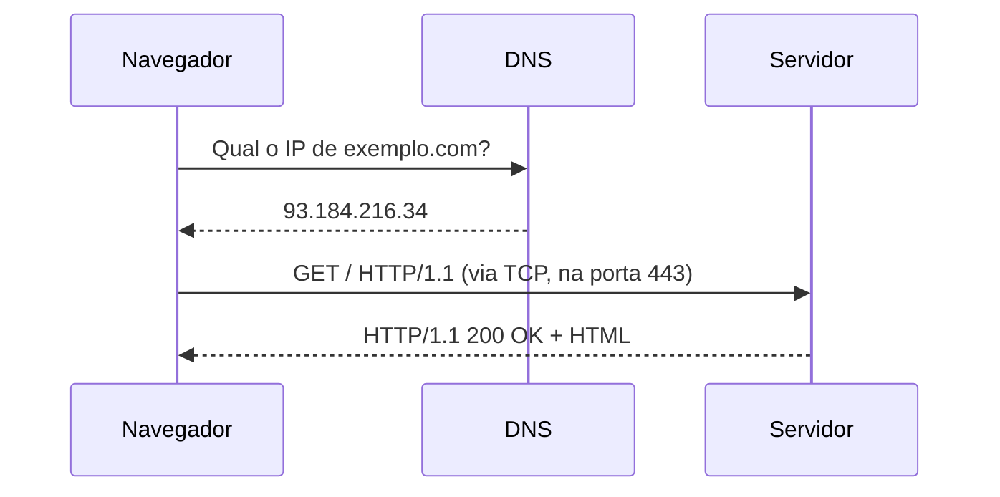

# FASE 0: Mentalidade de Engenharia

## 🎯 Objetivo

Um erro comum ao iniciar um projeto de estudos é pensar somente no conteúdo que será consumido, mas não no processo de consumo do mesmo. Previamente à primeira linha de código ou ao primeiro projeto no portfólio, é preciso ter um **sistema operacional** mental que alinhe suas expectativas em relação ao que será aprendido: dentro do contexto deste guia, estamos adentrando a **mentalidade da pessoa engenheira**.

Sem essa estrutura como alicerce, é comum que o estudo autodidata fique confuso ou se perca no meio do caminho, seja por falta de organização ou de retenção. Organizar previamente um sistema de estudos é o que permite um preparo adequado para entrevistas técnicas ou para o processo de identificação e correção de bugs no dia a dia de um deploy em produção, sem criar grandes dificuldades por não saber nem por onde começar.

> Esta fase existe para resolver um problema específico: **transformar consumo de conteúdo em capacidade real**, mensurável e demonstrável.

> 🎨 **Conexão com Design Engineering (Anexo F):** Neste estágio inicial, a transição para uma mentalidade de engenharia apoia-se na bagagem prévia em Design Gráfico e Branding, redirecionando seus princípios para a concepção de interfaces. Sugere-se iniciar de imediato o bloco F.1 (Fundamentos de Design de Interface) do [`Anexo F — Trilha de Design Engineering`](../anexos/anexo-f-design-engineering.md) executado em paralelo a esta fase e acessível sem requisitos de programação.

---

## 📝 Conceitos

- Active Recall (recuperação ativa)
- Spaced Repetition (repetição espaçada)
- Leitura de documentação técnica (documentation-first learning)
- Leitura técnica em inglês
- Método de resolução de problemas (Polya / Feynman Technique)
- GitHub como diário de evolução (learning in public)
- Inglês técnico (vocabulário mínimo viável)
- Como pesquisar como engenheira (Google-fu, Stack Overflow, RFCs, changelogs)
- Uso responsável de IA no aprendizado (IA como par, não como substituto)
- Deliberate Practice (prática deliberada) vs. prática ingênua
    
---

## 📋 Ordem de estudo

1. Entenda **por que** memorização passiva não funciona (a Curva do Esquecimento de Ebbinghaus).
2. Aprenda **Active Recall** e aplique imediatamente em qualquer conteúdo que consumir daqui para frente.
3. Configure um sistema de **Spaced Repetition** (Anki).
4. Adote o hábito de **ler documentação oficial primeiro**, vídeo depois (nunca o contrário).
5. Configure seu **GitHub** como diário de evolução desde o dia 1 (antes mesmo de saber programar bem).
6. Construa seu **vocabulário técnico em inglês** em paralelo — não depois.
7. Aprenda a **técnica de Feynman** para validar se você realmente entendeu algo.
8. Defina suas **regras pessoais de uso de IA** (detalhado abaixo) antes de tocar em qualquer assistente de código.
    

---

## 🔍 Explicação

### 1. Por que "estudar" do jeito tradicional não funciona?

Desde o primeiro contato com o processo de aprendizagem nas escolas, aprendemos que os métodos de estudo funcionam da seguinte forma: você abre o caderno, assiste ao professor lecionar o conteúdo e copia tanto o conteúdo passado na lousa quanto a explicação verbal feita pelo professor. Mas, de fato, isso se converte em aprendizado?

O fato é que, até mesmo no processo de leitura de livros conceituais, há uma aquisição passiva — você reconhece a origem do conceito, mas não consegue colocá-lo em prática por ter apenas criado um reconhecimento. Mas, no dia a dia, trabalhando com código ou participando de uma entrevista técnica, seu **cérebro** precisa ativamente exercitar aquele conhecimento e aplicá-lo no processo de debug — e isso exige muito mais processo cognitivo do que apenas reconhecer.

Isso é comprovado por décadas de pesquisa em ciência cognitiva (Roediger & Karpicke, Cepeda et al.). A curva de esquecimento mostra que, sem reforço, esquecemos a maior parte de um novo conteúdo em poucos dias. A solução não é "estudar mais", é **estudar de forma diferente**.

### 2. Active Recall (Recuperação Ativa)

Ao invés de copiar conteúdos ou marcar textos que nunca mais serão relidos, podemos utilizar a recuperação ativa, exercitando atividades que ajudam efetivamente a combater o processo da curva do esquecimento.

Esse processo faz com que o cérebro precise reforçar as conexões neurais estabelecidas no processo de aquisição daquele conteúdo, porém de forma **ativa**. Na prática:

- Depois de estudar um conceito, feche o material e escreva (ou fale em voz alta) tudo o que lembra, sem consultar nada.
- Crie perguntas sobre o conteúdo e tente respondê-las depois de um tempo, sem olhar a resposta.
- Ao terminar um exercício de código, **não copie e cole a solução** — reescreva do zero depois de entender a lógica.

Isso é fisicamente mais difícil e desconfortável do que reler — e é exatamente esse desconforto que fortalece a memória de longo prazo.

### 3. Spaced Repetition (Repetição Espaçada)

Mesmo exercitando as conexões neurais após a aquisição de conteúdo, precisamos encontrar meios de manter aquele conhecimento exercitado e constante, sedimentando-o na memória de longo prazo — para isso, podemos combinar a recordação ativa com a **repetição espaçada**. Os intervalos crescentes reforçam as bases e abrem caminho para outros conceitos mais complexos, sem a sensação de ter esquecido algo importante no meio do caminho.

Em vez de revisar um conceito todos os dias (ineficiente) ou nunca mais (esquecimento total), você revisa em intervalos que aumentam conforme você demonstra domínio: 1 dia, 3 dias, 7 dias, 15 dias, 30 dias...

**Ferramenta padrão da indústria:** Anki (gratuito, open-source). Crie flashcards para:

- Definições de conceitos (o que é Big O, o que é uma thread, o que é normalização)  
- Sintaxe que você erra com frequência
- Perguntas de entrevista técnica

> ⚠️ **Armadilha comum:** usar Anki para decorar sintaxe de código de memória, palavra por palavra. Isso é ineficaz. Use Anki para **conceitos, definições e "por quês"** — a sintaxe você fixa escrevendo código de verdade, repetidamente.

### 4. Documentação primeiro, vídeo depois

No processo de aprendizagem autodidata, é comum que o conhecimento fique direcionado para vídeos do YouTube. Vídeos são ótimos para uma primeira exposição visual ao conceito, ainda mais se tratando de um contexto atrelado à tecnologia, mas **documentação oficial é a fonte da verdade** — é o que profissionais consultam no dia a dia, é sempre atualizada e é o que você vai precisar saber ler fluentemente no trabalho.

A partir de agora, o fluxo padrão para aprender qualquer tecnologia nova é:

1. Ler a seção "Getting Started" / "Introduction" da documentação oficial.
2. Reproduzir os exemplos da própria documentação, sem vídeo.
3. Só recorrer a vídeo ou curso quando travar em algo específico.
4. Voltar à documentação para aprofundar (nunca considerar um vídeo como fonte final).
    
> **Como isso aparece no mercado:** Engenheiros seniores raramente "fazem um curso" para aprender uma lib nova — eles leem a documentação e o código-fonte. Treinar esse músculo cedo é uma vantagem competitiva enorme para uma Junior.

### 5. GitHub como diário de evolução

Desde o primeiro dia, é importante que todo código escrito (mesmo os exercícios mais simples) seja documentado diretamente no GitHub, com commits regulares. Isso cumpre três funções:

- **Prova de trabalho:** recrutadores e tech leads olham o histórico de commits, não apenas o "produto final".
- **Autoavaliação:** ao olhar seu código de 3 meses atrás, você literalmente vê sua evolução — e isso é um dos maiores motivadores de continuidade que existe.
- **Hábito profissional:** commitar com frequência, escrever mensagens de commit descritivas e manter repositórios organizados é uma habilidade que será cobrada no seu primeiro emprego, desde o primeiro dia.

> 💡 **Boas práticas:** crie um repositório chamado algo como `software-engineer` ou similar, com uma pasta por fase deste guia. Cada exercício, mesmo os pequenos, vira um commit com mensagem clara (ex.: `feat: implementa busca binária recursiva`).

### 6. Inglês técnico

O mercado de tecnologia é dominado pelo inglês, logo, não é preciso ser fluente em inglês para começar, mas é preciso desenvolver **inglês técnico de leitura** com urgência, porque:

- A quase totalidade da documentação de qualidade é em inglês.
- Mensagens de erro, logs e stack traces são em inglês.
- Boa parte das vagas competitivas (remotas, multinacionais) exige inglês em algum nível.
- Entrevistas em empresas como Google, Microsoft e Amazon frequentemente são conduzidas (ou têm etapas) em inglês.

**Como treinar em paralelo:**

- Configure o idioma do seu sistema operacional, IDE e ferramentas em inglês.
- Leia toda a documentação em inglês (nunca em traduções, que costumam estar desatualizadas).
- Assista a talks técnicas legendadas em inglês (não dubladas).
- Escreva seus commits e comentários de código em inglês desde já — é o padrão da indústria global.
    

### 7. Técnica de Feynman

Aprender um conteúdo pode ser facilitado quando simplificamos a conceituação dele, visando explicá-lo para alguém que nunca teve contato com aquele conceito — isso é a técnica de Feynman na prática. O processo:

1. Escolha um conceito (ex.: "o que é uma API REST").
2. Escreva a explicação como se estivesse ensinando para alguém sem nenhum conhecimento técnico.
3. Identifique onde você travou, usou jargão sem explicar ou "enrolou".
4. Volte ao material, estude o ponto em que travou e repita.
    

> **Aplicação prática:** ao final de cada fase deste guia, escreva um post curto (pode ser privado, num README, num blog) explicando o que você aprendeu, como se fosse para outra pessoa autodidata começando do zero. Isso é parte do "O que dominar" de toda fase.

### 8. IA como ferramenta de aprendizagem — não como muleta

No mercado atual, é impossível falar de tecnologia sem abordar os impactos da Inteligência Artificial dentro do setor. Evitar o uso de IA é uma prática que retrocede o processo de desenvolvimento de carreira, porém sua adoção no dia a dia deve ser mensurada de acordo com o momento atual e os conhecimentos adquiridos durante o estudo.

Ferramentas de IA (como Claude, ChatGPT, GitHub Copilot, Cursor) são extraordinariamente poderosas para acelerar o aprendizado — **quando usadas corretamente**. Usadas incorretamente, elas produzem o efeito oposto: uma pessoa que "entrega projetos", mas não consegue passar em uma entrevista técnica, porque nunca de fato desenvolveu o raciocínio.

**Regras práticas que você deve adotar a partir de hoje:**

|Uso correto ✅|Uso incorreto ❌|
|---|---|
|Pedir para a IA explicar um conceito de formas diferentes até você entender|Pedir para a IA resolver o exercício e você só copiar|
|Pedir para a IA revisar seu código já escrito e apontar melhorias|Pedir para a IA escrever o projeto inteiro do zero|
|Usar IA para debugar depois de você tentar sozinha por um tempo limite|Colar o erro na IA no primeiro sinal de dificuldade|
|Pedir perguntas de entrevista simuladas para você responder|Pedir para a IA te dar "as respostas certas" para decorar|
|Usar IA para gerar casos de teste extras depois que você escreveu a lógica|Usar IA para gerar toda a lógica de negócio|

**Regra de ouro:** trate a IA como um par sênior disponível 24h — você ainda precisa pensar, tentar, errar e só então pedir ajuda direcionada. Se você consegue "terminar" um projeto usando IA, mas não consegue explicar linha por linha o que o código faz e por quê, você não aprendeu — você apenas produziu um artefato.

> ⚠️ **Armadilha comum em 2026:** montar um portfólio inteiro "vibe coded" (gerado quase inteiramente por IA, sem compreensão) e ser reprovada na primeira pergunta técnica sobre o próprio projeto em entrevista. Isso já é um padrão reconhecido por recrutadores — e é motivo automático de eliminação em processos sérios.

---

## 💻 O que dominar

Ao final da Fase 0, você deve ser capaz de, sem consultar nada:

- Explicar o que é Active Recall e aplicá-lo em qualquer novo conteúdo de estudo
- Configurar e usar Anki (ou similar) para revisão espaçada
- Ler a documentação oficial de uma tecnologia nova como primeira fonte, antes de vídeo
- Ter um repositório GitHub configurado como diário de evolução, com commits organizados
- Escrever commits, comentários e código em inglês
- Aplicar a técnica de Feynman para validar seu próprio entendimento
- Ter regras pessoais claras e escritas de como (e quando) usar IA nos estudos
    
---

## ⚠️ Erros comuns

1. **"Tutorial hell"**: consumir curso atrás de curso sem nunca aplicar, porque parece produtivo, mas é fuga do desconforto de praticar.
2. **Ilusão de competência**: reler o mesmo material várias vezes e confundir familiaridade com domínio.
3. **Estudar sem medir**: não ter nenhum critério objetivo de "eu sei isso ou não sei", vivendo na zona cinzenta.
4. **Terceirizar o raciocínio para IA**: usar IA para gerar soluções completas e nunca desenvolver a capacidade de resolver problemas sozinha.
5. **Não documentar a jornada**: chegar em uma entrevista sem conseguir mostrar evolução real, porque nunca commitou nada, nunca escreveu sobre o que aprendeu.
6. **Ignorar inglês até "ser necessário"**: adiar o inglês técnico e travar meses depois ao tentar ler uma RFC ou documentação avançada.

---

## 🧠 Exercícios

- **Iniciante**
1. Crie sua conta no GitHub (se ainda não tiver) e crie o repositório `estudos-engenharia-de-software`.
2. Instale o Anki e crie seu primeiro deck: "Fundamentos de Engenharia de Software".
3. Escreva, em um arquivo `README.md`, sua própria definição (com suas palavras, sem copiar) do que é Active Recall e por que ele funciona.
    
- **Intermediário**
1. Escolha um conceito técnico qualquer que você já "conhece superficialmente" (ex.: API, banco de dados, variável) e aplique a Técnica de Feynman por escrito. Identifique pelo menos dois pontos em que você travou.
2. Configure seu ambiente (sistema, editor de código) em inglês.

- **Avançado**
1. Escreva, em texto, suas 5 regras pessoais de uso de IA nos estudos — o que você vai permitir e o que não vai permitir a si mesma fazer. Faça commit desse arquivo no seu repositório.
    
- **Desafio final**
1. Pelos próximos 7 dias, mantenha um "log de estudo" diário no seu GitHub (um commit por dia, mesmo que pequeno), descrevendo o que estudou e o que conseguiu recordar sem consultar material (Active Recall aplicado à própria rotina).
    
---

## 🌱 Projetos

Esta fase não tem projeto de código — o "projeto" é o **sistema de estudo** que você acabou de construir: repositório GitHub ativo, Anki configurado, rotina de leitura de documentação e regras de uso de IA por escrito. Isso será a espinha dorsal de todas as fases seguintes.

---

## ✔️ Critério de conclusão

Você conclui a Fase 0 quando:

- Tem um repositório GitHub ativo, com pelo menos 7 commits reais.
- Tem um sistema de Spaced Repetition funcionando (Anki configurado e com pelo menos um deck em uso).
- Consegue explicar por escrito, sem consultar, o que é Active Recall, Spaced Repetition e a Técnica de Feynman.
- Tem suas regras de uso de IA escritas e commitadas.
    
> **É isso que empresas realmente esperam de uma Junior?** Não diretamente — nenhuma empresa vai perguntar "você usa Anki?". Mas toda empresa vai notar a **consequência** disso: uma Junior que aprende rápido, retém conhecimento, documenta seu trabalho e não trava quando a IA não está disponível. Essa fase é o alicerce invisível que torna todas as próximas mais eficientes.

---

# 📖 FASE 1: Fundamentos da Computação

## 🎯 Objetivo

Conhecer as bases dos Fundamentos da Computação é aquilo que separa uma pessoa que sabe programar de uma pessoa com um perfil profissional de engenharia de software. As tecnologias mudam a cada 2-3 anos; os fundamentos de como um computador funciona não mudam há décadas. Entender o que acontece na infraestrutura é o que permite:

- Debugar problemas de performance com confiança.
- Entender por que um código é lento e outro é rápido.
- Responder perguntas de entrevistas técnicas de empresas como Google, Microsoft e Amazon, que **sempre** tocam em fundamentos.
- Aprender qualquer linguagem ou framework novo mais rápido, porque os conceitos de base se repetem.
    
> **Como isso aparece no mercado:** Perguntas como "o que acontece quando você digita uma URL e aperta Enter?", "diferença entre processo e thread", "o que é um deadlock" são clássicas em entrevistas — inclusive para vagas Junior em empresas que levam engenharia a sério.

---

## 📝 Conceitos

- Arquitetura de computadores (CPU, memória, barramentos, ciclo fetch-decode-execute)
- Sistema binário e hexadecimal
- Representação de dados (inteiros, ponto flutuante, caracteres/ASCII/Unicode)
- Lógica booleana e portas lógicas
- Sistemas operacionais (o que fazem, kernel vs. user space)
- Processos vs. Threads
- Concorrência vs. Paralelismo
- Gerenciamento de memória (stack, heap, garbage collection)
- Sistema de arquivos
- Compiladores vs. Interpretadores vs. JIT
- Terminal / linha de comando (shell, comandos essenciais)
- Redes de computadores (fundamentos: modelo cliente-servidor, TCP/IP, HTTP, DNS)

---

## 📋 Ordem de estudo

1. Arquitetura de computadores e binário/hexadecimal (a base física)
2. Lógica booleana (a base matemática que sustenta tudo)
3. Sistemas operacionais: processos, threads, memória
4. Sistema de arquivos e terminal (a base prática do dia a dia)
5. Compiladores vs. interpretadores (entender como seu código vira execução real)
6. Redes básicas (a base de tudo que você vai construir como backend)
    
---

## 🔍 Explicação

### 1. Como um computador funciona, de verdade

No nível mais fundamental, um computador é um dispositivo que manipula **bits** (0 e 1) usando **portas lógicas** (AND, OR, NOT, XOR...) construídas com transistores. A CPU executa um ciclo constante chamado **fetch-decode-execute**: busca uma instrução da memória, decodifica o que ela significa e a executa.

Não é preciso ser engenheira de hardware, mas é necessário entender esse modelo mental porque ele explica **por que** certas operações são caras (acesso à memória, I/O) e outras são baratas (operações aritméticas simples na CPU).

**Recurso definitivo para isso:** o projeto **Nand2Tetris** (gratuito, com curso em Coursera), que literalmente te faz construir um computador do zero — de portas lógicas até um sistema operacional simples. É considerado por muitos engenheiros seniores como o material mais formador que existe para entender computação de verdade.

### 2. Binário e Hexadecimal

Computadores armazenam tudo como sequências de bits. Você precisa saber:

- Converter números decimais para binário e vice-versa, manualmente.
- Entender por que hexadecimal é usado como "atalho" para binário (cada dígito hex representa exatamente 4 bits).
- Onde isso aparece na prática: endereços de memória, cores em CSS (`#FF5733`), representação de erros de baixo nível, endereços MAC, hashes.

### 3. Representação de dados

- **Inteiros:** como números negativos são representados (complemento de dois) e por que isso causa fenômenos como _integer overflow_.
- **Ponto flutuante:** por que `0.1 + 0.2 !== 0.3` em praticamente toda linguagem de programação (representação IEEE 754) — uma das perguntas mais reveladoras sobre profundidade de conhecimento que existe.
- **Caracteres:** ASCII (128 caracteres, 7 bits) e Unicode/UTF-8 (como o mundo representa emojis, acentos, caracteres de qualquer idioma).
    

### 4. Lógica booleana

A base matemática de todo `if`, `while` e condição que você vai escrever pelo resto da carreira. Tabelas-verdade, operadores AND/OR/NOT/XOR e como circuitos lógicos combinam essas portas para formar somadores, multiplexadores e, eventualmente, uma CPU inteira.

### 5. Sistemas Operacionais

Um sistema operacional é o software que gerencia os recursos físicos do computador (CPU, memória, disco, rede) e oferece uma interface para que outros programas (incluindo o seu código) rodem sem precisar "conversar" diretamente com o hardware.

Conceitos essenciais:

- **Kernel vs. user space:** o kernel tem acesso privilegiado ao hardware; seus programas rodam em um espaço isolado e pedem recursos ao kernel via _syscalls_.
- **Processo:** uma instância de um programa em execução, com seu próprio espaço de memória isolado.
- **Thread:** uma unidade de execução _dentro_ de um processo; múltiplas threads de um mesmo processo compartilham memória.
- **Concorrência vs. Paralelismo:** concorrência é lidar com múltiplas tarefas ao mesmo tempo (podendo alternar entre elas); paralelismo é executá-las literalmente ao mesmo tempo, em núcleos diferentes. Isso é fundamental para entender, mais tarde, o _event loop_ do Node.js.
- **Deadlock e race condition:** dois problemas clássicos de concorrência que toda engenheira precisa saber identificar.
    

### 6. Gerenciamento de memória

- **Stack:** memória usada para chamadas de função, variáveis locais — rápida, organizada, com tamanho limitado (por isso "stack overflow" em recursão infinita).
- **Heap:** memória usada para alocação dinâmica — mais flexível, mais lenta, precisa ser gerenciada (manualmente em C, automaticamente via _Garbage Collector_ em JavaScript, Java, Python).
- **Garbage Collection:** como o V8 (motor do JavaScript/Node.js) decide quando liberar memória que não está mais sendo usada. Você não vai implementar um GC, mas entender que ele existe explica _memory leaks_ — um problema real que você vai enfrentar em produção.

### 7. Sistema de arquivos e terminal

Todo engenheiro de software profissional trabalha fluentemente no terminal. Você precisa dominar:

- Navegação (`cd`, `ls`/`dir`, `pwd`)
- Manipulação de arquivos (`cp`, `mv`, `rm`, `mkdir`, `touch`)
- Permissões (`chmod`, no mundo Unix/Linux/Mac)
- Pipes e redirecionamento (`|`, `>`, `>>`)
- Variáveis de ambiente
- `grep`, `find` para busca
    
> ⚠️ **Armadilha comum:** depender 100% de interface gráfica (VSCode, GitHub Desktop) e travar completamente quando precisar debugar um servidor remoto via SSH, que só tem terminal. Isso acontece — e frequentemente — no primeiro emprego.

### 8. Compiladores, Interpretadores e JIT

- **Compilador:** traduz todo o código-fonte para código de máquina _antes_ da execução (ex.: C, Go, Rust).
- **Interpretador:** lê e executa o código linha a linha, em tempo real (ex.: Python "puro", Ruby).
- **JIT (Just-In-Time):** híbrido — compila partes do código durante a execução para ganhar performance. É assim que o **V8** (motor por trás do JavaScript no Chrome e no Node.js) funciona: interpreta inicialmente e compila "just in time" os trechos de código executados com frequência.
    

Entender isso explica, por exemplo, por que JavaScript — uma linguagem "interpretada" — consegue ter performance competitiva com linguagens compiladas em muitos cenários.

### 9. Redes de computadores — fundamentos

Como você vai construir APIs e sistemas backend, entender a base de rede não é opcional:

- **Modelo cliente-servidor:** a base de praticamente tudo que você vai construir.
- **TCP/IP:** como dados trafegam entre máquinas, de forma confiável, em pacotes.
- **DNS:** como um nome (`google.com`) vira um endereço IP.
- **HTTP/HTTPS:** o protocolo que sustenta a web — métodos (GET, POST, PUT, DELETE), status codes (200, 404, 500...), headers.
    

> Este tópico será aprofundado na Fase 7 (Node.js/APIs), mas o fundamento precisa estar sólido agora.

---

## Cursos recomendados

|Nome|Instituição|Nível|Gratuito/Pago|Vale certificado?|Vale o investimento?|Pré-requisitos|Alternativa gratuita|
|---|---|---|---|---|---|---|---|
|**CS50x: Introduction to Computer Science**|Harvard (via edX)|Iniciante|Gratuito (certificado pago, opcional)|Certificado tem reconhecimento, mas o que importa é o aprendizado|Sim — é hoje o padrão-ouro mundial de introdução à CS para autodidatas|Nenhum|O curso já é gratuito na íntegra|
|**Nand2Tetris (Build a Modern Computer from First Principles)**|Hebrew University / Coursera|Iniciante-Intermediário|Gratuito (áudio/vídeo); certificado pago|Reconhecimento é pela profundidade, não pelo papel|Sim, extremamente — poucos cursos entregam esse nível de entendimento real|Lógica básica|Já é essencialmente gratuito|
|**Computer Systems: A Programmer's Perspective (curso associado, CMU)**|Carnegie Mellon|Intermediário|Gratuito (materiais da CMU são públicos)|Não emite certificado formal público|Sim, para quem já tem base de CS50 e quer aprofundar|CS50 ou equivalente|É o próprio material gratuito|
|**Introdução à Ciência da Computação I e II**|USP (via Coursera/Veduca, dependendo do período)|Iniciante|Geralmente gratuito para assistir|Reconhecimento nacional forte|Sim, para quem quer uma referência em português|Nenhum|Aulas costumam ficar disponíveis gratuitamente|
|**Redes de Computadores (fundamentos)**|Google via Coursera ("Google IT Support" ou similar) / Cisco Networking Academy|Iniciante|Gratuito com opção de certificado pago|Certificado Cisco tem reconhecimento de mercado|Sim, para quem quer uma base prática de redes|Nenhum|Cisco Networking Academy tem trilhas gratuitas|
|**Microsoft Learn — Fundamentos de Computação**|Microsoft|Iniciante|100% gratuito|Módulos badge têm baixo peso isolado, mas somam|Como complemento, sim|Nenhum|O próprio é gratuito|

> **Qual priorizar?** Se você só puder fazer um, faça o **CS50x**. É o curso que mais aparece em currículos de autodidatas bem-sucedidos globalmente, tem produção excelente e cobre boa parte dos tópicos desta fase de forma integrada (incluindo uma introdução a C, Python, SQL e web, que preparam terreno para as próximas fases). O **Nand2Tetris** é o complemento ideal para quem quer entender hardware/software na raiz — recomendo fortemente para quem tem tempo (cronograma de 25h ou 40h/semana).

---

## 💻 O que dominar

Ao final da Fase 1, você deve ser capaz de, sem consultar nada:

- Converter números entre decimal, binário e hexadecimal manualmente
- Explicar por que `0.1 + 0.2` não é exatamente `0.3` em ponto flutuante
- Explicar a diferença entre processo e thread, com um exemplo prático
- Explicar o que é stack e heap, e por que recursão infinita causa "stack overflow"
- Navegar e manipular arquivos fluentemente pelo terminal, sem interface gráfica
- Explicar a diferença entre compilador, interpretador e JIT
- Explicar o que acontece, em alto nível, quando você digita uma URL e aperta Enter
- Explicar a diferença entre concorrência e paralelismo com um exemplo

---

## ⚠️ Erros comuns

1. **Pular fundamentos "porque quero programar logo".** Isso cria um teto de conhecimento baixo — a pessoa aprende sintaxe, mas nunca entende comportamento, performance ou causas-raiz de bugs.
2. **Confundir threads e processos** — um dos erros mais comuns em entrevistas técnicas, mesmo entre candidatos com experiência.
3. **Evitar terminal e viver só de interface gráfica.** Trava completamente em ambientes de servidor, CI/CD e debugging remoto.
4. **Achar que fundamentos de CS são "só teoria acadêmica sem aplicação prática".** Na realidade, eles explicam praticamente todo bug de performance e concorrência que você vai enfrentar profissionalmente.
5. **Tentar aprender tudo de sistemas operacionais em profundidade acadêmica completa antes de programar.** É desnecessário para uma Junior — o objetivo aqui é fundamento sólido, não especialização em SO.

---

## 🧠 Exercícios

- **Iniciante**
1. Converta manualmente (com papel e caneta, sem calculadora) os números decimais 42, 100 e 255 para binário e para hexadecimal.
2. No terminal, crie uma estrutura de pastas `projeto/src`, `projeto/tests`, `projeto/docs` usando apenas comandos de terminal (sem interface gráfica).
3. Escreva, com suas palavras, a diferença entre processo e thread.
    
- **Intermediário**
    
1. Escreva um pequeno texto (pode ser no seu README de estudos) explicando o ciclo fetch-decode-execute de uma CPU.
2. Usando o terminal, escreva um comando que liste todos os arquivos `.txt` de uma pasta e redirecione o resultado para um novo arquivo (`> arquivo.txt`).
3. Pesquise e explique, com suas palavras, o que é uma _race condition_, com um exemplo do mundo real (fora de programação) que ilustre o conceito.

- **Avançado**
1. Complete pelo menos os dois primeiros problem sets do CS50x (Semana 0 e Semana 1) e resolva-os sem assistir à solução antes de tentar sozinha por pelo menos 45 minutos.
2. Explique, por escrito, por que um número inteiro em muitas linguagens tem um limite máximo (ex.: por que `Number.MAX_SAFE_INTEGER` existe em JavaScript), relacionando com representação binária.
    
- **Desafio final**
1. Escreva um artigo curto (pode ser um post no seu GitHub/README) intitulado "O que realmente acontece quando eu aperto Enter numa URL", explicando DNS, TCP, HTTP e a resposta do servidor, em linguagem acessível para alguém não técnico (aplicando a Técnica de Feynman da Fase 0).

---

## 🌱 Projetos

> Fundamentos de computação não geram "projetos de portfólio" tradicionais (não há um app para mostrar), mas geram **artefatos de prova de entendimento**, que também têm valor no seu processo de aprendizagem e podem, inclusive, aparecer em conversas de entrevista como demonstração de profundidade.

**Projeto 1 — Simulador de portas lógicas (mini)**  
Depois de aprender lógica booleana, implemente (em qualquer linguagem, mesmo pseudo-código estruturado) funções que simulem portas lógicas básicas (AND, OR, NOT, XOR) e componha-as para simular um **somador de 1 bit**. Isso é literalmente o primeiro projeto do Nand2Tetris — fazer isso por conta própria antes ou durante o curso consolida o entendimento.

**Projeto 2 — Conversor de bases numéricas (CLI)**  
Construa uma pequena ferramenta de linha de comando que converte números entre decimal, binário e hexadecimal, sem usar funções prontas de conversão da linguagem (ex.: sem usar `Number.toString(2)` em JS) — implementando o algoritmo de conversão manualmente. Isso força o entendimento real do processo, não apenas o uso de uma função pronta.

> Estes projetos são propositalmente pequenos nesta fase — o objetivo aqui é consolidar fundamento, não portfólio. Os projetos "de peso" começam a partir da Fase 3 em diante.

---

## ✔️ Critério de conclusão

Você conclui a Fase 1 quando:

- Completa (e resolve, com esforço próprio antes de consultar soluções) pelo menos as duas primeiras semanas do CS50x.
- Consegue explicar, sem consultar, todos os itens da lista "O que dominar" acima.
- Tem o exercício "O que acontece quando aperto Enter numa URL" escrito e commitado.
- Consegue navegar confortavelmente pelo terminal sem depender de interface gráfica para tarefas básicas de arquivo.

> **É isso que empresas realmente esperam de uma Junior?** Parcialmente. Empresas não vão perguntar diretamente "explique o ciclo fetch-decode-execute" para uma vaga Junior comum (isso é mais cobrado em processos de Big Techs como Google/Amazon). Mas **todas** as empresas sérias vão notar, indiretamente, se você entende ou não o que está fazendo quando escreve código — e isso aparece em como você debuga, como você explica decisões e como você se comporta diante de um bug difícil. Esta fase é o que garante que, quando você chegar na Fase 3 (JavaScript), você não vá apenas "decorar sintaxe", mas entender profundamente o que está acontecendo.

---

## 🔖 Livros recomendados

- **"Code: The Hidden Language of Computer Hardware and Software" — Charles Petzold.** Leia **antes ou durante** o Nand2Tetris. É o livro que explica, em linguagem extremamente acessível (sem jargão excessivo), como bits, portas lógicas e circuitos viram um computador funcional. É praticamente literatura de entretenimento sobre um tema técnico — recomendado até para quem "tem medo" de fundamentos de hardware.
    
- **"Computer Systems: A Programmer's Perspective" (CS:APP) — Bryant & O'Hallaron.** Leia **depois** do CS50, quando já tiver alguma prática de programação (mesmo básica). É mais denso, é usado como livro-texto em cursos de graduação de CS de universidades como CMU e aprofunda muito além do que é estritamente necessário para uma vaga Junior — mas é uma referência de altíssimo nível para quem quer entender de verdade.
    
- **"Operating System Concepts" (o "livro do dinossauro") — Silberschatz, Galvin, Gagne.** Não é obrigatório nesta fase para uma Junior, mas é a referência canônica de sistemas operacionais usada mundialmente em graduações. Vale ter como consulta ao longo da carreira, não necessariamente ler linearmente agora.
    

> ⚠️ Não tente ler CS:APP ou o "livro do dinossauro" cover-to-cover antes de programar nada. Isso é um erro clássico de autodidatas perfeccionistas — eles viram bloqueio, não ferramenta. Use-os como referência de aprofundamento, não como pré-requisito absoluto.

---

## 📄 Documentações

Nesta fase, "documentação oficial" no sentido tradicional é menos aplicável (fundamentos de CS não têm um "site oficial"), mas os equivalentes são:

- **Material do próprio CS50** (cs50.harvard.edu) — sempre atualizado, gratuito, com problem sets.
    
- **The Missing Semester of Your CS Education (MIT)** — um curso curto, gratuito e extremamente prático sobre terminal, shell, Git, editores de texto e ferramentas do dia a dia que universidades tradicionalmente não ensinam bem. **Recomendação forte** para complementar esta fase com o lado prático de terminal.
    

---

## Checklist consolidado — Fase 0 + Fase 1

- Sei explicar Active Recall, Spaced Repetition e Técnica de Feynman
- Tenho GitHub configurado como diário de evolução, com commits reais
- Tenho Anki configurado e em uso
- Tenho minhas regras pessoais de uso de IA escritas
- Sei converter números entre decimal, binário e hexadecimal
- Sei explicar processo vs. thread, stack vs. heap
- Sei explicar compilador vs. interpretador vs. JIT
- Sei navegar fluentemente pelo terminal
- Sei explicar, em alto nível, o que acontece da URL até a resposta do servidor
- Consigo ensinar qualquer um dos tópicos acima para outra pessoa, do zero 

---

`↩ Voltar ao Índice Geral: 00-INDICE-GERAL.md` `➡ Próximo: Capítulo 2 — Fase 2 (Lógica de Programação)`
