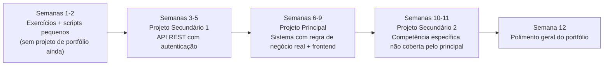

# 🚀 TRACI — Sprint de 12 Semanas para Empregabilidade em Software Engineering

`↩ Índice Geral: ../modulos/00-INDICE-GERAL.md`

---

## Como este documento se relaciona com o resto do repositório

O `software-engineer` (módulos 01-15 + anexos) é o **currículo de conteúdo** — o que aprender e por quê, organizado por tópico. Este documento é a **camada de execução**: transforma esse currículo em um **calendário de 12 semanas**, cruzando fundamentos, prática, projeto, algoritmos, entrevista e candidatura **desde a Semana 1**, seguindo o princípio que você definiu:

> **APRENDER → APLICAR → CONSTRUIR → DOCUMENTAR → EXPLICAR → ENTREVISTAR → RECEBER FEEDBACK → CORRIGIR**

Não é uma reformulação do guia — é a ordem de ataque. Sempre que um módulo do repositório for relevante numa semana, ele é referenciado diretamente (`../modulos/modulo-07.md`, por exemplo), em vez de duplicado aqui.

**Regra de decisão para qualquer coisa nova que você queira adicionar ao longo do sprint:**
> "Isso é necessário para o objetivo dos próximos 3 meses?"
> Se não for → vai para a seção **Backlog — Não Agora** (final deste documento), não para o cronograma.

---

## B. Stack Principal do Sprint

| Camada | Escolha | Por quê |
|---|---|---|
| **Backend** | Node.js + TypeScript + NestJS | Você já tem contato — trocar de stack agora violaria o princípio de execução vs. exploração. NestJS impõe arquitetura (SOLID, DI, camadas), o que acelera a Semana 6+ (arquitetura/testes). |
| **Banco de dados** | PostgreSQL + Prisma (SQL puro nas primeiras queries, antes do ORM) | Alinhado ao `../modulos/modulo-08.md`; SQL relacional é o mais cobrado em entrevista Junior no Brasil. |
| **Frontend (secundário)** | React + TypeScript | Só o suficiente para consumir suas próprias APIs com uma interface real no portfólio — não é o foco, é suporte ao projeto principal. |
| **Testes** | Jest (unitário/integração) | Padrão de mercado no ecossistema Node/NestJS. |
| **Deploy** | Docker + Render/Railway + GitHub Actions | Free tier suficiente para o sprint; CI/CD desde o primeiro projeto secundário, não só no final. |

> Esta escolha **não muda durante o sprint**. Qualquer vontade de trocar de stack no meio do caminho vai para o Backlog.

---

## A. Roadmap de Projetos — pequeno → intermediário → principal

| Projeto | Quando | O que demonstra | Vai pro portfólio final? |
|---|---|---|---|
| Exercícios/scripts (Odin, freeCodeCamp, LeetCode) | Semanas 1-2, contínuo depois | Fundamentos, lógica | Não — ficam soltos no GitHub, sem virar destaque |
| **Secundário 1** — API de Controle Financeiro Pessoal (autenticação, transações, saldo calculado) | Semanas 3-5 | Backend sólido, auth, banco relacional | Sim, se ficar com testes + deploy |
| **Principal** — Sistema de Reservas ou Gestão de Pedidos (regra de negócio real, concorrência, frontend consumindo a API) | Semanas 6-9 | Engenharia completa: arquitetura, testes, segurança, deploy, decisão técnica documentada | Sim — projeto-âncora |
| **Secundário 2** — escolha na Semana 9 com base na lacuna mais evidente (ex: fila assíncrona, ou hardening de segurança) | Semanas 10-11 | Competência específica que o principal não cobriu | Sim, se sólido; senão vira exercício de estudo |

> **Critério objetivo de "isso merece estar no portfólio?"** (use isso a cada projeto concluído): tem testes automatizados? Tem deploy real funcionando? Você consegue explicar cada decisão técnica sem gaguejar? Tem README com problema de negócio, arquitetura e decisões documentadas? Se **3 de 4** forem sim, entra no portfólio principal — senão, fica como exercício documentado, sem virar destaque.

---

## O Sprint — Semana a Semana

### Semana 1 — Fundação: Ambiente, Posicionamento e Primeiro Contato com Prática Diária

**Objetivo da semana:** sair da fase de exploração para execução — ambiente pronto, GitHub organizado, primeiro rascunho de currículo, e a rotina diária de prática (recall + algoritmo) já rodando.

**Competências técnicas:** setup de ambiente profissional; fundamentos de terminal e Git.

**Conteúdos prioritários:** revisão rápida de Git/GitHub (branches, commits, PR) — não do zero, já que você já tem contato; fundamentos de terminal (`../modulos/modulo-01.md`, seção de terminal).

**Cursos/recursos gratuitos:**
- **Essencial:** [The Odin Project — Foundations](https://www.theodinproject.com/paths/foundations) (módulos de Git/terminal, pule o que já domina) · [The Missing Semester — MIT](https://missing.csail.mit.edu/) (aulas 1-3: shell, editores, Git)
- **Complementar:** [CS50x](https://cs50.harvard.edu/x/) — Semana 0 apenas (Scratch/lógica), não é obrigatório se sua lógica já está sólida

**Projeto/prática:** nenhum projeto de portfólio ainda. Reorganize seus repositórios existentes (bootcamps/acadêmicos) — decida o que fica público, o que vira privado, o que é arquivado.

**Algoritmos:** diagnóstico — resolva 5 problemas Easy no LeetCode sem cronômetro, para mapear onde você está agora. Configure conta no NeetCode.

**Entrevista:** nenhuma prática formal ainda — leia 10 perguntas técnicas comuns de Junior JS/Node (sem responder ainda, só reconhecer o terreno).

**Empregabilidade (Fase 1 — Posicionamento):** rascunho v1 do currículo (`../anexos/anexo-c-empregabilidade.md`, Seção 1); configuração inicial do GitHub (foto, bio, README de perfil — `../anexos/anexo-c-empregabilidade.md`, Seção 2).

**Entregáveis concretos:**
- [ ] GitHub reorganizado (perfil + repositórios existentes triados)
- [ ] Currículo v1 (rascunho, não revisado ainda)
- [ ] Diagnóstico de 5 problemas LeetCode documentado (o que travou, o que saiu fácil)

**Critério de conclusão:** você tem clareza escrita de onde está tecnicamente agora (nem subestimando, nem superestimando), e o ambiente/GitHub não são mais um obstáculo para as próximas 11 semanas.

---

### Semana 2 — Consolidar Backend Base + Algoritmos com Padrão

**Objetivo da semana:** eliminar lacunas na base de Node/TS/SQL antes de começar o projeto secundário 1, e iniciar prática de algoritmos por padrão (não aleatória).

**Competências técnicas:** Node.js/Express fundamentos; TypeScript básico-intermediário; SQL (SELECT, JOIN, agregações).

**Conteúdos prioritários:** `../modulos/modulo-03.md` (JS — reforçar só o que estiver fraco: closures, event loop, async/await) e `../modulos/modulo-04.md` (TS — interfaces, generics básicos).

**Cursos/recursos gratuitos:**
- **Essencial:** [freeCodeCamp — JavaScript Algorithms and Data Structures](https://www.freecodecamp.org/learn/javascript-v9) (só os módulos que o diagnóstico da Semana 1 revelou como fracos, não o curso inteiro) · [The Odin Project — NodeJS course](https://www.theodinproject.com/paths/full-stack-javascript/courses/nodejs) (revisão)
- **Complementar:** `../modulos/modulo-08.md` (Banco de Dados) para revisão de SQL

**Projeto/prática:** modele (no papel/Miro/dbdiagram.io) o schema do Projeto Secundário 1 (Controle Financeiro): tabelas, relacionamentos, constraints. Não codar ainda — modelagem primeiro.

**Algoritmos:** padrão "Arrays & Hashing" — 5-6 problemas Easy/Medium no NeetCode 150, cronometrados (25 min cada), seguindo o Protocolo de Solidificação (`../anexos/anexo-e-pratica-deliberada.md`).

**Entrevista:** primeira simulação leve — grave-se respondendo em voz alta "me fale sobre um projeto que você fez" (mesmo que ainda seja de bootcamp).

**Empregabilidade (Fase 1):** revisão do currículo v1 com checklist ATS (`../anexos/anexo-c-empregabilidade.md`); LinkedIn — headline + "Sobre" configurados.

**Entregáveis concretos:**
- [ ] Schema do banco do Projeto Secundário 1 modelado e versionado no GitHub
- [ ] 5-6 problemas do padrão Arrays & Hashing resolvidos e documentados
- [ ] Currículo v2 (revisado, ATS-friendly)
- [ ] LinkedIn com headline e "Sobre" preenchidos

**Critério de conclusão:** você consegue montar um schema relacional simples sem hesitar, e resolve problemas Easy de array/hash sem travar na sintaxe (só no raciocínio, se travar).

---

### Semana 3 — Projeto Secundário 1: Fundação (API + Autenticação)

**Objetivo da semana:** sair do zero para uma API funcional com autenticação real — o primeiro código de portfólio do sprint.

**Competências técnicas:** NestJS (controllers/services/módulos); autenticação JWT; hash de senha (bcrypt).

**Conteúdos prioritários:** `../modulos/modulo-07.md` completo (Node/APIs/Auth); `../modulos/modulo-12.md`, seção de hash de senha (adiantada, porque autenticação sem isso não é aceitável nem num MVP).

**Cursos/recursos gratuitos:**
- **Essencial:** [docs.nestjs.com](https://docs.nestjs.com/) — seções de Controllers, Providers, Modules, Authentication
- **Complementar:** [DIO — Backend Corpay](https://www.dio.me/bootcamp/bootcamp-corpay-backend-do-zero-a-pratica) (se a edição estiver aberta — bootcamp com prazo limitado)

**Projeto/prática:** **Projeto Secundário 1 — Controle Financeiro Pessoal.** Implemente: cadastro/login com JWT, CRUD de transações, saldo calculado (nunca armazenado).

**Algoritmos:** padrão "Two Pointers" — 5 problemas, cronometrados.

**Entrevista:** pratique explicar, em voz alta, por que o saldo é calculado e não armazenado (é uma decisão técnica real do seu próprio projeto — comece a treinar isso desde já, não só no fim).

**Empregabilidade (Fase 1 → transição para Fase 2):** perfil GitHub com README de perfil publicado; primeiro rascunho de mensagem de apresentação para candidaturas (`../anexos/anexo-c-empregabilidade.md`, Seção 4).

**Entregáveis concretos:**
- [ ] API com cadastro/login funcionando (JWT + bcrypt)
- [ ] CRUD de transações implementado
- [ ] Commits organizados seguindo Conventional Commits (`../modulos/modulo-06.md`)
- [ ] README de perfil do GitHub publicado

**Critério de conclusão:** a API roda localmente do início ao fim (cadastro → login → criar transação → ver saldo), sem gambiarra, e você documentou por que tomou cada decisão.

---

### Semana 4 — Projeto Secundário 1: Testes, Validação e Segurança Básica

**Objetivo da semana:** transformar o projeto de "funciona" para "profissional" — testes, validação de entrada, tratamento de erro.

**Competências técnicas:** testes unitários e de integração (Jest); validação com Zod/class-validator; tratamento de erro centralizado.

**Conteúdos prioritários:** `../modulos/modulo-09.md` (Testes); parte de validação do `../modulos/modulo-07.md`.

**Cursos/recursos gratuitos:**
- **Essencial:** [jestjs.io](https://jestjs.io/) — Getting Started + Mocking
- **Complementar:** [freeCodeCamp — Quality Assurance](https://www.freecodecamp.org/learn/quality-assurance/) (módulos de Chai, se quiser reforço de fundamentos de teste)

**Projeto/prática:** adicione ao Projeto Secundário 1: testes unitários dos cálculos de saldo/relatório, testes de integração dos principais endpoints, validação de entrada em todas as rotas de escrita.

**Algoritmos:** padrão "Sliding Window" — 5 problemas.

**Entrevista:** simule 20 minutos respondendo "como você testou esse projeto e por quê" — grave e reassista.

**Empregabilidade (Fase 2 — Primeiras candidaturas):** publique o Projeto Secundário 1 (deploy simples, mesmo sem Docker ainda) e comece a aplicar para **3-5 vagas** essa semana — mesmo sem se sentir pronta. O processo seletivo é parte do treinamento.

**Entregáveis concretos:**
- [ ] Cobertura de testes na lógica crítica (cálculo de saldo)
- [ ] Validação de entrada em 100% das rotas de escrita
- [ ] Deploy funcional (link público)
- [ ] 3-5 candidaturas enviadas, registradas no sistema de tracking

**Critério de conclusão:** você tem um link público que qualquer pessoa pode abrir e testar, com testes rodando localmente sem erro, e já aplicou para pelo menos 3 vagas reais.

---

### Semana 5 — Fechamento do Secundário 1 + Modelagem do Projeto Principal

**Objetivo da semana:** fechar o primeiro projeto com qualidade de portfólio e desenhar o projeto principal antes de codar.

**Competências técnicas:** Docker básico; CI simples; modelagem de requisitos funcionais/não funcionais.

**Conteúdos prioritários:** `../modulos/modulo-11.md` (Docker/CI-CD, só o essencial); `../modulos/modulo-13.md` (como transformar um problema em requisitos).

**Cursos/recursos gratuitos:**
- **Essencial:** [docs.docker.com — Get Started](https://docs.docker.com/get-started/)
- **Complementar:** [DIO — Database Experience](https://www.dio.me/bootcamp/database-experience) se quiser reforçar modelagem antes do projeto principal

**Projeto/prática:** Dockerize o Secundário 1; escreva o README final dele (problema, arquitetura, decisões, como rodar — `../anexos/anexo-c-empregabilidade.md` tem o template). Em paralelo, escreva os requisitos do **Projeto Principal** (escolha entre Sistema de Reservas ou Gestão de Pedidos — o que tiver mais apelo pra você contar em entrevista).

**Algoritmos:** padrão "Busca Binária" — 5 problemas.

**Entrevista:** técnica — resolva 1 problema Medium ao vivo, cronometrado, verbalizando raciocínio do início ao fim.

**Empregabilidade (Fase 2):** mais 3-5 candidaturas; primeiro follow-up das candidaturas da Semana 4 que não responderam.

**Entregáveis concretos:**
- [ ] Secundário 1 dockerizado, com README completo e finalizado
- [ ] Documento de requisitos do Projeto Principal
- [ ] 3-5 novas candidaturas + follow-up das anteriores

**Critério de conclusão:** o Secundário 1 está com "selo de pronto" (você não vai mais tocar nele, exceto se pedirem em entrevista) e o Projeto Principal tem requisitos claros antes da primeira linha de código.

---

### Semana 6 — Projeto Principal: Arquitetura e Backend Core

**Objetivo da semana:** começar o projeto-âncora do portfólio com arquitetura pensada desde o início, não descoberta no meio do caminho.

**Competências técnicas:** arquitetura em camadas; SOLID aplicado; Repository Pattern.

**Conteúdos prioritários:** `../modulos/modulo-10.md` (Arquitetura) completo.

**Cursos/recursos gratuitos:**
- **Essencial:** seções de arquitetura do `../modulos/modulo-10.md` (já cobre SOLID/Clean Code/Repository com exemplos aplicáveis direto)
- **Complementar:** [Full Stack Open — Parte 3 (Node/Express)](https://fullstackopen.com/en/part3) se quiser um segundo ângulo de exemplo de backend estruturado

**Projeto/prática:** **Projeto Principal — Semana 1 de desenvolvimento.** Estruture em camadas (controller/service/repository), modele as entidades centrais, implemente a regra de negócio mais crítica primeiro (ex: prevenção de dupla reserva, ou baixa de estoque atômica).

**Algoritmos:** padrão "Recursão" — 4-5 problemas.

**Entrevista:** comportamental — prepare 2 histórias no formato STAR (um erro que você cometeu e corrigiu; uma vez que aprendeu algo rápido sob pressão).

**Empregabilidade (Fase 2 → 3):** 3-5 candidaturas; se alguma entrevista técnica já aconteceu, registre a pergunta e sua resposta no sistema de revisão (Seção F).

**Entregáveis concretos:**
- [ ] Estrutura em camadas do Projeto Principal criada
- [ ] Regra de negócio crítica implementada e testada manualmente
- [ ] 2 histórias STAR escritas
- [ ] 3-5 candidaturas

**Critério de conclusão:** a regra de negócio mais arriscada do projeto já está implementada (não deixada para o final), e você consegue explicar, em voz alta, por que estruturou as camadas daquele jeito.

---

### Semana 7 — Projeto Principal: Persistência, Concorrência e Testes

**Objetivo da semana:** a parte tecnicamente mais exigente do sprint — lidar com concorrência de verdade.

**Competências técnicas:** transações de banco; constraints; testes de concorrência.

**Conteúdos prioritários:** `../modulos/modulo-08.md` (transações/ACID) e `../modulos/modulo-09.md` (testes de integração) aplicados junto.

**Cursos/recursos gratuitos:**
- **Essencial:** [postgresql.org/docs](https://www.postgresql.org/docs/) — seção de transações
- **Complementar:** nenhum necessário — esta semana é aplicação direta do que já foi estudado

**Projeto/prática:** implemente a persistência real com transações; escreva um teste que dispara duas requisições simultâneas para comprovar que a regra de concorrência se sustenta.

**Algoritmos:** padrão "BFS/DFS" — 5 problemas.

**Entrevista:** técnica — simule explicar "como você testou que seu sistema previne X sob concorrência" (pergunta real que vai vir em entrevista sobre este projeto).

**Empregabilidade (Fase 3 — Candidaturas consistentes):** 5 candidaturas; se uma pergunta técnica te pegou de surpresa em alguma entrevista recente, ela vira prioridade de estudo nesta semana (regra do princípio fundamental).

**Entregáveis concretos:**
- [ ] Transações implementadas corretamente
- [ ] Teste de concorrência passando
- [ ] 5 candidaturas + qualquer lacuna técnica identificada em entrevista, corrigida

**Critério de conclusão:** você tem um teste automatizado (não manual) provando que a regra de concorrência funciona, e consegue narrar esse teste com confiança numa entrevista.

---

### Semana 8 — Projeto Principal: Frontend de Consumo + Segurança

**Objetivo da semana:** dar rosto ao backend (React consumindo a própria API) e fechar os pontos de segurança básicos.

**Competências técnicas:** React + TypeScript consumindo API; rate limiting; CORS; tratamento de erro sem vazar detalhe interno.

**Conteúdos prioritários:** `../modulos/modulo-12.md` (Segurança) completo; frontend mínimo viável (sem se aprofundar em React além do necessário).

**Cursos/recursos gratuitos:**
- **Essencial:** [owasp.org/www-project-top-ten](https://owasp.org/www-project-top-ten/) · [The Odin Project — React course](https://www.theodinproject.com/paths/full-stack-javascript/courses/react) (só os módulos de consumo de API e formulários, não o curso inteiro)
- **Complementar:** [DIO — React Developer](https://www.dio.me/curso-react) se quiser mais estrutura no frontend

**Projeto/prática:** construa 2-3 telas em React consumindo a API do Projeto Principal (não precisa ser bonito, precisa funcionar); aplique rate limiting nas rotas sensíveis; audite mensagens de erro (nada de stack trace vazando pro cliente).

**Algoritmos:** padrão "Programação Dinâmica (introdução)" — 4 problemas.

**Entrevista:** técnica — pergunta clássica de segurança ("como você previne SQL Injection/XSS nesse projeto?"), respondida com exemplo do próprio código.

**Empregabilidade (Fase 3):** 5 candidaturas.

**Entregáveis concretos:**
- [ ] Frontend mínimo funcional consumindo a API real
- [ ] Rate limiting implementado
- [ ] Auditoria de segurança documentada (`SECURITY.md`, como sugerido em `../modulos/modulo-12.md`)
- [ ] 5 candidaturas

**Critério de conclusão:** você consegue demonstrar o sistema rodando ponta a ponta (tela → API → banco) numa chamada de vídeo, sem travar.

---

### Semana 9 — Projeto Principal: Deploy, CI/CD e Fechamento

**Objetivo da semana:** projeto principal pronto para ser mostrado em qualquer entrevista, com link público e pipeline automatizado.

**Competências técnicas:** Docker Compose; GitHub Actions; deploy de múltiplos serviços.

**Conteúdos prioritários:** `../modulos/modulo-11.md` completo; `../modulos/modulo-14.md` (Portfólio — README, ADRs).

**Cursos/recursos gratuitos:**
- **Essencial:** [docs.github.com/actions](https://docs.github.com/actions)
- **Complementar:** nenhum necessário

**Projeto/prática:** pipeline de CI/CD completo (lint → testes → build → deploy); README final com problema de negócio, arquitetura (diagrama), decisões técnicas (ADRs) e GIF de demonstração.

**Algoritmos:** revisão — refaça, sem consultar, 3 problemas que você errou nas semanas anteriores (fila de revisão espaçada do `../anexos/anexo-e-pratica-deliberada.md`).

**Entrevista:** simulação completa de 45 minutos (1 problema técnico desconhecido + perguntas sobre o Projeto Principal).

**Empregabilidade (Fase 3):** 5 candidaturas; nesta altura, defina com base no funil de candidaturas (Seção D) se o gargalo é volume, currículo ou entrevista — e ajuste a Semana 10 de acordo.

**Entregáveis concretos:**
- [ ] Pipeline de CI/CD rodando em produção
- [ ] README final do Projeto Principal com ADRs e GIF
- [ ] Simulação de entrevista completa registrada (nota + gargalos)
- [ ] 5 candidaturas

**Critério de conclusão:** o Projeto Principal está no estado "eu mostraria isso numa entrevista amanhã sem editar nada às pressas".

---

### Semana 10 — Projeto Secundário 2: Lacuna Específica

**Objetivo da semana:** construir o projeto que preenche a lacuna mais evidente até aqui (decidida com base no funil de candidaturas e no que travou nas simulações de entrevista).

**Competências técnicas:** definidas pela lacuna identificada — exemplos: filas assíncronas (se o gargalo foi "sistema não escala"), ou hardening de segurança mais agressivo (se o gargalo foi segurança).

**Conteúdos prioritários:** módulo do repositório correspondente à lacuna (ex: parte de filas do `../anexos/anexo-b-portfolio.md`, Projeto 6).

**Cursos/recursos gratuitos:** definidos pela lacuna — não pré-determinado, para não virar consumo por consumo.

**Projeto/prática:** **Projeto Secundário 2** — pequeno e focado, não tenta repetir a complexidade do Principal, apenas prova uma competência específica.

**Algoritmos:** padrão à sua escolha entre os que ainda geram mais erro na fila de revisão.

**Entrevista:** técnica focada na lacuna identificada.

**Empregabilidade (Fase 3 → 4):** 5 candidaturas; revisão de currículo/LinkedIn se a taxa de resposta estiver baixa (regra do princípio fundamental: "se meu currículo não gera entrevistas → revisar posicionamento").

**Entregáveis concretos:**
- [ ] Projeto Secundário 2 funcional, com README
- [ ] 5 candidaturas
- [ ] Ajuste documentado no currículo/LinkedIn, se necessário

**Critério de conclusão:** a lacuna identificada na Semana 9 está objetivamente menor — você resolveria a mesma pergunta de entrevista com mais confiança hoje do que há uma semana.

---

### Semana 11 — Refinamento Geral + Intensificação de Entrevistas

**Objetivo da semana:** portfólio, currículo e LinkedIn no estado final; entrevistas técnicas e comportamentais em ritmo de quem está prestes a fechar proposta.

**Competências técnicas:** nenhuma nova — consolidação do que já existe.

**Conteúdos prioritários:** `../modulos/modulo-15.md` (Currículo & Primeira Vaga) revisitado por completo.

**Projeto/prática:** revisão final dos 3 projetos (Principal + 2 Secundários) — READMEs, links, GIFs, tudo funcionando.

**Algoritmos:** 2 simulações completas de entrevista técnica na semana (não só problemas soltos).

**Entrevista:** 1 simulação comportamental completa + 1 técnica, com feedback de alguém (mentor, colega, comunidade).

**Empregabilidade (Fase 4 — Refinamento):** 5-8 candidaturas; revisão de todo o funil (Seção D) — onde estão as maiores perdas?

**Entregáveis concretos:**
- [ ] 3 projetos revisados e sem link quebrado
- [ ] 2 simulações completas de entrevista realizadas
- [ ] Funil de candidaturas analisado por escrito

**Critério de conclusão:** você consegue apresentar seu portfólio inteiro (os 3 projetos) em 15 minutos, sem hesitar, para alguém que nunca viu antes.

---

### Semana 12 — Fechamento do Sprint + Plano de Continuidade

**Objetivo da semana:** consolidar as evidências de 12 semanas e definir o que vem depois — o sprint acaba, a busca pela vaga não.

**Competências técnicas:** nenhuma nova.

**Projeto/prática:** nenhum projeto novo — apenas manutenção dos existentes.

**Algoritmos:** manter a rotina — não pausar mesmo na última semana.

**Entrevista:** continuar processos em andamento; se nenhum estiver em andamento, isso **é um dado**, não um fracasso — volte à Seção F e investigue o gargalo real.

**Empregabilidade (Fase 4):** candidaturas contínuas; decisão consciente sobre o que vem depois — mais 4 semanas do mesmo ritmo? Foco em um processo específico que avançou? Ajuste de stack/nicho com base no que o mercado respondeu?

**Entregáveis concretos:**
- [ ] Retrospectiva completa das 12 semanas (Seção F, versão longa)
- [ ] Matriz de competências (Seção E) atualizada do zero
- [ ] Plano escrito para as próximas 4 semanas

**Critério de conclusão:** você tem, por escrito, evidência concreta (não sensação) de que consegue "construir software, entender o que está fazendo, explicar decisões, resolver problemas e demonstrar isso via GitHub, portfólio e entrevistas" — a frase que você definiu como objetivo final.

---

## C. Curadoria de Recursos

### 🟢 Essencial

| Recurso | O que ensina | Por que | Sobreposição |
|---|---|---|---|
| [The Odin Project — Full Stack JavaScript](https://www.theodinproject.com/paths/full-stack-javascript) | HTML/CSS/JS/Node/Express/React, com projetos reais | Curadoria já pronta, gratuita, orientada a projeto — reduz seu trabalho de curadoria | Parcial com `modulo-03/04/05/07.md` — use só os módulos que preenchem lacuna, não o curso linear inteiro |
| [freeCodeCamp — JS Algorithms / Back-End APIs](https://www.freecodecamp.org/learn/) | Algoritmos em JS + Node/Express/Mongo na prática | Certificação reconhecida, projetos avaliados automaticamente | Alta com Odin — escolha um dos dois como principal, o outro como reforço pontual |
| [LeetCode](https://leetcode.com) + [NeetCode 150](https://neetcode.io/practice) | Algoritmos por padrão, estilo entrevista | Preparação direta para a etapa mais eliminatória do processo seletivo | Nenhuma — é a ferramenta de prática contínua, ver `../anexos/anexo-e-pratica-deliberada.md` |
| [MDN Web Docs](https://developer.mozilla.org/) | Referência de JavaScript | Fonte da verdade, consulta contínua, não curso linear | Nenhuma |
| [docs.nestjs.com](https://docs.nestjs.com/) | Framework do backend principal do sprint | Direto aplicável ao Projeto Secundário 1 e Principal | Nenhuma |

### 🟡 Complementar

| Recurso | Quando usar |
|---|---|
| [CS50x](https://cs50.harvard.edu/x/) | Só as semanas específicas indicadas (Semana 1) — não é bloqueante, e você já tem prática suficiente para pular partes |
| [The Missing Semester — MIT](https://missing.csail.mit.edu/) | Semana 1, aulas de terminal/Git — 2-3h no total, não o curso completo |
| [Full Stack Open — Universidade de Helsinki](https://fullstackopen.com/en/) | Se sobrar tempo nas Semanas 6-8, como segunda referência de backend estruturado |
| [Nand2Tetris](https://www.nand2tetris.org/) | Só se restar tempo livre genuíno — não é prioridade para o objetivo de 3 meses |
| [DIO](https://www.dio.me/bootcamp) (bootcamps de parceria, ver `../modulos/modulo-07.md`/`../modulos/modulo-08.md`) | Oportunista — se uma edição relevante estiver aberta na semana certa, aproveite; não espere por ela |

### 🔴 Backlog — Não Agora

- Outro framework frontend (Vue, Angular, Svelte)
- Outra linguagem além de JS/TS (Java/Spring fica no `../anexos/anexo-d-java-spring.md`, só **depois** do sprint)
- Certificações pagas (AWS, Google Cloud, etc.)
- Cybersecurity ou Data Engineering como estudo formal (seguem como fallback mental, não como consumo de conteúdo)
- Qualquer curso completo sem aplicação na semana em que ele seria feito
- GraphQL, microsserviços avançados, Kubernetes — fora do escopo de uma vaga Junior

---

## D. Checklist de Empregabilidade

- [ ] Currículo (PT e, se possível, EN) — orientado a impacto, ATS-friendly, uma página
- [ ] GitHub — perfil com foto/bio/README, pinned repos com os 3 projetos do sprint
- [ ] LinkedIn — headline, "Sobre", Destaques, projetos listados
- [ ] Sistema de tracking de candidaturas em uso (`../anexos/anexo-c-empregabilidade.md`, Seção 4)
- [ ] 3 projetos de portfólio com: testes, deploy real, README com decisões técnicas documentadas
- [ ] Pelo menos 2 simulações completas de entrevista técnica realizadas
- [ ] Pelo menos 2 histórias comportamentais no formato STAR preparadas
- [ ] Rotina de candidaturas semanal sustentada (não só nas primeiras semanas)
- [ ] Pelo menos 1 conversa informativa ou contato de networking genuíno realizado

---

## E. Matriz de Competências — Junior Software Engineer

Preencha na Semana 1 (ponto de partida) e revise na Semana 12 (ponto de chegada). Escala: **Não iniciado → Em desenvolvimento → Funcional → Sólido**.

| Competência | Semana 1 | Semana 12 | O que define "Sólido" |
|---|:---:|:---:|---|
| Fundamentos (lógica, algoritmos, complexidade) | | | Resolve Medium sem consulta, explica Big O de cabeça |
| Frontend (React/TS consumindo API) | | | Constrói tela funcional consumindo API própria sem travar |
| Backend (Node/NestJS/APIs) | | | Estrutura API em camadas, com auth e validação, sem checklist |
| Databases (SQL, modelagem, transações) | | | Modela schema normalizado e usa transação corretamente sem ajuda |
| Git/GitHub | | | PR bem descrito, resolve conflito sozinha, commits limpos |
| Testes | | | Escreve unitário + integração sem copiar de exemplo |
| Segurança | | | Cita e previne 3+ vulnerabilidades OWASP no próprio código |
| Arquitetura | | | Aplica SOLID e justifica decisão de camadas em entrevista |
| Cloud/Deploy | | | Faz deploy com CI/CD sem depender de tutorial passo a passo |
| Soft skills / comunicação técnica | | | Explica decisão técnica para não-técnico em 2 minutos |
| Entrevistas (técnica + comportamental) | | | Verbaliza raciocínio sob timer sem travar |

---

## F. Sistema de Revisão Semanal

Ao final de **cada semana**, responda por escrito (pode ser no seu repositório, em `empregabilidade/retrospectivas/semana-N.md`):

1. **O que aprendi?**
2. **O que consigo fazer sem ajuda (que não conseguia na semana passada)?**
3. **Onde dependo de IA?** (seja honesta — isso é dado, não culpa)
4. **O que construí?**
5. **O que não consegui?**
6. **Qual foi meu maior gargalo?**
7. **O que deve mudar na próxima semana?**

> Trate isso com o mesmo rigor de um code review — 10 minutos de retrospectiva honesta valem mais do que mais uma hora de curso assistido passivamente.

---

## Princípio Final (mantido do seu documento original)

> Meu objetivo não é me tornar especialista em tudo em 3 meses. Meu objetivo é sair desses 3 meses sendo capaz de dizer: **"Eu consigo construir software, entender o que estou fazendo, explicar minhas decisões, resolver problemas, trabalhar com uma stack profissional e demonstrar isso através do meu GitHub, portfólio e entrevistas."**
>
> Menos consumo. Mais construção.
> Menos certificados. Mais evidência.
> Menos tutorial. Mais autonomia.
> Menos tecnologias. Mais domínio.
> Menos preparação abstrata. Mais empregabilidade.

---

`↩ Índice Geral: ../modulos/00-INDICE-GERAL.md`
